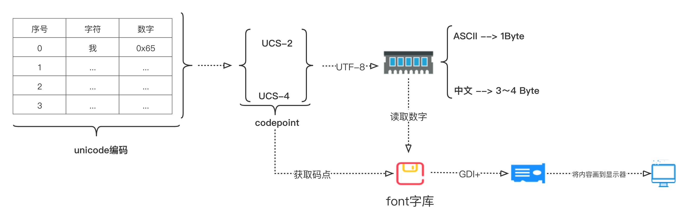

# 字符编码

## 编码

如下图为字符 **编码** 和 **解码** 过程。

### ASCII编码

ASCII是7位编码，编码范围是0x00～0FF。ASCII自负集包括英文字母、阿拉伯数字和标点符号等字符。

### Unicode编码

ASCII编码是7位编码，无法存储其它以外的语言字符，存储像中文这类字符只能使用其它编码。Unicode编码汇集了全球所有国家字符的编码，汇集成一个字符表。

### 码点 & 字符编码

`Unicode编码`字符表保存字符和数字映射关系，该数字称为**码点**。码点保证了`Unicode`字符的唯一性，根据码点数量使用`ucs-2`(2个字节)或`ucs-4`(4个字节)两种方案，将码点存储到内存中。

直接将码点存储到内存/磁盘是一种浪费，可以使用一种UTF节约内存存储的方式将码点存储到内存中。

`UCS`代表`Unicode`编码映射关系的码表；`UTF`将码表映射关系的数字存储到内存。即: **映射是码点;UTF是存储**

### 字符解码过程

字符的码点最终存储在内存中(ASCII 1字节; 中文 3~4字节)。为了显示，就需要**字库(Font)**，拿到要显示的码点，作为字库的索引，从中查找，然后通过GDI+将数据画到显示器上。
