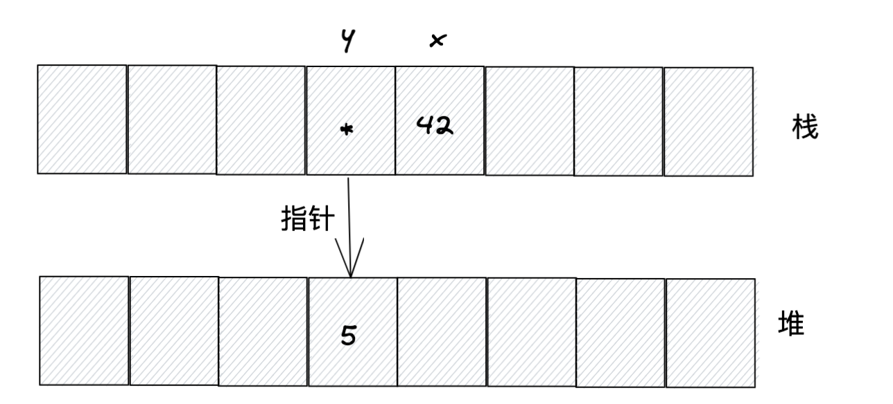
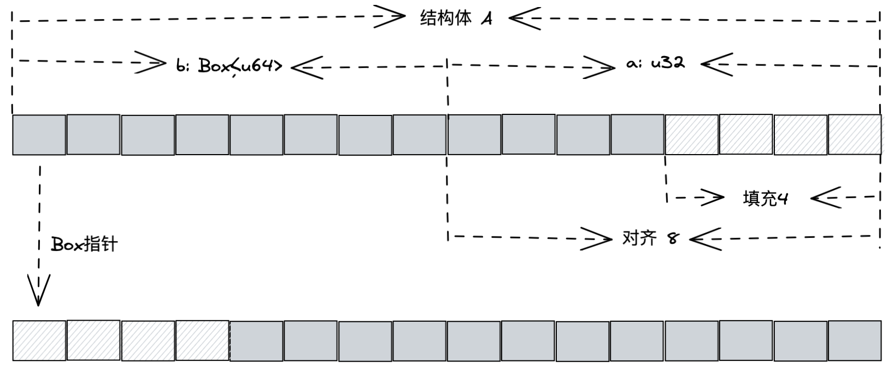
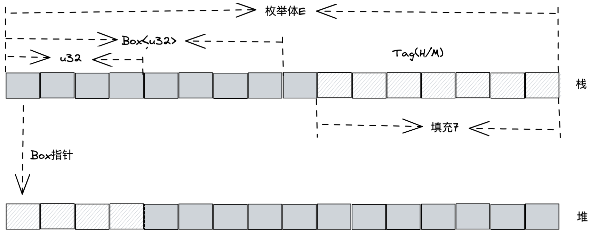

# Rust中的资源管理

Rust不需要开发者显示地通过`malloc/new`或`free/delete`之类的函数去分配和回收堆内存。**Rust可以静态地在编译时确定何时需要释放内存，而不需要在运行时确定**。Rust有一套完整的内存管理机制来保证资源的合理利用和良好的性能。

&nbsp;

## 变量和函数

变量有两种：全局变量和局部变量。

全局变量分为常量变量和静态变量。局部变量是指在函数中定义的变量。

&nbsp;

### 常量

常量使用`const`关键字定义，并且需要显示指明类型，只能进行简单赋值，只能使用支持`CTFE`的表达式。**常量没有固定的内存地址，因为其生命周期是全局的，随着程序消亡而消亡，并且会被编译器有效地内联到每个使用到它的地方**。

&nbsp;

### 静态变量

静态变量使用`static`关键字定义，**静态变量的生命周期是全局的，它不会被内联，每个静态变量都有一个固定的内存地址**。

**静态变量资源分配并不是在栈上和堆上，而是和程序代码一起被存储在静态存储区中**。静态存储区是伴随着程序的二进制文件的生成(编译时)被分配的，并且在程序的整个运行期都存在。**Rust中的字符串字面量同样是存储于静态存储区中**。

### 检查声明未初始化的变量

函数中定义的局部变量都会被默认存储在栈中。Rust编译器可以检查未初始化的变量，以保证内存安全。

```rust
fn main() {
    let x: i32;
            // ^ use of possibly-uninitialized `x` 
    println!("{}", x);
}
```

&nbsp;

### 检查分之流程是否存在为初始化的变量

```rust
fn main() {
    let x: i32;
    if true {
        x = 1;
    } else {        // 如果去掉该代码块，编译器会检查出变量x未正确初始化，导致编译失败
        x = 2;
    }
    println!("{}", x);
}
```

&nbsp;

### 空数组或向量可以初始化变量

当变量绑定空的数组或向量时，需要显式指定类型，否则编译器无法推断其类型。

```rust
fn main() {
    let a: Vec<i32> = vec![];
    let b: [i32; 0] = [];
}
```

&nbsp;

### 转移所有权产生了未初始化变量

当将一个已初始化的变量y绑定给另一个变量y2时，Rust会把变量y看作逻辑上的**未初始化变量**。

```rust
fn main() {
    let x = 42;
    let y = Box::new(5);
    println!("{:p}", y);

    let x2 = x;
    let y2 = y;

    // println!("{:p}", y);
                        // ^ value borrowed here after move
}
```

变量 `x` 为原生整数类型，默认存储在栈上。变量`y`属于指针类型，通过`Box::new`方法在堆上分配的内存返回指针，并与`y`绑定，而指针`y`被存储在栈上。



`let x2 = x;` 代码让变量`x2`绑定了变量`x`，因为`x`是原生整数类型，实现了 `Copy trait`，所以这里变量`x`并未发生任何变化。

`let y2 = y;` 代码变量`y2`绑定了变量`y`，因为`y`是`Box<T>`指针，并未实现`Copy trait`，所以此时 `y` 的值会移动给`y2`，而变量`y`会被编译器看作一个未初始化的变量，所以当`println!("{:p}", y);`，编译器就会报错。**但是此时如果给`y`再重新绑定一个新值，`y`依然可用，这个过程称为重新初始化。**

像`Box<T>`这样的指针被称为**智能指针**。**使用智能指针，可以让Rust利用栈来隐式自动释放内存，从而避免显式调用`free`之类的函数去释放内存**。

&nbsp;

## 智能指针与RAII

Rust中指针分为3类: 引用、原生指针(裸指针)和智能指针。

引用就是Rust提供的普通指针，用`&`和`& mut` 操作符来创建，形成`&T` 和 `&mut T`。原生指针是指形如`*const T` 和 `*mut T` 这样的类型。

引用和指针类型之间有以下区别:
* 可以通过`as`操作符随意转换,例如：`&T as *const T` 和 `&mut T as *mut T`。
* 原生指针可以在`unsafe` 块下任意使用，不受Rust的安全检查规则的限制，而引用则必须受到编译器安全检查规则的限制。

&nbsp;

### 智能指针

智能指针实际上就是一个结构体，只不过它的行为类似指针。智能指针是对指针的一次封装，提供了一些额外的功能，比如自动释放堆内存。

**智能指针区别于常规结构体的特征在于，它实现了`Deref`和`Drop` 这两个trait。`Dref`提供了解引用能力，`Drop`提供了自动析构能力，** 正是这两个`trait`让智能指针拥有了类似指针的行为。

```rust
fn main() {
    let s = String::from("hello");

    // 变量s进行了解引用操作，返回str类型
    // 因为str大小不确定类型，编译器会报错
    // let deref_s: str = *s;

    let v = vec![1,2,3];

    // 变量v解引用，返回[u32]类型
    // 无法确定类型大小，编译器会报错
    // let deref_v: [u32] = *v;
}
```

`String`类型和`Vec`类型的值都是被分配在heap并返回指针的，通过将返回的指针封装来实现`Deref` 和 `Drop`，以自动化管理解引用和释放堆内存。

当`main`函数执行完毕，栈帧释放，变量`s`和`v`被清空之后，对应的已分配内存会被自动释放(因为它们实现了Drop)。

```x86asm
   0x000055555555c388 <+88>:	lea    rdi,[rsp+0x8]
   0x000055555555c38d <+93>:	call   0x55555555d250 <core::ptr::drop_in_place<alloc::string::String>>
   0x000055555555c392 <+98>:	jmp    0x55555555c3bc <eee::main+140>
   0x000055555555c394 <+100>:	mov    rcx,rax
   0x000055555555c397 <+103>:	mov    eax,edx
   0x000055555555c399 <+105>:	mov    QWORD PTR [rsp+0x38],rcx
   0x000055555555c39e <+110>:	mov    DWORD PTR [rsp+0x40],eax
   0x000055555555c3a2 <+114>:	jmp    0x55555555c388 <eee::main+88>
   0x000055555555c3a4 <+116>:	lea    rdi,[rsp+0x20]
   0x000055555555c3a9 <+121>:	call   0x55555555d2b0 <core::ptr::drop_in_place<alloc::vec::Vec<i32>>>          ; Drop Vec
   0x000055555555c3ae <+126>:	jmp    0x55555555c3b0 <eee::main+128>
   0x000055555555c3b0 <+128>:	lea    rdi,[rsp+0x8]
   0x000055555555c3b5 <+133>:	call   0x55555555d250 <core::ptr::drop_in_place<alloc::string::String>>         ; Drop String
   0x000055555555c3ba <+138>:	jmp    0x55555555c3c8 <eee::main+152>
```

`Drop`被执行很重要，他可以帮助智能指针在被丢弃时，自动执行一些重要的清理工作，比如**释放堆内存**。除了可以释放内存，`Drop`还可以做很多其他的工作，比如释放文件和网络连接。

`Drop`的功能有点儿类似GC，但它比GC的应用更加广泛，GC只能回收内存，而`Drop`可以回收内存及内存之外的一切资源。

&nbsp;

#### 确定性析构

以上的资源管理方式叫RAII(Resource Acquisition Is Initialization)，资源获取即初始化。RAII和智能指针均起源于C++，智能指针就是基于RAII机制来实现的。

在C++中，RAII的机制是使用构造函数来初始化资源，使用析构函数来回收资源。看上去RAII所要做的事情确实跟GC差不多，但RAII和GC最大的不同在于，RAII将资源托管给创建堆内存的指针对象本身进行管理，并保证资源在生命周期内始终有效，一旦生命周期终止，资源马上会被回收。而GC是由第三方针对内存来统一回收垃圾的，这样很被动。正是因为RAII的这些优势，Rust才将其纳入自己的体系中。

**Rust并没有像C++一样所拥有的那种构造函数(constructor)，而是直接对每个成员的初始化来完成构造，也可以直接通过封装一个静态函数来构造「构造函数」。** Rust中的`Drop`就是析构函数。

```rust
// Drop已经被标记为语言项，表明该trait为语言本身所用，
// 比如智能指针被丢弃后自动触发析构函数，编译器知道该去
// 哪里找Drop
#[lang = "drop"]
pub trait Drop {
    fn drop(&mut self);
}
```

#### Drop实例

```rust
use std::ops::Drop;

#[derive(Debug)]
struct S(i32);

impl Drop for S {
    fn drop(&mut self) {
        println!("drop {}", self.0);
    }
}

fn main() {
    // 变量x的作用域范围是整个main函数
    let x = S(1);
    println!("crate x: {:?}", x);

    {
        // 变量y的作用域是当前代码块
        let y = S(2);
        println!("crate y: {:?}", y);
        println!("exit inner scope");
    }

    println!("exit main");
}
```

以下是执行结果，变量`x`和`y`分别离开作用域时，都执行了`drop`方法。所以RAII有一个别名,叫**作用域界定的资源管理(Scope-Bound Resource Management, SBRM)**。

```bash
root@8d75790f92f5:~/rs/eee/src# cargo r
   Compiling eee v0.1.0 (/root/rs/eee)
    Finished dev [unoptimized + debuginfo] target(s) in 4.12s
     Running `/root/rs/eee/target/debug/eee`

crate x: S(1)
crate y: S(2)
exit inner scope
drop 2
exit main
drop 1
```

正是有了`Drop`的特性，它允许在对象即将消亡之时，自行调用指定代码(`drop`方法)。

&nbsp;

## 复合类型的内存分配和布局

Rust中基本原生数据类型默认被分配到栈上。结构体(Struct)、枚举体(Enum)和联合体(Union)本身被分配在栈上，其内部元素根据特征分配在stack或heap上。

```rust
struct A {
    a: u32,
    b: Box<u64>,
}

struct B(i32, f64, char);

struct N;

enum E {
    H(u32),
    M(Box<u32>)
}

union U {
    u: u32,
    v: u64
}

fn main() {
    println!("Box<64>: {:?}", std::mem::size_of::<Box<u64>>());
    println!("A: {:?}", std::mem::size_of::<A>());
    println!("B: {:?}", std::mem::size_of::<B>());
    println!("N: {:?}", std::mem::size_of::<N>());
    println!("E: {:?}", std::mem::size_of::<E>());
    println!("U: {:?}", std::mem::size_of::<U>());
}
```

### Struct A 内存布局

```rust
struct A {
    a: u32,
    b: Box<u64>,
}
```

`struct A` 的成员 `a` 为数字类型，`b` 为 `Box<T>` 类型。根据内存对齐规则，结构体A的大小为16字节，其内存对齐示意如图:



`struct A` 在函数中有实例被初始化时，该结构体会被放到栈中，首地址为第一个成员变量`a`的地址，长度为16字节；成员`b`是`Box<u32>`类型，会在堆上开辟空间存放数据，但是指针会返回给成员b，并存放在栈上，一共占8字节。

&nbsp;

### Struct B

`struct B` 为元组结构体，对齐规则和普通结构图一样，占用16字节。

&nbsp;

### Struct N

`struct N` 为单元结构体，占用0个字节。

&nbsp;

### enum E

`enum E` 实际上是一种标签联合体(Tagged Union)，跟普通联合体(Union)的共同点在于，成员变量公用一块内存，所以联合体也被称为共用体。

不同点在于，标签联合体中每个成员都有一个标签(tag)，用于显式地表明同一时刻哪一个成员在使用内存，而且标签也需要占用内存。

操作枚举体的时候，需要匹配处理其所有成员。



`enum E`的成员`H(u32)`和`M(Box<u32>)`中，`H`和`M`就是标签，占1字节。但是`H`和`M`都带自定义数据，`u32`和`Box<u32>`，其中`Box<u32>`最长，按联合体的内存对齐规则，此处按8字节对齐。所以，标签需要补齐到8个字节，自定义数据取最长字节，即8个字节，整个枚举体的长度为标签和自定义数据之和，为16字节。`union U` 没有标签，按内存对齐规则，占8个字节。

当枚举体和联合体在函数中有实例被初始化时，与结构体一样，也会被分配到栈中，占相应字节长度。如果成员的值存放于堆上，那么栈中就存放其指针。
