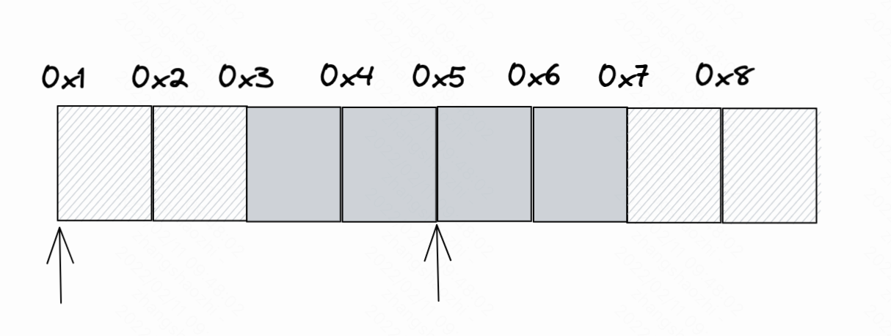
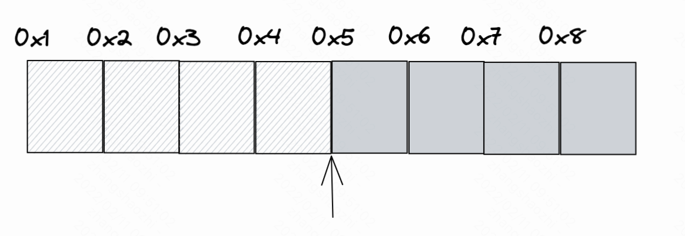

# 内存布局

**内存中数据的排列方式称为内存布局**。不同的排列方式，占用的内存不同，也会间接影响CPU访问内存的效率。为了权衡空间占用情况和访问效率，引入了内存对齐规则。

CPU在单位时间内能处理的一组二进制数称为**字**，这组二进制数的位数称为**字长**。如果是32位CPU，字长为32位，也就是4个字节。一般来说，字长越大，计算处理信息的速度就越快，例如，64位CPU就比32位CPU效率更高。

32位CPU每次只能读取4字节的数据，所以每次只能对4的倍数的地址进行读取。

&nbsp;

## 内存对齐案例

有一整数类型的数据，首地址并不是4的倍数，比如是0x3，则该类型存储在地址范围是`0x3~0x7`的存储空间中。因此，CPU如果想读取该数据，需要分别在0x1和0x5处进行两次读取，而且还需要对读取到的数据进行处理才能得到该整数。CPU的处理速度比从内存中读取数据的速度要快的多，因此，减少CPU对内存空间的访问是提高程序性能的关键。

采用内存对齐策略是提高程序性能的关键。所以只需要按4字节对齐，CPU只需要读取一次。

内存是按字节对齐，所有内存对齐也叫字节对齐。内存对齐是编译器或虚拟机(比如JVM)的工作，一些语言不需要人为干预，Rust默认情况下编译器自动对齐(并不是所有语言都会自动对齐)，如果是数据结构，会对结构体字段进行重排，重排是编译器的优化手段之一，用来避免内存浪费。
