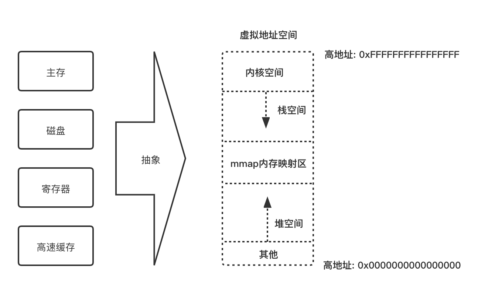

# 通用概念

## 虚拟内存空间

现代操作系统在保护模式下都采用虚拟内存管理技术。虚拟内存是一种对物理存储设备的统一抽象，其中物理存储设备包括物理内存、磁盘、寄存器、高速缓存等。统一抽象的好处是，方便同时运行多道程序，使得每个进程都有各自独立的进程地址空间，并且可以通过操作系统调度将外存当作内存来使用。

虚拟地址空间是线性空间，用户所接触到的地址都是虚拟地址，而不是真实的物理地址。利用这种虚拟地址不但能保护操作系统，让程序在各自的地址空间内操作内存，更重要的是，用户程序可以使用比物理内存更大的地址空间。虚拟地址空间被分为两部分：**用户空间和内核空间**，它们的比例是3:1。

上图为虚拟内存示意图，栈空间向下(由高地址向低地址)增长，堆向上(由低地址向高地址)增长，这样设计为了更高效地利用内存。

&nbsp;

## 栈(Stack)

栈一般有两种定义，一种是指**数据结构**，一种是指**栈内存**。操作栈的一端被称为**栈顶**，相反的一端被称为**栈底**。从栈顶压入数据叫**入栈(push)**，从栈顶弹出数据叫**出栈(pop)**，这意味着最后一个入栈的数据会第一个出栈，所以栈被称为**后进先出(LIFO, Last in First Out)** 线性表。

物理内存本身不区分堆和栈，但是虚拟内存空间需要分出一部分内存，用于支持CPU入栈或出栈的指令操作，这部分内存空间就是栈空间。栈内存拥有和栈数据结构相同的特性，支持入栈和出栈操作，数据压入的操作使栈顶的地址减少，数据弹出的操作使栈顶的地址增多。

栈顶由栈指针寄存器ESP保存，起初栈顶指向栈底位置，当有数据入栈时，栈顶地址向下增长，地址由高地址变成低地址；当有数据被弹出时，栈顶地址向上增长，地址由低地址变成高地址。因此，降低ESP的地址等价于开辟栈空间，增加ESP的地址等价于回收栈空间。

**栈内存最重要的作用时在程序运行过程中保存函数调用所要维护的信息**。存储每次函数调用所需信息的记录单位被称为**栈帧(Stack Frame)**，有时也被称为活动记录(Activate Record)。因此栈内存被栈帧分割成了N个记录中，而且这些记录块都是大小不一的。

&nbsp;

### 栈帧

栈帧一般包括三方面的内容：

* 函数的返回地址和参数。
* 临时变量。包括函数内部的非静态局部变量和编译器产生的临时变量。
* 保存的上下文(IP、SP、BP)。

BP指针是帧指针(Frame Pointer)，它指向当前栈帧的一个固定位置(栈底)，SP始终指向栈顶。BP指向的值是调用函数之前的旧的BP值，这样在函数返回的时候，旧可以通过该值恢复到调用前的值。

栈上分配的值都是可以预先确定大小的类型。当函数结束调用的时候，栈帧会被自动释放，所以栈上的数据的生命周期都是在一个函数调用周期内的。

&nbsp;

## 堆(heap)

堆(heap)一般也有两种定义，一种是指数据结构，另一种是堆内存。

数据结构中，堆表示一种特殊的树形数据结构，此树是一棵完全二叉树，它的特点是父节点的值要么都大于两个子节点的值，称为**大顶堆**；要么都小于两个子节点的值，称为**小顶堆**。一般用于实现堆排序或优先级队列。**堆数据结构和堆内存并无直接的联系**。

栈内存中保存的数据，生命周期都比较短，会随着函数调用的完成而消亡。但很多情况下会需要能对长久保存在内存中的数据，以便跨函数使用，这就是堆内存发挥作用的地方。堆内存是一块巨大的内存空间，占了虚拟内存空间的绝大部分。程序不可以主动申请栈内存，但可以主动申请堆内存。在堆内存中存放的数据会在程序中一直存在，除非该内存被主动释放掉。

在C语言中，可以通过`malloc`函数来申请堆内存，通过`free`函数释放它；在C++中，可以使用`new`和`delete`进行操作。

堆是一大块内存空间，程序通过`malloc`申请到内存空间是大小不一、不连续且无序的，所以如何管理堆内存是一个问题。这就涉及到堆分配算法，堆分配算法由很多种，可以分为两大类： **空闲链表(Free List)** 和 **位图标记(Bitmap)**。

&nbsp;

### 空闲链表

空闲链表实际上就是把堆中空闲的内存地址记录为链表，当系统收到程序申请时，会遍历该链表；当找到合适的空间堆节点时，会将此节点从链表中删除；当空间被回收以后，再将其加到空闲链表中。空闲链表优势是实现简单，但如果链表遭到破坏，整个堆就无法正常工作。

&nbsp;

### 位图标记

位图的核心思想是将整个堆划分为大量大小相等的块。当程序申请内存时，总是分配整个块的空间。每块内存都有一个二进制来表示其状态，如果该内存被占用，则相应位图中的位置为1；如果该内存空闲，则相应位图中的位置置为0。位图优势速断快，如果单个内存块数据遭到破坏，也不影响整个堆，但缺点是容易产生碎片。

&nbsp;

### Rust 内存分配与回收

Rust编译器目前自带两个默认分配器： `alloc_system` 和 `alloc_jemalloc`。在Rust 2015版本中，编译器产生的二进制文件默认使用`alloc_jemalloc`，而对于静态或动态链接库，默认使用`alloc_system`。在Rust 2018版本下，默认使用 `alloc_system`，并且可以由开发者自己指派`Jemalloc`或其它第三方分配器。

Jemalloc 的优势有以下几点：

* 分配或回收内存更快速
* 内存碎片更少
* 多核友好
* 良好的可伸缩性

Jemalloc是现代化的业界流行的内存分配解决方案，它整块批发内存(称为chunk)以供程序使用，而非频繁地使用系统调用(比如 `brk` 或 `mmap`)来向操作系统申请内存。内存管理采用层级架构，分别是线程缓存(`tcache`)、分配区(`arena`)和系统内存(`system memory`)，不同大小的内存块对应不同的分配区。

每个线程对应一个`tcache`，`tcache`负责当前线程所使用内存块的申请和释放，避免线程间锁的竞争和同步。`tcache`是对`arena`中内存块的缓存，当没有`tcache`时则使用`arena`分配内存。`arena`采用内存池思想对内存区域进行了合理划分和管理，在有效保证低碎片的前提下实现了不同大小内存块的高效管理。

当`arena`中有不能分配的超大内存时，再直接使用`mmap`从系统内存中申请，并使用红黑树进行管理。

从性能角度考虑，能放在栈上的数据最好不要放在堆上。因此，**Rust的类型默认都是放在栈上**。
