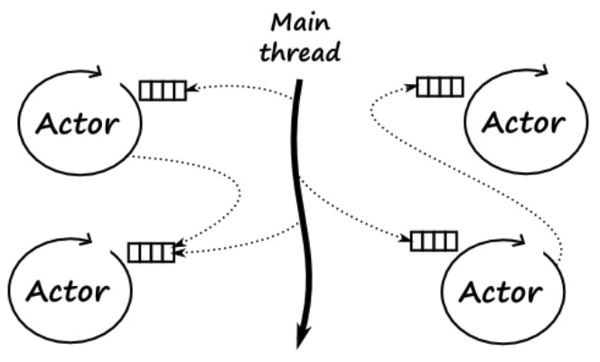

# actor 模型实现并发

actor模型是一种概念模型，它使用名为actors的实体在类型层面实现并发。它避免了对锁和同步的要求，并提供了一种向系统引入并发的更简洁方法。**一个actor是一个基本的计算单元**，通常actor会接收消息，然后基于消息来做某些计算。actor模型由3部分组成。

* Actor: actor模型中的核心元素。每个actor都包含其地址，使用该地址我们可以将消息发送到某个actor和邮箱，这只是一个存储它收到的消息的队列。
* FIFO(mailBox): 队列通常是先进先出(First In First Out，FIFO)。actor的地址是必需的，以便其他actor可以向其发送消息。超级actor能够创建其他子actor的子actor。
* Message: actor之间仅通过消息进行通信，它们由actor异步处理。



&nbsp;

在Actor并发模型中，一切事物都是actor，为了发送消息给actor，我们需要知道某个actor的地址。每个actor是完全隔离的，他们不会共享内存；同时，actor也会维护自身的私有状态，并且不会直接被其他的actor修改。

消息是被异步发送给actor，如果一个actor正在处理某个消息，这个时候给它发送了其他消息，需要将这些消息存储到某个地方。邮箱(mailbox)正是存储消息的地方，mailbox绑定到actor上，跟CSP中的channel是匿名的不同。

&nbsp;

## Rust Actor 使用

在Rust编译器中，实现了actor模型的 `actix` 程序库。该程序库使用的 `tokio` 和 `futures` 软件包。该程序库的核心对象是 `Arbiter`(仲裁器) 类型，它只是一个简单的在底层生成事件循环的线程，并且提供了 `Addr` 类型作为该事件循环的句柄。一旦创建该类型，就可以使用这个句柄向actor发送消息了。

### actix使用

在actix中，actor的创建遵循以下简单步骤:

* 创建一个类型，定义一个消息
* 为`actor`类型实现消息的处理程序
* 完成创建后，将它添加到已经创建的某个仲裁器(`Arbiter`)中。

当创建一个 `actor` 后，它不会马上执行，将这些 `actor` 放入仲裁器线程后，它们才会开始执行。

```toml
[dependencies]
futures = "0.1.25"
actix = "0.7.9"
tokio = "0.1.15"
```

```rust
use actix::prelude::*;
use tokio::timer::Delay;
use std::time::Duration;
use std::time::Instant;
use futures::future::Future;
use futures::future;
use futures::future::lazy;

struct Add(u32, u32);

impl Message for Add {
    type Result = Result<u32, ()>;
}

// Adder类型的actor
struct Adder;

impl Actor for Adder {
    type Context = SyncContext<Self>;
}

// adder actor 可以接收/发送 Add类型的信息
// 通过Add消息类型为参数化的Adder实现了Handler特征
impl Handler<Add> for Adder {
    type Result = Result<u32, ()>;

    fn handle(&mut self, msg: Add, _: &mut Self::Context) -> Self::Result {
        let sum = msg.0 + msg.1;
        println!("Computed: {} + {} = {}", msg.0, msg.1, sum);
        Ok(msg.0 + msg.1)
    }
}

fn main() {
    // 创建一个系统级actor
    // System::run 是一个一直在执行的父事件循环
    System::run(|| {
        // 1. 启动3个线程的SyncArbiter; 
        // 2. 同时创建了3个准备接收消息的actor
        // 3. 返回的addr是事件循环句柄，以便可以将消息发送到Adder类型的actor
        let addr = SyncArbiter::start(3, || Adder);

        // 向仲裁器地址addr发送了5条消息
        for n in 5..10 {
            addr.do_send(Add(n, n+1));
        }

        // 生成一个计划，在延迟1s后停止系统的actor
        tokio::spawn(lazy(||{
            Delay::new(Instant::now() + Duration::from_secs(1)).then(|_| {
                System::current().stop();
                future::ok::<(),()>(())
            })
        }));
    });
}
```

&nbsp;

## 其他程序库

### rayon

rayon是一个基于工作窃取算法的数据并行程序库，使编写并发代码变的非常简单。

```toml
[dependencies]
rayon = "1.5"
```

```rust
use rayon::prelude::*;

fn sum_of_squares(input: &[i32]) -> i32 {
    input.par_iter() // <-- just change that!
         .map(|&i| i * i)
         .sum()
}

fn main() {
    let s = &[1, 2, 3][..];
    let res = sum_of_squares(s);
    println!("{:?}", res);
}
```

&nbsp;

### crossbeam

crossbeam 允许用户编写多线程代码，可以从父stack访问数据，并保证在父堆栈帧消失之前终止。
