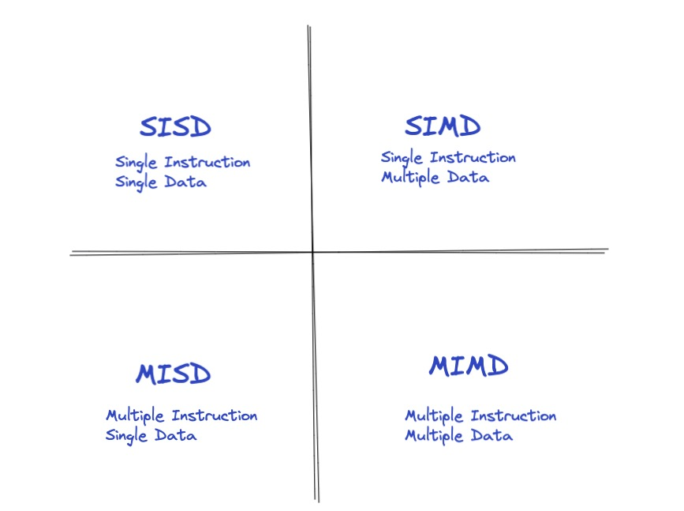
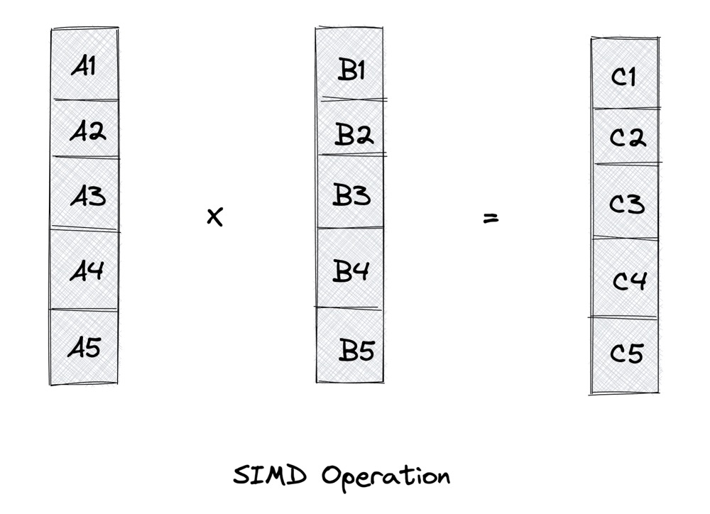
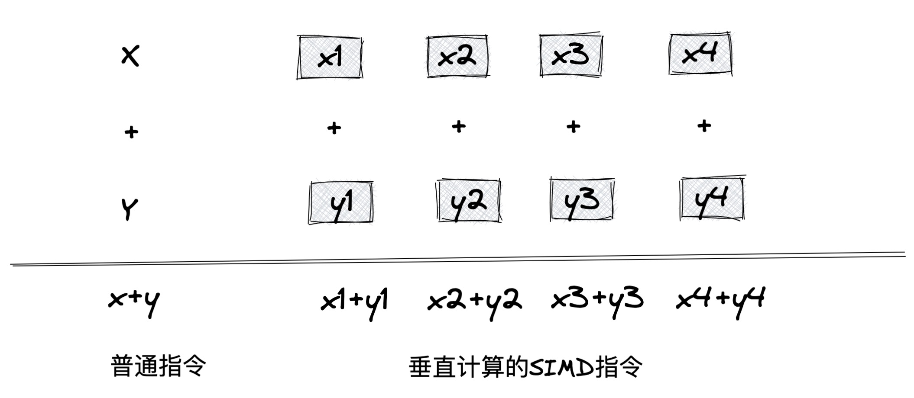
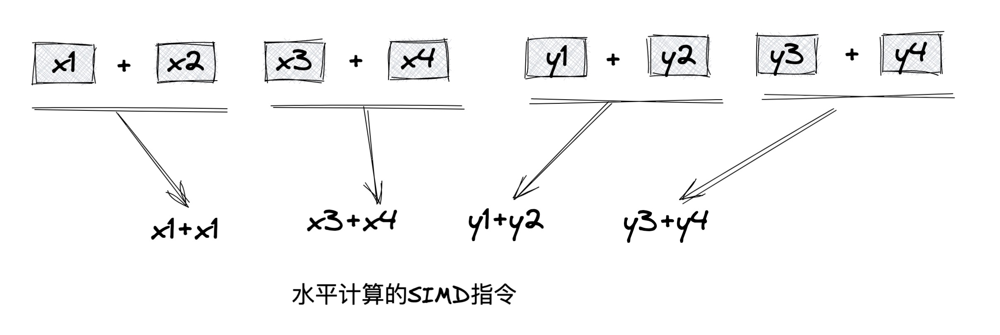

# 数据并行

计算机在许多领域的发展十分迅猛，随着人类前进的步伐，越来越多的领域对计算机的要求越来越高，待解决问题的规模也在不断增加。因此，对并行计算的要求就越来越烈。

因此解决并行计算这个问题大致有两种解决方案:

* 任务并行(Task Parallelism)：将所需要执行的任务分配到多个核上。
* 数据并行(Data parallelism)：将需要处理的数据分配到多个核上。

「数据并行处理」起来比「任务并行处理」更加简单和实用，所以得到了重点关注。

&nbsp;

## 计算机体系结构分类

按Flynn分类法，将计算机系统架构分为四类：



* `SISD`: 单指令单数据的单CPU机器，它在单一的数据流上执行指令。可以说，任何单CPU的计算机都是`SISD`系统。

* `MISD`: 有N个CPU的机器。在这种架构下，底层的并行实际上是指令级的并行。有多个指令来操作同一组数据，`MISD`在实际中很少用。

* `SIMD`：包含了多个独立的CPU，每一个CPU都有自己的存储单元，可以用来存储数据。所有的CPU可以同时在不同的数据上执行执行同一条指令，也就是数据并行。这种架构非常实用，便于算法的设计和实现。

* `MIMD`：是应用最广泛的一类计算机体系。该架构比`SIMD`架构更强，通常用来解决`SIMD`无法解决的问题。


&nbsp;

## SIMD

SIMD 是一种采用一个控制器控制多个CP，同时对一组数据(向量数据)中的每一个数据分别执行相同的操作而实现空间上数据的并行技术。

### SISD Vs. SIMD

如果采用SISD架构来计算，需要先访问内存，取得第一个操作数，然后再访问内存，取得第二个操作数，最后才能进行求和运算。


&nbsp;

SIMD可以一次性从内存中获得两个操作数，然后执行求和运算。



### 历史

SIMD起源于美国超级计算机之一的ILLIAC IV大型机中，它拥有64个处理器单元。随着现代多媒体技术的发展，各大CPU生产商陆续扩展了多媒体指令集，允许这些指令一次处理多个数据。最早Intel的MMX(MultiMedia eXtensions)指令集，包含了57个多媒体指令、8个64位寄存器。然后是SSE(Streaming SIMD Extensions) 70个指令集。接下来出现了SSE2、SSE3、SSE4和SSE5指令集。

2011年Intel发布了全新的处理器微架构，其中增加了新的指令集AVX(Advanced Vector Extensions), 进一步把寄存器的带宽扩展到256位,并且革新了指令格式，支持三目运算。

&nbsp;

### 名词解释

按寄存器的宽度可以将SIMD看作不同的并行通道。拿AVX-256来说，如果按4个64位进行计算，就可以看成是4个并行计算通道。而在SIMD中并行计算可以分为多种计算模式，其中有垂直计算和水平计算。

并行计算也是有限制的，对于不同的指令集，一次数据并行能接受长度是固定的，比如AVX-256，能够接受的长度为256字节。

&nbsp;

#### 垂直计算

垂直计算中，每个并行通道都包含的待计算值称为标量值，通道按水平方向进行组织。将加法运算中X和Y的数据在垂直方向上进行求和。在垂直计算中，每组计算的标量值都来自不同的源。



&nbsp;

#### 水平计算

水平计算则是将并行通道垂直组织，依次对相邻两个通道的标量值进行求和。在水平计算中，每组计算的标量值都来自同一源。



编写SIMD数据并行的代码成为向量化(Vectorrization)。这是因为向量(Vector)是一个指令操作数，包含一组打包到一维数组的数据元素。大多数SIMD都是对向量操作数进行操作的，所以向量也称为SIMD操作数或打包操作数。

&nbsp;

## Rust中使用SIMD

Rust 从1.27版本开始支持SIMD，并且默认为x86和x86_64目标启用SSE和SSE2优化。Rust基本支持市面上 90%的SIMD指令集，从SSE到AVX256。不过，目前还不支持AVX-512。

Rust通过标准库 `std::arch` 和第三方库`stdsimd`结合的方式来支持SIMD。Rust对SIMD的支持属于比较底层的，在标准库中支持多种CPU平台架构，比如x86、x86_64、ARM、AArch64等。平台模块中所有的函数都是`unsafe`的，因为调用不支持的平台指令可能会导致未定义的行为。

&nbsp;

### SIMD 实例

```rust
// stdsimd仅支持Nightly环境
#![feature(stdsimd)]

// std标准库使用stdsimd进行替换
use ::std as real_std;
use stdsimd as std;

// 静态CPU平台检查
#[cfg(target_arch = "x86")]
use ::std::arch::x86::*;

#[cfg(target_arch = "x86_64")]
use ::std::arch::x86_64::*;

fn main() {
    // 判断当前代码执行的CPU平台是否支持SSE4.2
    if is_x86_feature_detected!("sse4.2") {
        #[target_feature(enable = "sse4.2")]

        // 定义了unsafe函数worker, 该函数使用SIMD指令执行字符串搜索任务。
        // 因为要用到SIMD命令，所以该函数被标记为unsafe
        unsafe fn worker() {
            let needle = b"\r\n\t ignore this ";
            let haystack = b"Split a \r\n\t line ";

            // 调用 _mm_loadu_si128函数，该函数接收一个__m128i类型的原生指针，
            // 它会从内存中将长度为128位的整数数据加载到向量寄存器中。
            // 它实际调用的是Intel的_mm_loadu_si128指令
            // 将needle字符串加载到向量寄存器中.
            let a = _mm_loadu_si128(needle.as_ptr() as *const _);

            // 将haystack字符串加载到向量寄存器中，这个过程称为打包字符串
            let b = _mm_loadu_si128(haystack.as_ptr() as *const _);

            // 在haystack字符串中查找匹配needle前三位的索引位置
            let idx = _mm_cmpestri(
                // a: 打包好的needle字符串
                // 3: 要检索的长度
                // b: 打包好的haystack字符串
                // 20: 长度
                // _SIDD_CMP_EQUAL_ORDERED: 比较模式说明符，代表字符串相等检测模式
                a, 3, b, 20, _SIDD_CMP_EQUAL_ORDERED
                );
                assert_eq!(idx, 8);
        }
        unsafe { worker(); }
    }
}
```

&nbsp;

### faster

Rust社区还有很多simd库，例如faster和simdeez。相比标准库simd做了更近一步的抽象，对开发者友好。

```rust
use faster::*;

fn main() {
    let two_hundred = (&[2.0f32; 100][..]).simd_iter().simd_reduce(f32s(0.0), f32s(0.0), |acc, v| acc + v)
        .sum();
    assert_eq!(two_hundred, 200.0f32);
}
```
