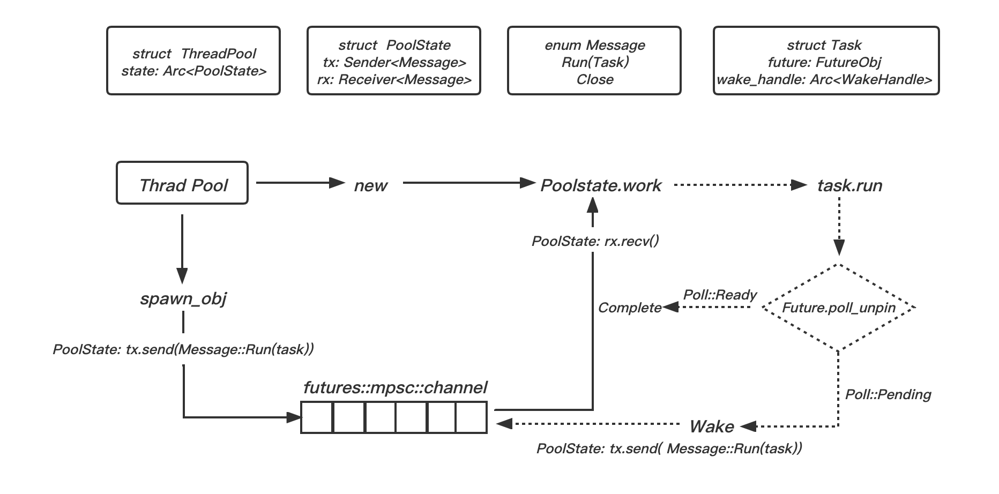

# Future并发模式

Rust对`Future`异步并发模式做了一个完整的抽象，包含在第三方库[futures-rs](https://github.com/rust-lang/futures-rs)中。该抽象主要包含三个组件:

* **Future**：基本的异步计算抽象单元。
* **Executor**：异步计算调度层。
* **Task**：异步计算执行层。

&nbsp;

## Future

在Rust中，Future是一个`trait`，源码如下：

```rust
pub trait Future {
    // Output一个占位类型，在实现该特征时，该类型可以被替换成其他类型
    type Output;

    fn poll(self: Pin<&mut Self>, cx: &mut Context<'_>) -> Poll<Self::Output>;
}
```

`poll`方法是`Future`的核心，它是对`Pool(轮询)`行为的一种抽象。在Rust中，每个`Future`都需要使用`poll`方法来轮询所要计算值的状态。该方法返回的`poll`是一个枚举类型，该类型包含两个枚举值，即 `Ready(T)` 和 `Pending`。 该类型和 `Option<T>`、`Result<T, E>`相似，都属于和类型。他是对**准备好**和**未完成**两种状态的统一抽象，以此来表达`Future`的结果。

```rust
pub enum Poll<T> {
    Ready(#[stable(feature = "futures_api", since = "1.36.0")] T),
    Pending,
}
```

&nbsp;

## Executor 和 Task

Future 只是一个基本的异步计算抽象单元，具体的计算工作还需要由`Executor` 和 `Task` 共同完成。

在实际的异步开发中，会遇到纷繁复杂的异步任务，还需要一个专门的调度器来对具体的任务进行管理统筹，这个工具就是`Executor`。具体的异步任务就是 `Task`。

`futures-rs` 第三方库的 `Executor` 是基于线程池实现的。`futures-rs`是由很多小的 `crate`组合而成的，其中 `futures-executor` 库专门基于线程池实现的一套 `Executor`。

下图展示了几个关键的复合类型: `ThreadPool`、`PoolState`、`Message`和`Task`。

* `ThreadPool`：该结构体包含了字段 `state`，用于共享线程池内的线程信息。
* `PoolState`：该结构体包含了`tx`和`rx`两个字段，用于 `channal` 通信的发送端和接收端。
* `Message`：该 `Message` 用作发送到 `Channel`中的消息。包含了两个枚举值：
    * `Run(Task)`：运行 `Task` 任务
    * `Close`：关闭线程池
* `Task`：该结构体包含了 `future` 和 `wake_handle` 两个字段，分别是 `FutureObj` 和 `Arc<WakeHandle>`类型。其中，`FutureObj`就是 `Future`对象，它实际上是 `future-executor` 中实现的自定义 `Future` 对象，它是对一个 `Future trait` 对象的一种包装；`WakeHandle`则是用来唤醒任务的句柄。

&nbsp;

### futures-rs 执行流程

如下是 `futures-rs` 第三方库的 `Executor` 完整执行流程简易图：



`Executor` 提供了一个 `Channel`，实际上就是一个任务队列。生产者通过`ThreadPool`提供的`spawn_obj`方法将一个异步任务(`Task`)发送(`send`)到`Channel`中。实际上，在 `spawn_obj` 内部是通过 `PoolState` 结构体中存储的发送端`tx`将`Message::Run(task)` 发送到 `Channel`中的。

通过 `ThreadPool::new` 方法，可以从线程池中调用一个线程来执行具体的任务。同时，在该线程中也调用了 `PoolState` 结构体中 `work` 方法来消费 `channel` 中的消息。实际上，`work` 方法是通过 `PoolState` 结构体中存储的接收端`rx`接收并消费`Message::Run(task)`的。

**由 `spawn_obj` 往 `Channel`中发送消息，由 `work` 来接收并消费消息，构成一个完整的工作流程。**

当 `work` 方法接收到 `Message::Run(task)` 之后，会调用 `Task`中定义的`run`方法来执行具体的task。在 `run` 方法中，调用存储于 `task` 实例中的 `FutureObj` 类型值的 `poll_unpin` 方法，将会执行具体的 `poll` 方法，返回 `Pending` 和 `Ready` 两种状态。如果是 `Pending`状态，则通过 `task` 实例存储的 `WakeHandle` 句柄将此任务再次唤醒，也就是重新将该任务发送到 `Channel`中，等待下一次轮询；如果是 `Ready` 状态，则计算任务完成，返回到上层进行处理。

&nbsp;

### Future 参数

```rust
fn poll(self: Pin<&mut Self>, cx: &mut Context<'_>) -> Poll<Self::Output>;
```

很长一段时间内，`Future`的唯一参数是 `&Waker`类型。在稳定版本(`stablize Future`)前夕，考虑到将来可能的扩展需求，withoutboats 提出将 `Waker`包装在 `Context` 类型内，这样将来需要扩展 `Future` 时可以避免引入`breakchange`(中断变更)。目前阶段内，`std::task::Context` 类型基本等价于`std::task::Waker` 类型。

> break changes:
>
> break changes 指明是否产生了破坏性修改，涉及break changes的改动必须指明该项，类似版本升级、接口参数减少、接口删除、迁移等。
>

```rust
// std::task::Context

// 目前，`Context` 仅用于提供对 `&Waker`的访问， 该 `&Waker`可用于唤醒当前任务.
#[stable(feature = "futures_api", since = "1.36.0")]
pub struct Context<'a> {
    waker: &'a Waker,
    
    // 保证生命周期不可变
    _marker: PhantomData<fn(&'a ()) -> &'a ()>,
}
```

&nbsp;

`Waker` 虽然是标准库实现的类型，但 `Executor` 可以通过为 `Waker` 内的 `vtable`和原始指针赋值进而指定该`Waker`的功能(宁愿暴露`vtable`也不用`Trait`约束行为，主要因为`Object Safety`相关的阻碍)。

```rust
// `Waker`是一个句柄，用于通过通知执行器，它已经准备好运行，可以唤醒任务了
// 这个句柄封装了一个 `RawWaker` 实例, 它定义了特定用于执行器的唤醒行为.

/// Implements [`Clone`], [`Send`], and [`Sync`].
#[repr(transparent)]
#[stable(feature = "futures_api", since = "1.36.0")]
pub struct Waker {
    waker: RawWaker,
}
```

```rust
// 1. `RawWaker` 允许任务执行器的实现者，创建一个 [`Waker`]来提供定制的唤醒行为
// 2. 他由一个数据指针和一个虚拟函数指针表(vtable)[vtable]组成，用于自定义 `RawWaker`的行为
// 3. [vtable]: https://en.wikipedia.org/wiki/Virtual_method_table
#[derive(PartialEq, Debug)]
#[stable(feature = "futures_api", since = "1.36.0")]
pub struct RawWaker {
    // 1. 一个数据指针，可以用来存储执行器需要的任意数据.
    // 2. 该字段的值作为第一个参数传递给属于vtable的所有函数.
    data: *const (),
   
    // 自定义唤醒器行为
    vtable: &'static RawWakerVTable,
}
```

&nbsp;

对于 `Future` 的实现者来说，可以通过 `Waker` 通知 `Executor`，其所在的`Task`目前已经处于就绪状态，可以再次被调用 `poll`方法。

```rust
// 1. 指定 `RawWaker`行为的虚拟函数指针表(vtable)
// 2. 传递给vtable内所有函数的指针是来自 `RawWaker`对象的`data`指针
// 3. 该结构体函数仅允许`RawWaker`里的`data`指针上调用

#[stable(feature = "futures_api", since = "1.36.0")]
#[derive(PartialEq, Copy, Clone, Debug)]
pub struct RawWakerVTable {
    // 当 `RawWaker` 被克隆时，此函数被调用
    // Eg: `RawWaker`的 `waker`被克隆
    clone: unsafe fn(*const ()) -> RawWaker,

    
    // 在Waker上调用wake时，将调用此函数
    // 它必须唤醒与RawWaker关联的任务
    // 必须确保释放与RawWaker和相关任务的此实例关联任何资源
    wake: unsafe fn(*const ()),

    // 在Waker上调用wake_by_ref时，将调用此函数
    // 它必须唤醒与rawWaker关联的任务
    // 类似于wake，但是引用，不会对数据指针有影响
    wake_by_ref: unsafe fn(*const ()),

    // RawWaker被删除时，该函数被调用
    // 必须确保释放与RawWaker和相关任务的此实例关联的任何资源
    drop: unsafe fn(*const ()),
}
```

&nbsp;

## Future实例

&nbsp;

### 简单实例

```rust
trait SimpleFuture {
    type Output;
    fn poll(&mut self, wake: fn()) -> Poll<Self::Output>;
}

enum Poll<T> {
    Ready(T),
    Pending,
}
```

```rust
use futures::channel::mpsc;
use futures::executor; //standard executors to provide a context for futures and streams
use futures::executor::ThreadPool;
use futures::StreamExt;

fn main() {
    let pool = ThreadPool::new().expect("Failed to build pool");
    let (tx, rx) = mpsc::unbounded::<i32>();
    
    // 通过 async 创建Future, 其中 async 负责Future实现。暂时还没有为Future提供执行器, 所以它不会运行。
    let fut_values = async {
        // 创建另一个 async, 同时是由async异步生成Future实现的地方。
        // 由于是在父 async内部，因此在执行时将提供父块的executor。 
        let fut_tx_result = async move {
            (0..100).for_each(|v| {
                tx.unbounded_send(v).expect("Failed to send");
            })
        };

       
        // 通过线程池生成Future，对Future进行发送，生产者
        pool.spawn_ok(fut_tx_result);

        // 消费者，
        let fut_values = rx.map(|v| v * 2).collect();

        // 等待Future执行完成
        fut_values.await
    };

    // 实际上述Future，调用 `Future::poll`并随后链接到适当的 `Future::poll`和需要执行者驱动所有 `Futures`的方法。
    // 最终 `fut_values` 将被驱动完成。
    let values: Vec<i32> = executor::block_on(fut_values);

    println!("Values={:?}", values);
}
```

&nbsp;

### SocketRead场景

```rust
struct SocketRead<'a> {
    socket: &'a Socket,
}

impl SimpleFuture for SocketRead<'_> {
    type Outpue = Vec<u8>;

    fn poll(&mut self, wake: fn()) -> Poll<Self::Output> {
        if self.socket.has_data_to_read() {
            // 套接字拥有数据就读取数据到缓冲区并返回数据.
            Poll::Ready(self.socket.read_buf())
        } else {
            // 套接字没有数据：
            // 1. 安排 `wake` 在有数据后再次调用.
            // 2. 当有数据的时候， `wake`会被调用.
            // 3. 并且这个 `Future` 的用户将知道再一次调用 `poll` 接收数据.
            self.socket.set_reaable_callback(wake);
            Poll::Pending
        }
    }
}
```

&nbsp;

### 多个异步操作

`Futures` 特征允许将多个异步操作组合在一起，而无需中间分配。一次运行多个 `Future` 或将 `Future` 链接在一起，可以通过无分配状态机实现。

```rust
pub struct Join<FutureA, FutureB> {
    // 每个字段都可能包含运行已完成的 futures.
    // 如果 `future` 已经完成，则该字段设置为 `None`，
    // 这样可以防止持续轮询(poll) future.
    // 如果这样做，就违反了 `Future` trait的契约.

    a: Option<FutureA>,
    b: Option<FutureB>,
}

impl<FutureA, FutureB> SimpleFuture for Join<FutureA, FutureB>
where
    FutureA: SimpleFuture<Output = ()>,
    FutureB: SimpleFuture<Output = ()>,
{
    type Output = ();

    fn poll(&mut self, wake: fn()) -> Poll<Self::Output> {
        // 尝试完成 future `a`.
        if let Some(a) = &mut self.a {
            if let Poll::Read(()) = a.poll(wake) {
                self.a.take();
            }
        }

        // 尝试完成 future `b`.
        if let Some(b) = &mut self.b {
            if let Poll::Read(()) = b.poll(wake) {
                self.b.take();
            }
        }

        if self.a.is_none() && self.b.is_none() {
            // 所有的futures都完成了, 返回成功
            Poll::Ready(())
        } else {
            // 一个或者全部 futures 返回 `Poll::Pending`，说明仍然有工作要去做
            // 将再次调用 `wake`
            Poll::Pending
        }
    }
}
```

如何在不需要单独分配的情况下同时运行多个 `Future`，从而允许更高效的异步程序。

```rust
pub struct AndThenFut<FutureA, FutureB> {
    first: Option<FutureA>,
    second: FutureB,
}

impl<FutureA, FutureB> SimpleFuture for AndThenFut<FutureA, FutureB>
where
    FutureA: SimpleFuture<Output = ()>,
    FutureB: SimpleFuture<Output = ()>,
{
    type Output = ();
    fn poll(&mut self, wake: fn()) -> Poll<Self::Output> {
        if let Some(first) = &mut self.first {
            match first.poll(wake) {
                // 我们完成了第一个future，之后轮询它并完成第二个
                Poll::Ready(()) => self.first.take(),

                // 我们还不能完成第一个 future.
                Poll::Pending => return Poll::Pending,
            };
        }
        // 现在第一个future已经完成，尝试完成第二个
        self.second.poll(wake)
    }
}
```
