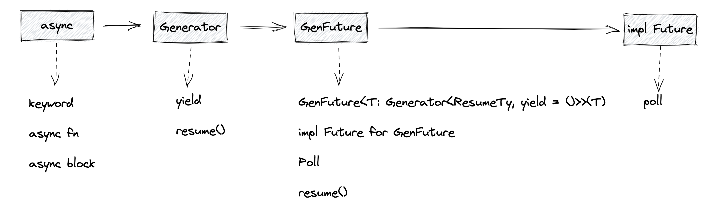
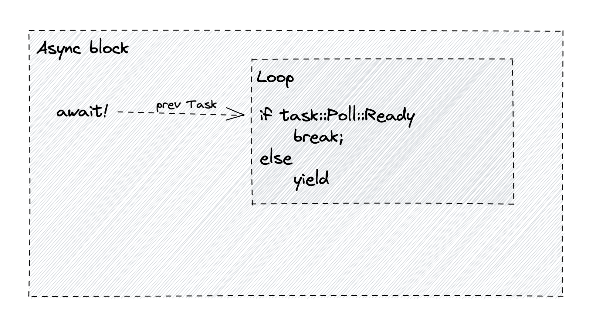

# async/await

`future-rs` 第三方库经历了三个阶段迭代:

* 0.1 版本中，通过 `then` 和 `and_then` 方法实现 `Future` 异步计算的执行顺序(这种方式会导致很多混乱的嵌套和回归链，不利于开发体验)。
* 0.2 版本引入了 `async/await`方案解决以上存在的问题。
* 经过两个阶段迭代，目前 `async/await` 处于 0.3 版本。

## futures-rs 两种写法对比

`futures-rs 0.1` 版本，需要先执行`pull_down_tweets`异步函数，再执行`write_tweets`异步函数，这种写法使用`and_then`构成了很长的调用链。

`rutures-rs 0.3` 版本，使用了`async/await!`，在语义上要比使用`and_then`更加直观和简单。Rust当前以`async`关键字配合`await!`宏提供`async/await`异步方案。

```rust
// futures-rs 0.1
fn download_and_write_tweets(
    user: String,
    socket: Socket,
) -> impl Future<Output = io::Result<()>> {
    pull_down_tweets(user).and_then(move |tweets| write_tweets(socket))
}

// futures-rs 0.3
async fn download_and_write_tweets(
    user: &str,
    socket: &Socket,
) -> io::Result<()> {
    let tweets = await!(pull_down_tweets(user))?;
    await!(write_tweets(socket))
}
```

&nbsp;

## async/await实现原理

`async/await` 是一种语法糖，`async fn` 会自动为开发者生成返回值是 `impl Future`类型的函数。Rust不仅支持 `async fn` 定义的异步函数，而且还支持`async block`异步块。

```rust
let my_future = async {
    await!(prev_async_func);
    println!("Hello from an async block");
}
```

如上实例，直接使用 `async` 块创建一个 `Future`。实际上，使用`async fn`函数在底层也是由 `async` 块生成`Future`的，具体执行过程如下：



Rust 将 `async fn`或`async block` 异步块代码解析为AST后，在HIR层都会转换为`async` 块的形式。

* 首先，将 `async` 块生成一个 `Generator<ResumeTy, Yield=()>` 类型的生成器使用
* 然后，将该生成器通过 `GenFuture` 结构体进行包装，得到一个`GenFuture<T: Generator<ResumeTy, Yield=()>>(T)`类型
* 最后，为该`GenFuture`实现`Future`

如下为`GenFuture` 实现 `Future`源码：

```rust
impl<T: Generator<ResumeTy, Yield = ()>> Future for GenFuture<T> {
        type Output = T::Return;

        fn poll(self: Pin<&mut Self>, cx: &mut Context<'_>) -> Poll<Self::Output> {
            // Pin::map_unchecked_mut 函数返回一个 &mut self 类型，等价于 &mut self.0.resume()
            let gen = unsafe { Pin::map_unchecked_mut(self, |s| &mut s.0) };

            // 匹配resume方法的调用结果，轮询Future的计算结果
            match gen.resume(ResumeTy(NonNull::from(cx).cast::<Context<'static>>())) {
                // 将实现了Future的GenFuture作为返回值插入编译器生成的代码中
                GeneratorState::Yielded(()) => Poll::Pending,
                GeneratorState::Complete(x) => Poll::Ready(x),
            }
        }
    }
```

以上就是 `async` 语法糖在编译器内部转化作为返回类型 `GenFuture` 的整个过程。当然，还需要 `await!` 宏相互配合才可以。`await!` 宏原理原理如下：



`await!` 宏必须在 `async` 块中使用，不能单独使用。因为 `await!` 宏实际展开的代码要在 `loop` 循环中对轮询结果进行判断。如果`Ready` 状态，则跳出 `loop` 循环；如果是 `Pending` 状态，则生成 `yield`。正因为 `yield`，才允许 `async` 块生成一个 `Generator<ResumeTy, Yield=()>` 类型生成器。
