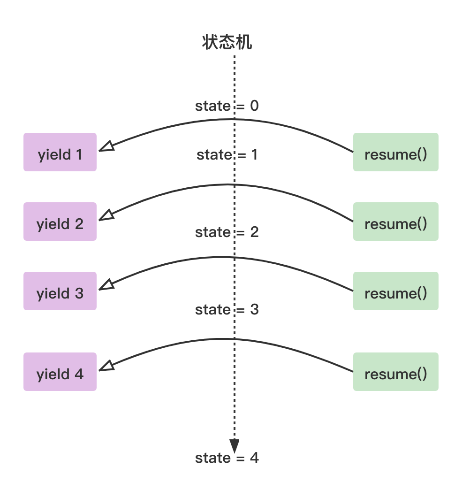

# yield(生成器)

如果要支持`async/await` 异步开发，最好是能有协程支持。所以，Rust的第一步是需要引进协程(Coroutine)。

## 协程

协程的实现分为两类：有栈协程(stackfull)、无栈协程(stackless)。

&nbsp;

### 有栈协程(stackfull)

有栈协程的实现，一般每个协程都自带独立的栈，功能强大，但是比较耗内存，性能不如无栈协程。

&nbsp;

### 无栈协程(stackless)

无栈协程的实现，一般是基于状态机(State Machine)，不实用独立的栈，具体的应用形式叫**生成器(Generator)**。这种形式的协程性能更好，但功能要弱于有栈协程，但也够用了。在Rust标准库支持的协程功能，就属于无栈协程。

&nbsp;

### 生成器

```rust
// cargo +nightly run

#![feature(generators, generator_trait)]

use std::ops::Generator;
use std::pin::Pin;

fn main() {
    let ret = "foo";
    let mut generator = move || {
        // 创建生成器
        // yield 专门为生成器引入的关键字
        yield 1;                        // 生成器挂起，返回 1
        return ret                      // 退出
    };

    // 此函数将恢复生成器的执行或开始执行(如果尚未执行)。 
    // 此调用将返回到生成器的最后一个暂停点，从最新的 `yield` 恢复执行。 
    // 生成器将继续执行，直到它产生或返回，此时此函数将返回。
    Pin::new(&mut generator).resume(());
    Pin::new(&mut generator).resume(());
}
```



上图展示了 `yield` 和 `resume` 的跳转过程。第一次调用 `resume` 方法，跳到生成器中，执行到 `yield 1`(挂起生成器)，跳回到调用者。第二次调用 `resume` 方法，同样会跳到生成器中，然后继续从上次的 `yield 1` 位置开始执行代码，直到遇到 `yield 2`(挂起生成器)，再跳回到调用者。依此类推，直到生成器代码执行完毕，到达 `return`。

如上实例用简单的数字表示状态，但返回结果实际上是一种枚举类型 `GeneratorState<Y, R>`，该类型只包括 `Yielded(Y)` 和 `Complete(R)` 两种值。**`Yielded(Y)`表示在生成器执行过程中产生的各种状态，也就是程序在生成器代码中挂起的位置；而 `Complete(R)` 表示生成器执行完成后最终返回的值。**

&nbsp;

#### 生成器实现原理

`Generator` 包含了两种关联类型，即 `Yield` 和 `Return`，分别对应于 `yield`的状态类型和生成器执行完成后最终返回的类型。

```rust
// library/core/src/ops/generator.rs

pub trait Generator<R = ()> {
    // 生成器产生的值的类型
    type Yield;

    // 生成器退出时返回的值的类型
    type Return;

    // 生成器恢复时，执行该函数
    fn resume(self: Pin<&mut Self>, arg: R) -> GeneratorState<Self::Yield, Self::Return>;
}
```

&nbsp;

#### 生成器脱糖

如上实例代码是加了糖的，编译器经过编译后会进行脱糖，脱糖后编译器自动生成一个匿名的枚举体，然后为该枚举体自动实现 `Generator`。

```rust
#![feature(arbitrary_self_types, generators, generator_trait)]

use std::ops::{Generator, GeneratorState};
use std::pin::Pin;

fn main() {
    let ret = "foo";
    let mut generator = {
        enum __Generator {
            Start(&'static str),
            Yield1(&'static str),
            Done,
        }

        impl Generator for __Generator {
            type Yield = i32;
            type Return = &'static str;

            fn resume(mut self: Pin<&mut Self>, resume: ()) -> GeneratorState<i32, &'static str> {
                use std::mem;
                match mem::replace(&mut *self, __Generator::Done) {
                    __Generator::Start(s) => {
                        *self = __Generator::Yield1(s);
                        GeneratorState::Yielded(1)
                    }

                    __Generator::Yield1(s) => {
                        *self = __Generator::Done;
                        GeneratorState::Complete(s)
                    }

                    __Generator::Done => {
                        panic!("generator resumed after completion")
                    }
                }
            }
        }

        // Start作为初始状态
        __Generator::Start(ret)
    };

    Pin::new(&mut generator).resume(());
    Pin::new(&mut generator).resume(());
}
```

&nbsp;

### 生成器与迭代器

生成器是一个非常有用的功能，如果只关注计算的过程，而不关心计算的结果，则可以将 `Return` 设置为单元类型，只保留 `Yield` 的类型，那么生成器就可以化身为迭代器。

```rust
#![feature(generators, generator_trait)]
use std::ops::{Generator, GeneratorState};
use std::pin::Pin;

fn main() {
    let mut gen = || {
        let mut x = 0;
        loop {
            x += 1;
            yield x;
        }
    };
    for _ in 0..10 {
        match Pin::new(&mut gen).resume(()) {
            GeneratorState::Yielded(i) => println!("{:?}", i),
            _ => println!("Completed"),
        }
    }
}
```

生成器的性能比迭代器更高，因为生成器是一种延迟计算或惰性计算，它避免了比必要的计算，只有在每次需要时才通过 `yield` 产生相关的值。
