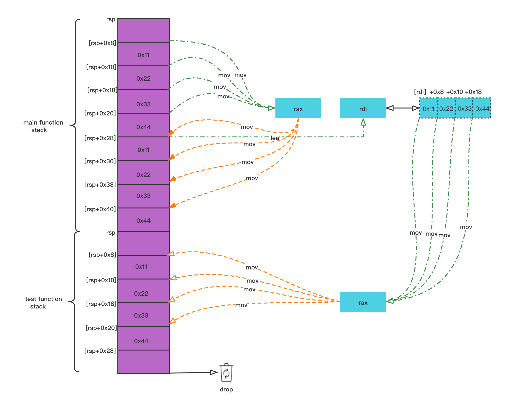

# 所有权(Ownership)

所有权目的是安全管理内存等资源，及时有效释放。

规则：(ownership rules)

* 每个值（value）都有一个所有者（owner）
* 同一时刻，只能有一个所有者
* 当所有者超出范围（scope），值被删除（drop）

&nbsp;

## 作用域

在进一步了解所有权之前，需要简要了解一下作用域。Rust中所有权与作用域协同工作。因此，作用域只不过是**变量**和**值**存在的环境。代码中的作用域是由一对花括号表示的。无论何时使用块表达式都会创建一个作用域，即任何以花括号开头和结尾的表达式。此外，作用域支持互相嵌套，并且可以在子作用域中访问父作用域的元素，但返过来不行。

```rust

fn main() {
    let level_0_str = String::from("foo");

    {
        let level_1_number = 9;
        {
            let mut level_2_vector = vec![1, 2, 3];
            level_2_vector.push(level_1_number);   // 可以访问
        }   // level_2_vector 离开作用域

         // level_2_vector.push(4);  不再有效
    }    // level_1_number 离开作用域
}        // level_0_str 离开作用域 
```

```x86asm
; Dump of assembler code for function ddd::main:
; /root/rs/ddd/src/main.rs:
   fn main() {
   0x0000555555559db0 <+0>:   sub    rsp,0x48
   0x0000555555559db4 <+4>:   lea    rax,[rip+0x35295]        # 0x55555558f050

      let level_0_str = String::from("foo");
   0x0000555555559dbb <+11>:  mov    rdi,rsp
   0x0000555555559dbe <+14>:  mov    rsi,rax
   0x0000555555559dc1 <+17>:  mov    edx,0x3
   0x0000555555559dc6 <+22>:  call   0x55555555ab90 <<alloc::string::String as core::convert::From<&str>>::from>

      {
         let level_1_number = 9;
   0x0000555555559dcb <+27>:  mov    DWORD PTR [rsp+0x34],0x9
   0x0000555555559dd3 <+35>:  mov    edi,0xc
   0x0000555555559dd8 <+40>:  mov    esi,0x4

         {
            let mut level_2_vector = vec![1, 2, 3];
   0x0000555555559ddd <+45>:  call   0x55555555ac90 <alloc::alloc::exchange_malloc>
   0x0000555555559de2 <+50>:  mov    DWORD PTR [rax],0x1
   0x0000555555559de8 <+56>:  mov    DWORD PTR [rax+0x4],0x2
   0x0000555555559def <+63>:  mov    DWORD PTR [rax+0x8],0x3
   0x0000555555559df6 <+70>:  lea    rdi,[rsp+0x18]
   0x0000555555559dfb <+75>:  mov    edx,0x3
   0x0000555555559e00 <+80>:  mov    rsi,rax
   0x0000555555559e03 <+83>:  call   0x55555555d150 <alloc::slice::<impl [T]>::into_vec>
   0x0000555555559e08 <+88>:  jmp    0x555555559e0a <ddd::main+90>
   0x0000555555559e0a <+90>:  lea    rdi,[rsp+0x18]
   0x0000555555559e0f <+95>:  mov    esi,0x9

            level_2_vector.push(level_1_number);
=> 0x0000555555559e14 <+100>: call   0x55555555cfe0 <alloc::vec::Vec<T,A>::push>
   0x0000555555559e19 <+105>: jmp    0x555555559e1b <ddd::main+107>
   0x0000555555559e1b <+107>: lea    rdi,[rsp+0x18]

         }
   0x0000555555559e20 <+112>: call   0x555555559490 <core::ptr::drop_in_place>   ; level_2_vector 离开作用域
   0x0000555555559e25 <+117>: jmp    0x555555559e27 <ddd::main+119>

         // level_2_vector.push(4);                                              // 不再有效
      }
   0x0000555555559e27 <+119>: mov    rdi,rsp
   0x0000555555559e2a <+122>: call   0x555555559540 <core::ptr::drop_in_place>   ; level_1_number 离开作用域
   0x0000555555559e2f <+127>: add    rsp,0x48
   0x0000555555559e33 <+131>: ret
   }
   0x0000555555559e3e <+142>: mov    rdi,rsp
   0x0000555555559e41 <+145>: call   0x555555559540 <core::ptr::drop_in_place>   ; level_0_str 离开作用域
```

`drop` 方法会被放在作用域结束标记 `}` 之前调用。

## 所有权转移(move)

**在Rust中，变量绑定默认具有移动语义。赋值、传参和返回值都可能导致所有权转移。所有权转移(move)后，原绑定失效，不能再次引用，由新拥有者负责释放。**

* 如果值可复制（copy），则值传递。
* 其他情况，转移（move）所有权。

```rust
fn main() {
    let s = String::from("abc");    // heap分配空间

    {
        let s2 = s;                 // Move!!! 所有权转移

        println!("{:?}", s2);
    }                               // 此处释放!!!

    println!("{:?}", s);            // 所有权已经被转移，所以此处不能再引用
                     // ^ value borrowed here after move
}
```

```x86asm
; Dump of assembler code for function ddd::main:
   0x0000555555559930 <+0>:   sub    rsp,0xa8
   0x0000555555559937 <+7>:   lea    rax,[rip+0x34712]        # 0x55555558e050
   0x000055555555993e <+14>:  lea    rdi,[rsp+0x18]
   0x0000555555559943 <+19>:  mov    rsi,rax
   0x0000555555559946 <+22>:  mov    edx,0x3
   0x000055555555994b <+27>:  call   0x55555555a170 <<alloc::string::String as core::convert::From<&str>>::from>
   0x0000555555559950 <+32>:  mov    rax,QWORD PTR [rsp+0x28]
   0x0000555555559955 <+37>:  mov    QWORD PTR [rsp+0x40],rax
   0x000055555555995a <+42>:  movups xmm0,XMMWORD PTR [rsp+0x18]
   0x000055555555995f <+47>:  movaps XMMWORD PTR [rsp+0x30],xmm0
   0x0000555555559964 <+52>:  lea    rax,[rsp+0x30]
   0x0000555555559969 <+57>:  mov    QWORD PTR [rsp+0x88],rax
   0x0000555555559971 <+65>:  mov    rax,QWORD PTR [rsp+0x88]
   0x0000555555559979 <+73>:  mov    QWORD PTR [rsp+0x90],rax
   0x0000555555559981 <+81>:  lea    rsi,[rip+0x718]        # 0x55555555a0a0 <<alloc::string::String as core::fmt::Debug>::fmt>
   0x0000555555559988 <+88>:  mov    rdi,rax
   0x000055555555998b <+91>:  call   0x55555555acb0 <core::fmt::ArgumentV1::new>
   0x0000555555559990 <+96>:  mov    QWORD PTR [rsp+0x10],rdx
   0x0000555555559995 <+101>: mov    QWORD PTR [rsp+0x8],rax
   0x000055555555999a <+106>: jmp    0x55555555999c <ddd::main+108>
   0x000055555555999c <+108>: mov    rax,QWORD PTR [rsp+0x8]
   0x00005555555599a1 <+113>: mov    QWORD PTR [rsp+0x78],rax
   0x00005555555599a6 <+118>: mov    rcx,QWORD PTR [rsp+0x10]
   0x00005555555599ab <+123>: mov    QWORD PTR [rsp+0x80],rcx
   0x00005555555599b3 <+131>: lea    rsi,[rip+0x42b76]        # 0x55555559c530
   0x00005555555599ba <+138>: lea    rdi,[rsp+0x48]
   0x00005555555599bf <+143>: mov    edx,0x2
   0x00005555555599c4 <+148>: lea    rcx,[rsp+0x78]
   0x00005555555599c9 <+153>: mov    r8d,0x1
   0x00005555555599cf <+159>: call   0x55555555af00 <core::fmt::Arguments::new_v1>
   0x00005555555599d4 <+164>: jmp    0x5555555599d6 <ddd::main+166>
   0x00005555555599d6 <+166>: lea    rax,[rip+0x16153]        # 0x55555556fb30 <std::io::stdio::_print>
   0x00005555555599dd <+173>: lea    rdi,[rsp+0x48]
   0x00005555555599e2 <+178>: call   rax
   0x00005555555599e4 <+180>: jmp    0x5555555599e6 <ddd::main+182>
=> 0x00005555555599e6 <+182>: lea    rdi,[rsp+0x30]
   0x00005555555599eb <+187>: call   0x555555559380 <core::ptr::drop_in_place>         ; drop s2 !!!
   0x00005555555599f0 <+192>: add    rsp,0xa8
   0x00005555555599f7 <+199>: ret
   0x00005555555599f8 <+200>: lea    rdi,[rsp+0x30]
   0x00005555555599fd <+205>: call   0x555555559380 <core::ptr::drop_in_place>         ; drop s !!!
   0x0000555555559a02 <+210>: mov    rdi,QWORD PTR [rsp+0x98]
   0x0000555555559a0a <+218>: call   0x555555559050 <_Unwind_Resume@plt>
   0x0000555555559a0f <+223>: ud2
   0x0000555555559a11 <+225>: mov    QWORD PTR [rsp+0x98],rax
   0x0000555555559a19 <+233>: mov    DWORD PTR [rsp+0xa0],edx
   0x0000555555559a20 <+240>: jmp    0x5555555599f8 <ddd::main+200>
End of assembler dump.
```

* 通过以上反汇编代码可以看出，在内层`{}`内，变量 `s` 所有权转移至`s2`，然后超出`}`作用域后，调用 `drop` 将变量`s2`进行销毁
* 此时变量 `s` 在heap上仍然存在，但处于未初始化状态，不可被访问。超出main函数栈帧，调用 `drop` 将变量 `s`进行销毁。

```x86asm
; s2
(gdb) x/xg $rsp+0x30
0x7fffffffe390:   0x00005555555a09d0

(gdb) x/3xb 0x00005555555a09d0
0x5555555a09d0:   0x61  0x62  0x63
```

> 释放操作是编译器插入的drop_in_place完成的

&nbsp;

### 可变性可以改变

转移时，可变性可以改变。

```rust
fn main() {
    let s = String::from("abc");    // mut string

    let mut s2 = s;
    s2.push_str("def");

    println!("{:?}", s2);
}
```

&nbsp;

### match表达式

在match表达式中，移动类型默认也会被移动。

```rust
#[derive(Debug)]
enum Food {
    Cake,
    Pizza,
    Salad
}

#[derive(Debug)]
struct Bag {
    food: Food
}

fn main() {
    let bag = Bag { food: Food::Cake };
    match bag.food {
        Food::Cake => println!("I got cake"),
        a => println!("I got {:?}", a)
    }

    // println!("{:?}", bag);
                        // ^^^ value borrowed here after partial move
}
```

&nbsp;

### self作为第一参数

任何以`self`作为第一参数的方法都将获取调用该方法的值的所有权。这意味着对该值调用方法后，你无法再次使用该值。

```rust
struct Item(u32);

impl Item {
    fn new() -> Self {
        Item(1024)
    }

    fn take_item(self) {

    }
}

fn main() {
    let it = Item::new();
    it.take_item();
    println!("{}", it.0);
                     // ^^^^ value borrowed here after move
}
```

take_item是一个以`self`作为第一个参数的实例方法。在调用之后，他将在方法内移动，并在函数作用域结束时被释放。

&nbsp;

### 闭包中的所有权

在闭包中同样存在所有权转移。

```rust
#[derive(Debug, Clone)]
struct Foo;

fn main() {
    let a = Foo;

    let _closure = || {
        let b = a;
    };

    // println!("{:?}", a);
                     // ^ value borrowed here after move
}
```

&nbsp;

我们可以在闭包内调用`a.clone()`并将它分配给b。

```rust
let _closure = || {
   let b = a.clone();
};
```

```x86asm
; let a = Foo;
0x00005555555591e4 <+4>:   lea    rax,[rsp+0x18]

; let b = a.clone();
=> 0x00005555555591ee <+14>:  mov    QWORD PTR [rsp+0x68],rax
   0x00005555555591f3 <+19>:  mov    rax,QWORD PTR [rsp+0x68]
```

&nbsp;

### 案例剖析

用下面的例子，观察值拷贝，以及所有权转移后的释放问题。

```rust
#[derive(Debug)]                // 导出结构体，方便调试
struct Data {
    a: i64,
    b: i64,
    c: i64,
    d: i64,
}

// impl Drop：允许我们在值要离开作用域时执行一些代码，
// 可以为任何类型提供`Drop trait`的实现，
// 同时所指定的代码被用于释放类似于文件或网络连接的资源。
impl Drop for Data {             // 实现特征
    fn drop(&mut self) {
        println!("dropping!");
    }
}

fn test(d: Data) {              // 值传递，转移所有权
    let _d = d;
}

fn main() {
    let d = Data{a:0x11, b:0x22, c:0x33, d: 0x44};
    test(d);
}
```

```x86asm
(gdb) b 16
(gdb) b 21
(gdb) r

(gdb) disass
   fn main() {
   0x0000555555559240 <+0>:   sub    rsp,0x48

      let d = Data{a: 0x11, b:0x22, c:0x33, d:0x44};
   0x0000555555559244 <+4>:   mov    QWORD PTR [rsp+0x8],0x11        --+ +0x8
   0x000055555555924d <+13>:  mov    QWORD PTR [rsp+0x10],0x22         |
   0x0000555555559256 <+22>:  mov    QWORD PTR [rsp+0x18],0x33         |
   0x000055555555925f <+31>:  mov    QWORD PTR [rsp+0x20],0x44       --+ +0x20 + 8

      test(d);
=> 0x0000555555559268 <+40>:  mov    rax,QWORD PTR [rsp+0x8]
   0x000055555555926d <+45>:  mov    QWORD PTR [rsp+0x28],rax        --+ +0x28
   0x0000555555559272 <+50>:  mov    rax,QWORD PTR [rsp+0x10]          |
   0x0000555555559277 <+55>:  mov    QWORD PTR [rsp+0x30],rax          |
   0x000055555555927c <+60>:  mov    rax,QWORD PTR [rsp+0x18]          | arg: d.copy
   0x0000555555559281 <+65>:  mov    QWORD PTR [rsp+0x38],rax          |
   0x0000555555559286 <+70>:  mov    rax,QWORD PTR [rsp+0x20]          |
   0x000055555555928b <+75>:  mov    QWORD PTR [rsp+0x40],rax        --+ +0x40 + 8


   0x0000555555559290 <+80>:  lea    rdi,[rsp+0x28]                  --> pass d2.addr
   0x0000555555559295 <+85>:  call   0x555555559200 <closure::test>

   }
   0x000055555555929a <+90>:  add    rsp,0x48
   0x000055555555929e <+94>:  ret

(gdb) b *0x555555559200
(gdb) disassemble
Dump of assembler code for function closure::test:
=> 0x0000555555559200 <+0>:   sub    rsp,0x28
   0x0000555555559204 <+4>:   mov    rax,QWORD PTR [rdi]
   0x0000555555559207 <+7>:   mov    QWORD PTR [rsp+0x8],rax
   0x000055555555920c <+12>:  mov    rax,QWORD PTR [rdi+0x8]
   0x0000555555559210 <+16>:  mov    QWORD PTR [rsp+0x10],rax
   0x0000555555559215 <+21>:  mov    rax,QWORD PTR [rdi+0x10]
   0x0000555555559219 <+25>:  mov    QWORD PTR [rsp+0x18],rax
   0x000055555555921e <+30>:  mov    rax,QWORD PTR [rdi+0x18]
   0x0000555555559222 <+34>:  mov    QWORD PTR [rsp+0x20],rax
   0x0000555555559227 <+39>:  lea    rdi,[rsp+0x8]
   0x000055555555922c <+44>:  call   0x555555559350 <core::ptr::drop_in_place>
   0x0000555555559231 <+49>:  add    rsp,0x28
   0x0000555555559235 <+53>:  ret

(gdb) x/10xg $rsp               ; main stack_frame 显然有复制品存在
0x7fffffffe398:   0x000055555555929a   0x00007fffffffe498
0x7fffffffe3a8:   0x0000000000000011   0x0000000000000022
0x7fffffffe3b8:   0x0000000000000033   0x0000000000000044
0x7fffffffe3c8:   0x0000000000000011   0x0000000000000022
0x7fffffffe3d8:   0x0000000000000033   0x0000000000000044
```

&nbsp;

#### 具体实现

如下图所示，赋值操作由两部分组成, `d` 被分配在`stack`，Data数据分配在`heap`, `d` 指向该数据地址。当调用test函数，则发生了值拷贝(`d2`), `d2` 指向相同heap位置，发生了`所有权转移`。

当发生所有权转移，d变量不可再访问，数据超出test函数作用域，释放资源。

```rust
Stack               Heap
d --------------->  Data{a:0x11, b:0x22, c:0x33, d: 0x44}
|                  ^
|                  |
|                  |
|                  | 
d.copy --- d2 -----+--> Drop
|
|
d 转移所有权后，d对象失效，不可访问
```

&nbsp;

#### stack流程图



> 可以看出，数据被复制。
> 原数据内存区域不会再访问，也不会执行释放操作。
> 新拥有者负责释放，也就是说drop只会执行一次。

&nbsp;

## 复制

Rust 是了严格值传递（pass-by-value）语言。如果对象实现`Copy`特征，则表示可复制，不存在转移问题。**标量类型实现了复制特征，元素类型实现了`Copy`特征的元组和数组也会复制**。`Copy`特征通常用于可以在`stack`上完全表示的类型，也就是说它们自身没有任何部分位于 `heap`上。

```rust
fn main() {
    let s = [1, 2, 3, 4];               // 数组实现了Copy操作

    {
        let s2 = s;
        println!("{:?}", s2);
    }

    println!("{:?}", s);
}
```

&nbsp;

### Copy案例

```rust
#[derive(Copy, Clone, Debug)]
struct Dummy;

fn main() {
    let a = Dummy;
    let b = a;

    println!("{:?}", a);
    println!("{:?}", b);
}
```

### Clone案例

没有实现 **Copy** 特征的类型包括 `Vec<T>`、`String`和可变引用。为了获得这些值的复制，我们需要使用目的性更明确的 `Clone` 特征。

```rust
#[derive(Clone, Debug)]
struct Dummy {
    items: u32
}

fn main() {
    let a = Dummy { items: 54 };
    let b = a.clone();
    println!("a: {:?}, b: {:?}", a, b);
}
```

```x86asm
(gdb) disassemble
; let a = Dummy { items: 54 };
0x00005555555591f7 <+7>:   mov    DWORD PTR [rsp+0x30],0x36

; let b = a.clone();
0x00005555555591ff <+15>:  lea    rdi,[rsp+0x30]
0x0000555555559204 <+20>:  call   0x5555555593b0 <<ddd::Dummy as core::clone::Clone>::clone>
0x0000555555559209 <+25>:  mov    DWORD PTR [rsp+0x34],eax

(gdb) x/2xw $rsp+0x30
0x7fffffffe390:   0x00000036  0x00000036        ; $rsp+0x30 -> 0x36  ==> let b = a.clone();  ==> $rsp+0x36 -> 0x36
```

&nbsp;


&nbsp;

## Copy和Clone

**Copy**是隐式调用，**Clone**需要显式调用。Clone是Copy的父级特征(trait)，任何实现Copy特征(trait)的类型必须实现Clone。Copy和Clone特征传达了在代码中使用类型如何进行复制的原理。

&nbsp;

### Copy trait

Copy特征通常用于在stack上完全表示的类型，自身没有任何部分位于Heap；Copy开销很大，必须从发生复制操作，如果类型实现了Copy，则从一个变量到另一个变量的赋值操作将隐式复制数据。

Copy是一种自动化特征，大多数stack的数据类型都自动实现了它，例如基元类型(primitive type)和不可变引用，即&T。Copy特征复制方式与C语言中的memcopy函数类似。

默认情况下不会为自定义类型实现Copy Trait，因为Rust希望显示指定复制操作，并且要求开发人员必须选择实现该特征(Trait)。Copy Trait取决于Clone Trait。

没有实现Copy Trait的类型包括`Vec<T>`、`String`和可变引用。

&nbsp;

### Clone trait

`Clone trait`用于显式复制。Clone有一个clone方法，用于获取接收者的不可变引用，即`&self`，并返回相同类型的新值。**用户自定义类型或者需要提供能够复制自身的包装器类型，应通过实现`clone`方法实现`Clone trait`**。

clone method 源码实现:

```rust
// library/core/src

public trait Clone {
   // ...
   fn clone(&self) -> self;
   // ...
}
```

&nbsp;

String和Vec这类元素很难进行复制，只实现了Clone trait。智能指针类型也实现了Clone trait，它只是在指向heap相同数据的同时“复制指针”和“额外的元数据”。

```rust
#[derive(Clone, Debug)]
struct Dummy {
   items: u32
}

fn main() {
   let a = Dummy{ items: 54 };
   let b = a.clone();
   println!("a: {:?}, b: {:?}", a, b);
}
```

> 基元类型: 编译器直接支持的数据类型称为基元类型。

&nbsp;

## Copy和move区别

移动(move)和复制(Copy 特征)是有区别的，尽管它们在底层都进行了数据浅拷贝。**复制后，原数据对象和复制两个实体都可用。移动则导致原始对象失效，成为“逻辑上未初始化”状态**。

&nbsp;

## 总结

尽管所有权、引用、借用等概念导致学习更陡峭的学习曲线，但优点是这些都是编译期行为，并没有额外的运行期负担。最关键的是，在手动和垃圾回收器之间，找到一条性能优秀的资源管理方案。
