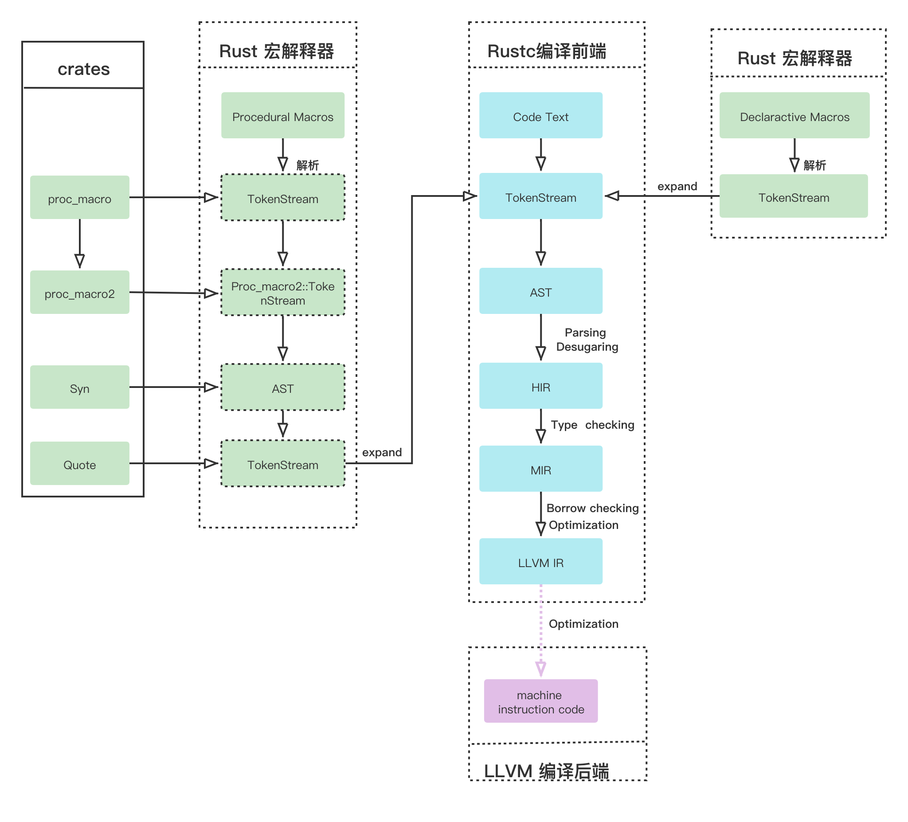
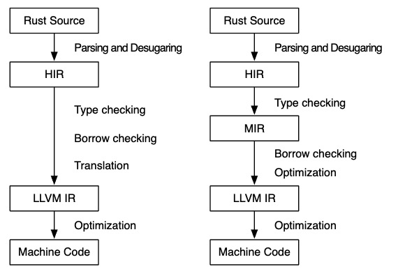

# 编译

直接使用 `rustc` 编译器，或使用 `cargo` 构建工具。

## 编译过程

Rust编译过程主要有以下步骤:

源代码 -> 词法分析tokens -> 抽象语法树AST -> 高层中间语言HIR -> 中层中间语言MIR -> 底层语言虚拟机中间语言LLVM IR -> 机器码。



&nbsp;

### 词法分析

* TokenStream：词法分析阶段，将文本语法中的元素识别为Rust编译器可以理解的词条。
* AST：通过语法分析形成抽象语法树；进行`Desugaring`(脱糖处理)。

### 中间语言(IR)

词法分析之后，需要进行语义分析，Rust里面语义分析会持续到两层的中间语言(IR). `RFC 1211` 之前并不是两层中间语言，只有一层HIR中间语言。



* HIR：目前HIR主要是将AST进一步降级，方便编译器理解的一种高级中间语言。包括`rustc_typeck`，用于类型检查和类型推断。

* THIR(`Typed High-Level Intermediate Representation`)：它是在类型检查后生成的，它(截止2021/08)仅用于构造MIR和穷举检查，该IR具体实现是在MIR。该IR还提供一个 `unsafety` 检查器，它在THIR上运行，作为当前MIR `unsafety` 替代品，可以通过将 `-Z thir-unsafeck` 标志传递给 `rustc` 进行替代 MIR `unsafety`。

* MIR：它是由HIR构建的，它是Rust的一种彻底简化的形式，用于对流信息的安全检查，尤其是借用检查器(`borrow checker`)；优化代码和代码生成。

&nbsp;

### cargo-inspect

`cargo-inspect` 可以对rust源代码进行desugering(脱糖)，并查看幕后发生的事情。

```bash
# 目前beta版本还不支持，只能运行在nightly版本

$> rustup install nightly            # 安装nightly版本
$> rustup component add rustfmt      # 添加rustfmt
$> cargo install cargo-inspect       # 安装cargo-inspect

$> cargo [+nightly] inspect main.rs  # 进行desugering
```

&nbsp;

## rustc

编译器只接受 crate root 作为输入文件。

```bash
$> rustc [OPTIONS] INPUT
```

* `--crate-type`: 编译类型。(lib, bin)
* `--crate-name`: 
* `--edition`: 版本。 (2015, 2018)
* `-g`: 生成调试信息
* `-O`: `优化代码`。(`-C opt-level=2`)
* `-o`: 输出文件名。
* `-v`: 详细输出。

&nbsp;

> 优化等级:
>
> 0: 不优化
>
> 1: 基础优化
>
> 2: 标准优化
>
> 3: 深度优化(all)
>
> s: 优化尺寸(size)
>
> z: 优化尺寸，关闭循矢量化

&nbsp;

## cargo

整合工具链，可完成如下工作:

* 项目管理。
* 源码编译。
* 依赖管理。

```bash
$ cargo [+toolchain] [OPTIONS] [SUBCOMMAND]
```

* `new`: 创建新包  
    * `--bin`: 使用 `binray` 模版。
    * `--lib`: 使用 `library` 模版。
    * `--name`: 包名。(默认使用目标名)
* `init`: 将现有目录初始化为包。

&nbsp;

* `check, c`: 分析并报告错误，不生成目标文件。
* `run, r`: 运行包
    * `--bin <name>`: 指定 bin 目标
    * `--package <spec>`: 指定 package 目标
    * `--release`: 发布版本

* `build, b`: 编译
    * `-v`: 输出 rustc详细信息。
    * `--workspace`: 编译工作空间下的所有包。
    * `--exclude <spec>`: 编译时忽略指定包。
    * `--lib`: 仅编译library。
    * `--bins`: 编译所有binary。
    * `--release`: 变异优化过的发布版本。

* `test, t`: 运行测试。
* `bench`: 运行性能测试。
* `clean`: 清除 target目录。
* `doc`: 生成包和依赖文档。

&nbsp;

* `update`: 更新依赖项
* `search`: 搜索包(crate.io)
* `publish`: 发布包(crate.io)

&nbsp;

* `--verbose, -v`: 输出详情编译参数信息。

&nbsp;

[Rustc Book](https://doc.rust-lang.org/rustc/index.html)

[Cargo Commands](https://doc.rust-lang.org/cargo/commands/index.html)

[Cargo Profiles](https://doc.rust-lang.org/cargo/reference/profiles.html)