# 内部实现

## The Abstract Machine(抽象机器)

和 `C` 和 `C++`一样，Rust也是基于抽象机器。

&nbsp;

### The abstract machine

* 不是运行时(Runtime)，没有任何运行时开销，它是一种计算模型的抽象
* 包含内存(`stack,...`)、执行语义等概念
* 关注一些CPU可能不关注事情
* 达成程序员和机器之间的约定
* 利用以上规则，进行优化


&nbsp;

## Language Sugar(语法糖)

* `Coercions`：弱化类型以匹配签名(隐式地强制类型在某些上下文中进行更改)，主要集中在指针和生命周期上。Eg：`&mut T` => `&T`
* `Deref`：解引用
* `Prelude`：自动导入标准库包，eg: `Option`, `Drop`, ...
* `Reborrow`：可以使一个变量同时存在多个可变引用
* `Lifetime Elision`：Rust为了程序可读性，如果你的代码适合省略生命周期规则，可以在函数签名中省略生命周期。
* `Method Resolution`：解引用或借用`x`，`x.f()`
* `Match Ergonomics`：用于模式匹配，目前匹配引用需要使用 `ref` 或者 `&`
* `Rvalue Static Promotion`：引用静态常量

&nbsp;

### Deref(解引用)

```rust
use std::ops::Deref;

struct DerefExample<T> {
    value: T
}

impl<T> Deref for DerefExample<T> {
    type Target = T;

    fn deref(&self) -> &self::Target {
        &self.value
    }
}

let x = DerefExample { value: 'a' };
assert_eq!('a', *x);
```

&nbsp;

### Reborrow

```rust
fn main() {
    let mut s = 11;
    let b = &mut s;
    let c:&mut i32 = b;   // let c = &mut s; -> 会报错，因为这种写法是borrow不是reborrow
    *c = 13;
    *b = 12;
}
```

&nbsp;

### Lifetime Elision

生命周期位置可以显示为**输入**或**输出**。对于 `fn`定义，`fn`类型和`trait Fn`、`FnMut`和`FnOnce`，输入类型是指**形参类型**，而输出指的是**结果类型**。

```rust
// 1. 输入位置省略了一个生命周期
// 2. 输出位置省略了两个生命周期
fn foo(s: &str) -> (&str, &str) {}
```

省略生命周期规则如下：

* 每个参数都有自己的生命周期
* 如果只有一个输入生命周期参数，则该生命周期将分配给所有输出生命周期参数
* 如果多个输入生命周期参数，包含`&self`或`&mut self`，则将`self`生命周期分配给所有省略的输出生命周期

除以上三种情况外，其它情况需要显示指定生命周期。

&nbsp;

#### Example

```rust
fn print(s: &str);                                                                  // 省略
fn print<'a>(s: &'a str);                                                           // 展开

fn debug(lvl: usize, s: &str);                                                      // 省略
fn debug<'a>(lvl: usize, s: &'a str);                                               // 展开

fn substr(s: &str, until: usize) -> &str;                                           // 省略
fn substr<'a>(s: &'a str, util: usize) -> &'a str;                                  // 展开

fn get_str() -> &str;                                                               // 非法的

fn frob(s: &str, t: &str) -> &str;                                                  // 非法的

fn get_mut(&mut self) -> &mut T;                                                    // 省略
fn get_mut<'a>(&'a mut self) -> &'a mut T;                                          // 展开 

fn args<T: ToCStr>(&mut self, args: &[T]) -> &mut Command;                          // 省略 
fn args<'a, 'b, T: ToCStr>(&'a mut self, args: &'b [T]) -> &'a mut Command;         // 展开

fn new(buf: &mut [u8]) -> BufWriter;                                                // 省略 
fn new(buf: &mut [u8]) -> BufWriter<'_>;                                            // 省略
fn new<'a>(buf: &'a mut [u8]) -> BufWriter<'a>;                                     // 展开 
```

&nbsp;

### Match Ergonomics

```rust
let x &Option<_> = &Some(0);

match x {
    &Some(ref y) => { ... },
    &None => { ... },
}

// or using *:

match *x {
    Some(ref x) => { ... },
    None => { ...},
}
```

* Rust Issue: [rust-lang/rust#42640](https://github.com/rust-lang/rust/issues/42640)

该问题修复后，可以使用以下简单方法:

```rust
let x: &Option<_> = &Some(0);

match x {
    Some(y) => { ... },    // `y` is a reference to `0`
    NOne => { ... },
}
```

&nbsp;

### Rvalue Static Promotion

如果想让表达式值存储在静态内存中，而不是在stack中，可以使用 `'static` 进行创建:

```rust
let x: &'static u32 = &42;
```

&nbsp;

在处理常量值时，必须显式定义常量或`'static`，以创建具有静态生命周期的引用。

```rust
fn generic<T>() -> &'static Option<T> {
    const X: &'static Option<T> = &None::<T>;
    X
}
```

&nbsp;

## Memory & Lifetimes(内存和生命周期)

包括变量所有权转移(`move`)、引用(`references`)、生命周期(`lifetimes`)等内容。

&nbsp;

### Type & Moves

#### Application Memory(进程内存分布)

* 应用程序内存底层就是字节数组。
* 内存可分为：
    * stack：栈内存，低地址空间，低开销内存(无需考虑内存垃圾回收)，大多数变量都存放在该地址空间
    * heap：堆内存，高地址空间，该地址空间较大而且操作灵活，一般通过 `Box<T>`进行内存分配，需要考虑内存垃圾回收的问题
    * static：静态存储区，该内存在程序编译的时候已经分配好，这块儿内存在程序的整个运行期都存在。它主要存放静态数据、全局数据和常量
    * code：存放函数体的二进制代码。运行程序就是执行代码，代码要执行就要加载进内存

&nbsp;


&nbsp;

#### Variables(变量)

```rust
// 使用let 声明，则位置位于stack中
let t = S(1);
```


&nbsp;

#### Moves(所有权转移)

```rust
// 1. 如果S实现Copy，会将t内的值移动到a的位置，或者复制它
// 2. move之后内存位置t无效，无法再读取
//  2.1. 底层字节数组并不为空，而是未定义
//  2.2. 如果仍想访问t，可使用unsafe方式进行访问
let a = t;
```


#### Type Safety

```rust
// 1. 该赋值无效，M::new() 字节无法转换为S类型的形式
let c: S = M::new();
```


&nbsp;

#### Scope & Drop(作用域&内存释放)

```rust
// 1. 当变量超出作用域，将该变量值进行清理(drop_in_place)
// 2. 新值分配给现有变量位置，超出作用域旧值也会被清理

{
    let mut c = S(2);
    c = S(3);
    let t = S(1);
    let a = t;
}   // <- Scope of `a`, `t`, `c` ends here, drop called on `a`, `c`.
```


&nbsp;

```rust
#[derive(Debug)]
struct Data{
    x: i64
}

fn main() {
    let mut s = Box::new(Data{x:1});
    let s = Box::new(Data{x: 2});
    println!("{:?}", s);
}
```

```x86asm
0x0000555555559487 <+7>:    mov    QWORD PTR [rsp+0x40],0x1
   0x0000555555559490 <+16>:    mov    rax,QWORD PTR [rsp+0x40]
   0x0000555555559495 <+21>:    mov    QWORD PTR [rsp+0xb8],rax
   0x000055555555949d <+29>:    mov    ecx,0x8
   0x00005555555594a2 <+34>:    mov    rdi,rcx
   0x00005555555594a5 <+37>:    mov    rsi,rcx
   0x00005555555594a8 <+40>:	mov    QWORD PTR [rsp+0x30],rax
   0x00005555555594ad <+45>:	call   0x555555559770 <alloc::alloc::exchange_malloc>
   0x00005555555594b2 <+50>:	mov    rcx,rax
   0x00005555555594b5 <+53>:	mov    rdx,QWORD PTR [rsp+0x30]
   0x00005555555594ba <+58>:	mov    QWORD PTR [rax],rdx
   0x00005555555594bd <+61>:	mov    QWORD PTR [rsp+0x38],rcx             ; [rsp+0x38] => Box::new(Data{ x: 1});
   0x00005555555594c2 <+66>:	mov    QWORD PTR [rsp+0x50],0x2
   0x00005555555594cb <+75>:	mov    rax,QWORD PTR [rsp+0x50]
   0x00005555555594d0 <+80>:	mov    QWORD PTR [rsp+0xc0],rax
   0x00005555555594d8 <+88>:	mov    ecx,0x8
   0x00005555555594dd <+93>:	mov    rdi,rcx
   0x00005555555594e0 <+96>:	mov    rsi,rcx
   0x00005555555594e3 <+99>:	mov    QWORD PTR [rsp+0x28],rax
   0x00005555555594e8 <+104>:	call   0x555555559770 <alloc::alloc::exchange_malloc>
   0x00005555555594ed <+109>:	mov    QWORD PTR [rsp+0x20],rax
   0x00005555555594f2 <+114>:	jmp    0x5555555594f4 <ddd::main+116>
   0x00005555555594f4 <+116>:	mov    rax,QWORD PTR [rsp+0x20]
   0x00005555555594f9 <+121>:	mov    rcx,QWORD PTR [rsp+0x20]
   0x00005555555594fe <+126>:	mov    rdx,QWORD PTR [rsp+0x28]
   0x0000555555559503 <+131>:	mov    QWORD PTR [rcx],rdx
   0x0000555555559506 <+134>:	mov    QWORD PTR [rsp+0x18],rax
   0x000055555555950b <+139>:	mov    rax,QWORD PTR [rsp+0x18]
   0x0000555555559510 <+144>:	mov    QWORD PTR [rsp+0x48],rax             ; [rsp+0x48] => Box::new(Data{x: 2});
   0x0000555555559515 <+149>:	lea    rcx,[rsp+0x48]
    
   ...
   
   0x000055555555959d <+285>:	lea    rdi,[rsp+0x48]   ; 待清理值 Box::new( Data{x: 1});
   0x00005555555595a2 <+290>:	call   0x555555559240 <core::ptr::drop_in_place>
   0x00005555555595a7 <+295>:	jmp    0x5555555595a9 <ddd::main+297>
   0x00005555555595a9 <+297>:	lea    rdi,[rsp+0x38]   ; 待清理值 Box::new( Data{ x: 2});
   0x00005555555595ae <+302>:	call   0x555555559240 <core::ptr::drop_in_place>
   0x00005555555595b3 <+307>:	add    rsp,0xc8
   0x00005555555595ba <+314>:	ret
   
   ...
```

&nbsp;

### Call Stack

#### Function Boundaries(函数边界)

```rust
// 1. 当一个函数被调用时，参数和返回值的内存被保留在stack上
// 2. 在调用f之前，a值被移动到指定stack位置(调用函数参数作准备)，在f运行期间，x(参数)的值像操作局部变量一样

fn f(x: S) { ... }

let a = S(1); // <- We are here
f(a);
```


&nbsp;

#### Nested Functions(嵌套函数)

```rust
// 1. 递归函数(Recursively Calling function)，或调用起它函数，会导致stack增长
// 2. 嵌套太多调用(尤其是无限递归)将导致stack增长，最终溢出，终止应用程序

fn f(x: S) {
    if once() { f(x) } // <- We are here (before recursion)
}

let a = S(1);
f(a);
```


&nbsp;

#### Repurposing Memory(内存复用)

```rust
// 1. 持有某种类型的stack将在函数之间(甚至函数内部)重新利用
// 2. 如下实例，在f上递归产生第二个x,在递归之后它m被重用
fn f(x: S) {
    if once() {
        f(x)
    }
    let m = M::new()
}

let a = S(1);
f(a);
```


&nbsp;

### References & Pointers(引用和指针)

#### References as Pointers

```rust
// 1. 引用类型可以保存某些内存位置
// 2. 类型 &S，绑定为名称r, 保存变量a(0x3)的位置，它必须是类型S，通过&a获得
// 3. 引用类型，跟所有其他类型一样，通常可以推断出来，我们可以省略它
let a = S(1);
let r: &S = &a;     // let r = &a;
```


&nbsp;

#### Access to Non-Owned Memory

```rust
// 1. 引用可以从(&S)读取，也可以写入它们指向的(&mut S)位置
// 2. 取消引用*r,意味着不使用r的位置或值；而是使用r指向的位置
// 3. d是从*r创建的; S(2)写入*r

let mut a = S(1);
let r = &mut a;
let d = r.clone();      // 复制(clone) r指向的目标，绑定变量d
*r = S(2);              // 为r目标变量设置新值
```


&nbsp;

#### References Guard Referents

```rust
// 1. 绑定的变量保证数据有效性
// 2. &mut T 必须保证和绑定的变量相同
// 2.1. 不允许写入无效数据
// 2.2. 不允许将目标对象清空

let mut a = ...;
let r = &mut a;
let d = *r;         // Invalid
*r = M::new();      // Invalid
```

&nbsp;

#### Raw Pointers

```rust
// 1. 与引用不同，指针没有安全保证
// 2. 指针可能执行无效或不存在的数据
// 3. 直接对指针解引用是非安全操作

let p: *const S = questionable_origion();
```


&nbsp;

### Lifetime Basics

#### "Lifetime" of Things

* 程序运行过程中，每个实体都是活跃的
* 活跃的实体包括
    * 代码段(Eg: 模块名称)
    * 变量初始化、废弃之间的逻辑
    * 变创建和释放之间的代码逻辑

以上的描述可以表示为：
* 该项目的作用域
* 该变量或作用域范围
* 参数的生命周期

同样，代码中的生命周期参数。例如：`r: &'a S`：
* 在作用域内都应该可以访问参数r
* 与r本身逻辑无关

&nbsp;

* `&'static S`：静态作用域，在程序运行期都可以访问


&nbsp;

#### Meaning for r: &'c s

* `r` 持有 `S` 的地址
* `r` 本身的寿命不能超过 `'c`


&nbsp;

#### Typelinkeness of Lifetimes

```rust
{
    let b = S(3);
    {
        let c = S(2);
        let r: &'c S = &c;
        {
            let a = S(0);
            r = &a;             // not Ok !!!
            r = &b;             // Ok !!!
        }
    }
}
```


&nbsp;

#### Borrowed State

```rust
// 1. 一旦通过 `&b` 或 `&mut b` 获取变量的地址，该变量就会被标记为借用（borrowed）
// 2. 借用时，不能再通过原始绑定修改地址的内容 `b`
// 3. 一旦通过 `&b` 或 `&mut b` 获取的地址停止使用时, 原始绑定 `b` 将再次起作用

let mut b = S(0);
let r = &mut b;

b = S(4);      // Will fail since `b` in borrowed state.

print_byte(r);
```


&nbsp;

### Lifetimes in Functions(生命周期在函数中应用)

#### Function Parameters

```rust
// 1. 局部变量被置于借用状态
// 2. 但是在编译期不知道返回哪个？

fn f(x: &S, y: &S) -> &u8 { ... }

let b = S(1);
let c = S(2);

let r = f(&b, &c);
```


&nbsp;

#### Problem of 'Borrowed' Propagation

```rust
// 1. f函数只能返回一个地址，因此并非所有情况下 `b` 和 `c`都需要保持锁定状态
// 2. 可以明确的是，我们知道一个参数不能再用于返回值

let b = S(1);
let c = S(2);

let r = f(&b, &c);

let a = b;   // Are we allowed to do this?
let a = c;   // Which one is _really_ borrowed?

print_byte(r);
```


&nbsp;

#### Lifetimes Propagate Borrowed State

```rust
// 1. `'c` 解决了签名中lifetime参数问题
// 2. 调用函数时，解释基于哪个输入地址作为输出地址
// 3. 函数体内，保证分配至少存活 `'c`的地址

fn f<'b, 'c>(x: &'b S, y: &'c S) -> &'c u8 { ... }

let b = S(1);
let c = S(2);

let r = f(&b, &c); // We know returned reference is `c`-based, which must stay locked,
                   // while `b` is free to move.

let a = b;

print_byte(r);
```

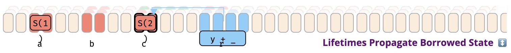

&nbsp;

#### Unlocking

```rust
// 1. 一旦最后一次使用可能指向它的任何引用结束，变量位置就会再次解锁

let mut c = S(2);

let r = f(&c);
let s = r;
                    // <- Not here, `s` prolongs locking of `c`.
print_byte(s);

let a = c;          // <- But here, no more use of `r` or `s`.
```

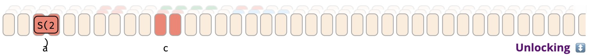

&nbsp;

## Data Layout(数据内存布局)

常见数据类型的内存布局。

&nbsp;

### Basic Types(基本类型)

内置的基本类型。

&nbsp;

#### Numeric Types 数字类型

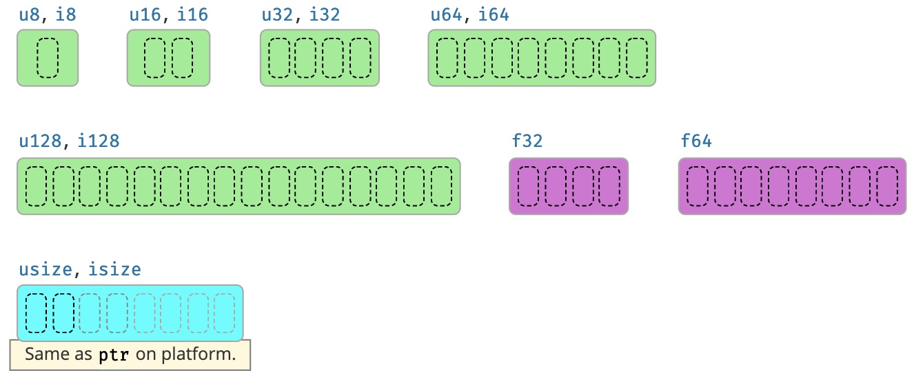

##### Unsigned Types(无符号类型)

|类型|最大值|
|----|----|
|u8|255|
|u16|65_535|
|u32|4_294_967_295|
|u64|18_446_744_073_709_551_615|
|u128|340_282_366_920_938_463_463_374_607_431_768_211_455|
|usize|取决于平台指针大小|

&nbsp;

##### Signed Types(有符号类型)

|类型|最小值|最大值|
|----|---|----|
|i8|-128|127|
|i16|-32_768|32_768|
|i32|-2_147_483_648|2_147_483_648|
|i64|-9_223_372_036_854_775_808|9_223_372_036_854_775_808|
|i128|-170_141_183_460_469_231_731_687_303_715_884_105_727|170_141_183_460_469_231_731_687_303_715_884_105_727|
|isize|取决于平台指针大小|取决于平台指针大小|

&nbsp;

##### Float Types(浮点类型)

* f32 内存表示位：


|f32|S(1)|E(8)|F(23)|value|
|----|---|----|---|---|
|Normalized number|±|1 to 254|any|±(1.F)2 * 2E-127|
|Denormalized number|±|0|non-zero|±(0.F)2 * 2-126|
|Zero|±|0|0|±|
|Infinity|±|255|0|±∞|
|NaN|±|255|non-zero|NaN|

&nbsp;

|f64|S(1)|E(11)|F(52)|value|
|----|---|----|---|---|
|Normalized number|±|1 to 2046|any|±(1.F)2 * 2E-1023|
|Denormalized number|±|0|non-zero|±(0.F)2 * 2-1022|
|Zero|±|0|0|±0|
|Infinity|±|2047|0|±∞|
|NaN|±|2047|non-zero|NaN|

&nbsp;

##### Casting Pitfalls(使用陷阱)

|陷阱|真实值|描述|
|----|---|----|
|3.9_f32 as u8|3|截断，x.round()值|
|314_f32 as u8|255|获取最接近的可用数字|
|f32::INFINITY as u8|255|相同，取最大的可用数字|
|f32::NAN as u8|0|-|
|_314 as u8|58|截断多余的位|
|_200 as i8|56|-|
|_257 as i8|-1|-|

&nbsp;

##### Arithmetical Pitfalls(算数陷阱)

|操作|真实值|描述|
|----|---|----|
|200_u8 / 0_u8|编译错误|-|
|200_u8 / _0|Panic|除数为0|
|200_u8 + 200_u8|编译器错误|超出最大值|
|200_u8 + _200[d]|Panic|编译需要checked\_,wrapping\_,... 检查|
|200_u8 + _200[r]|144|release模式将溢出|
|1_u8 / 2_u8|0|其它整数除法截断|
|0.8_f32 + 0.1_f32|0.90000004|-|
|1.0_f32 / 0.0_f32|f32::INFINITY|-|
|0.0_f32 / 0.0_f32|f32::NaN|-|

> [d]: Debug 模式编译
> 
> [r]: Release 模式编译

&nbsp;

#### Textual Types(文本类型)

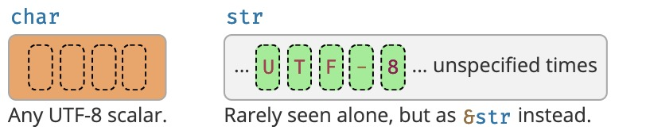

> str很少单独出现，一般是作为&str(引用)使用

&nbsp;

##### Basics

|类型|描述|
|----|---|
|char|4字节，只包含一个unicode字符|
|str|一个未知长度的u8数组，保证保存UTF-8编码的代码点|

&nbsp;

## Custom Types(自定义类型)

### T:Sized

该类型必须是编译期可以确定的大小，属于默认行为。

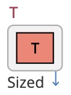

&nbsp;

### T:?Sized

该类型大小编译期无法确定，所以无法为它分配内存，该类型称之为DST(`Dynamic Sized Type`)。

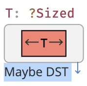

&nbsp;

### [T; n]

数组，固定大小。

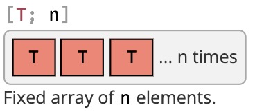

&nbsp;

### [T]

slice类型，无固定大小。通常情况下以 `&[T]` 的形式存在引用之后。


&nbsp;

### struct{}

空结构体。

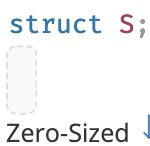

&nbsp;

### (A, B, C)

tuple(元组)。

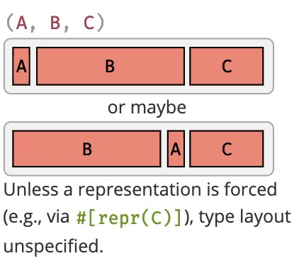

&nbsp;

### struct S{}

自定义结构体。

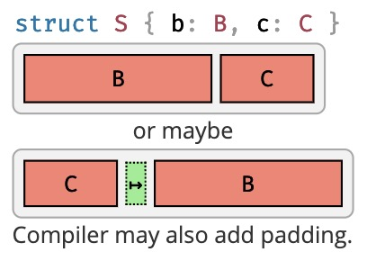

### enum

枚举。

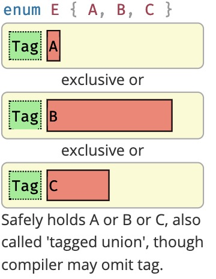

&nbsp;

### union

联合。

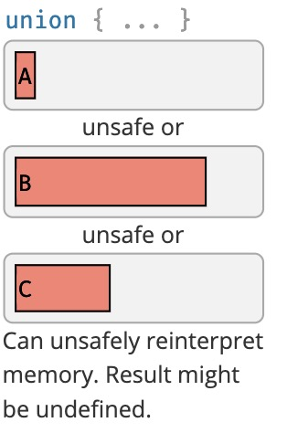

&nbsp;

## References & Pointers(引用和指针)

引用提供怼内存的安全访问，指针不保证内存的安全访问。引用的目标类型必须存在生命周期。

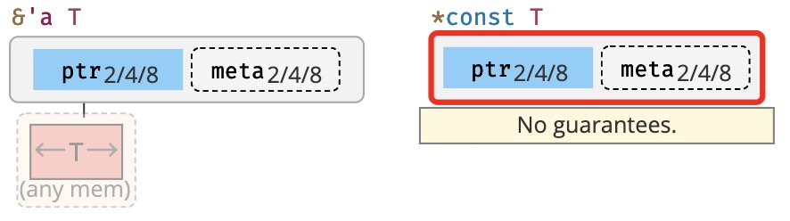

### Pointer Meta(指针元数据)

许多引用和指针类型可以携带一个额外的字段，指针元数据(Pointer Meta)可以是目标的元素或字节长度，也可以是指向`vtable`的指针。

带元数据的称为**胖指针**,否则成为**瘦指针**。

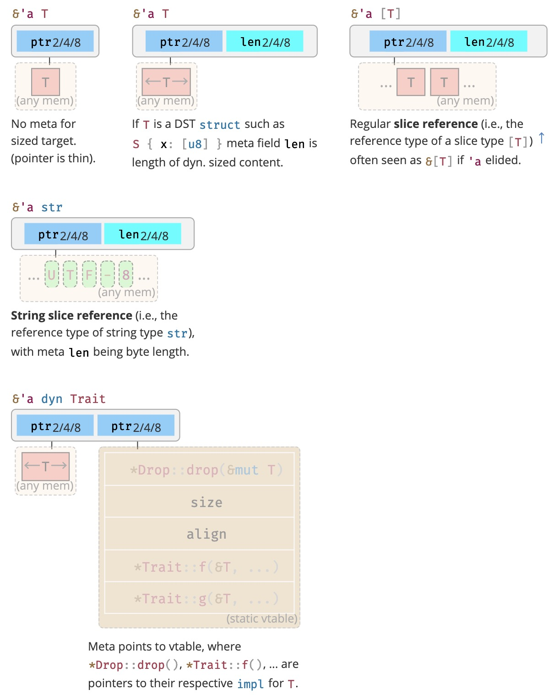

&nbsp;

* `&'a T`：`T` 没有元数据。
* `&'a T`：如果`T`是DST结构，Eg: `S {x: [u8]}`，元数据字段`len`是`dyn`的长度。
* `&'a [T]`：slice类型`[T]`的引用类型，元数据 `len` 为`T`类型长度。
* `&'a str`：字符串切片引用(即字符串类型`str`的引用类型)，元数据 `len` 为字节长度。
* `&'a dyn Tarit`：`Meta`指向`vtable`，其中 `*Drop::drop()`，`*Trait::f(&T, ...)` 是指向它们各自对 `T` 的 `impl` 的指针。

&nbsp;

## Closures(闭包)

闭包 = 匿名函数+环境变量。

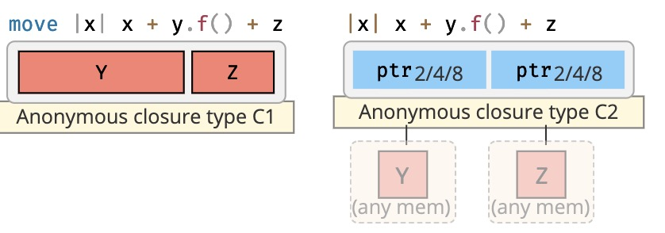

&nbsp;

## Standard Library Types(标准库类型)

Rust标准库类型将上述原始类型组合成具有特殊语义的有用类型，例如：

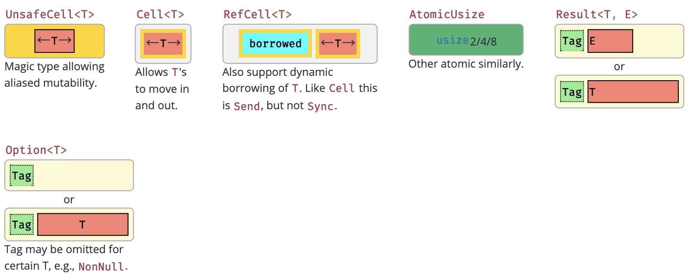

&nbsp;

* `UnsafeCell<T>`：允许类型可变。
* `Cell<T>`：可以为值提供可变性(仅限于`Copy`特征类型)。
* `RefCell<T>`：可以为值提供可变性(不限于`Copy`特征类型)。
* `AtomicUsize`：`Usize`原子版本(可以在线程之间使用)。
* `Result<T, E>`：枚举类型，多用于函数返回值，可恢复性错误处理。
* `Option<T>`：枚举类型，可用作函数可选参数(默认值)，结构体可选字段等

&nbsp;

### General Purpose Heap Storage(heap存储)

明确指定在 `heap` 分配内存的智能指针类型。其中某些类型可能存在元数据(meta data)。

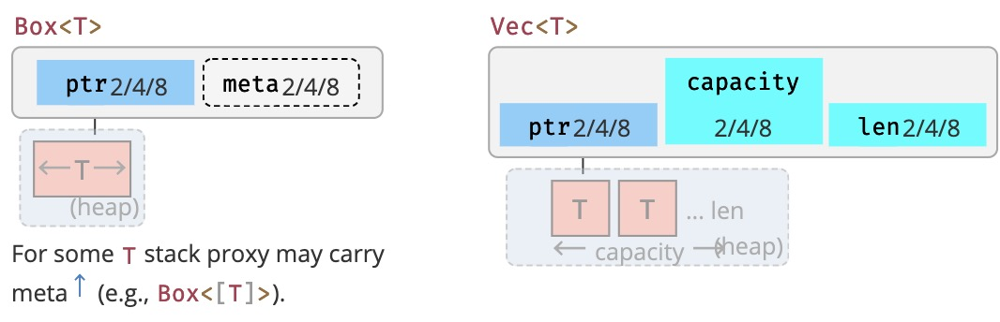

&nbsp;

### Owned Strings(字符串类型)

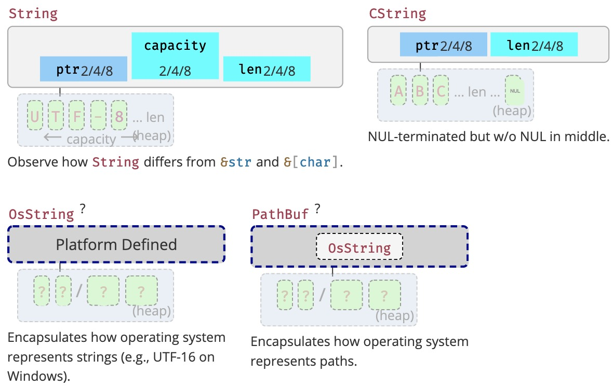

&nbsp;

* `OsString`：封装的操作系统如何表示字符串。
* `PathBuf`： 封装的操作系统如何表示路径。

&nbsp;

### Shared Ownership(所有权共享)

如下智能指针，共享所有权。

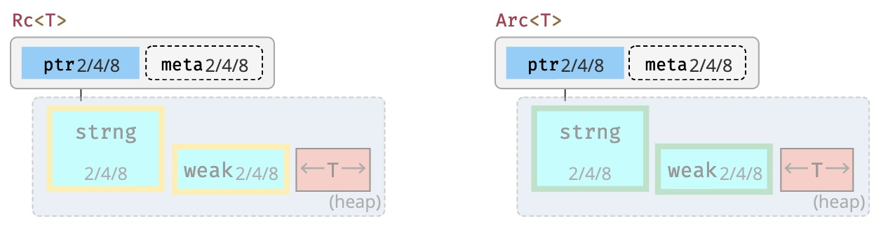

&nbsp;

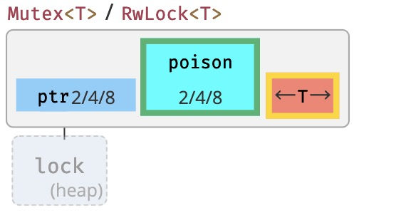

* 在`Send`或`Sync`中，可以使用`Rc`、`Arc`解决`Cell`、`RefCell`无法跨线程共享所有权的问题。
* 使用`Arc`才能在线程之间实现共享，为提升性能可使用[parking_log](https://crates.io/crates/parking_lot)(不使用heap)
