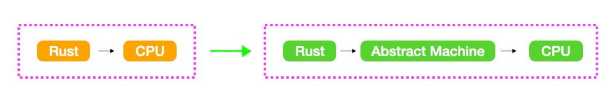
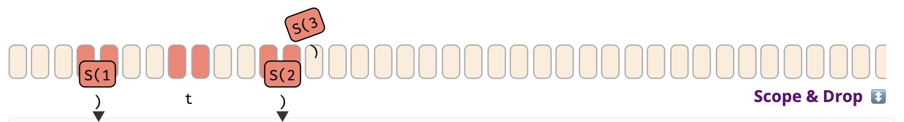

# 内部实现

## The Abstract Machine(抽象机器)

和 `C` 和 `C++`一样，Rust也是基于抽象机器。

&nbsp;

### The abstract machine

* 不是运行时(Runtime)，没有任何运行时开销，它是一种计算模型的抽象
* 包含内存(`stack,...`)、执行语义等概念
* 关注一些CPU可能不关注事情
* 达成程序员和机器之间的约定
* 利用以上规则，进行优化



&nbsp;

## Language Sugar(语法糖)

* `Coercions`：弱化类型以匹配签名(隐式地强制类型在某些上下文中进行更改)，主要集中在指针和生命周期上。Eg：`&mut T` => `&T`
* `Deref`：解引用
* `Prelude`：自动导入标准库包，eg: `Option`, `Drop`, ...
* `Reborrow`：可以使一个变量同时存在多个可变引用
* `Lifetime Elision`：Rust为了程序可读性，如果你的代码适合省略生命周期规则，可以在函数签名中省略生命周期。
* `Method Resolution`：解引用或借用`x`，`x.f()`
* `Match Ergonomics`：用于模式匹配，目前匹配引用需要使用 `ref` 或者 `&`
* `Rvalue Static Promotion`：引用静态常量

&nbsp;

### Deref(解引用)

```rust
use std::ops::Deref;

struct DerefExample<T> {
    value: T
}

impl<T> Deref for DerefExample<T> {
    type Target = T;

    fn deref(&self) -> &self::Target {
        &self.value
    }
}

let x = DerefExample { value: 'a' };
assert_eq!('a', *x);
```

&nbsp;

### Reborrow

```rust
fn main() {
    let mut s = 11;
    let b = &mut s;
    let c:&mut i32 = b;   // let c = &mut s; -> 会报错，因为这种写法是borrow不是reborrow
    *c = 13;
    *b = 12;
}
```

&nbsp;

### Lifetime Elision

生命周期位置可以显示为**输入**或**输出**。对于 `fn`定义，`fn`类型和`trait Fn`、`FnMut`和`FnOnce`，输入类型是指**形参类型**，而输出指的是**结果类型**。

```rust
// 1. 输入位置省略了一个生命周期
// 2. 输出位置省略了两个生命周期
fn foo(s: &str) -> (&str, &str) {}
```

省略生命周期规则如下：

* 每个参数都有自己的生命周期
* 如果只有一个输入生命周期参数，则该生命周期将分配给所有输出生命周期参数
* 如果多个输入生命周期参数，包含`&self`或`&mut self`，则将`self`生命周期分配给所有省略的输出生命周期

除以上三种情况外，其它情况需要显示指定生命周期。

&nbsp;

#### Example

```rust
fn print(s: &str);                                                                  // 省略
fn print<'a>(s: &'a str);                                                           // 展开

fn debug(lvl: usize, s: &str);                                                      // 省略
fn debug<'a>(lvl: usize, s: &'a str);                                               // 展开

fn substr(s: &str, until: usize) -> &str;                                           // 省略
fn substr<'a>(s: &'a str, util: usize) -> &'a str;                                  // 展开

fn get_str() -> &str;                                                               // 非法的

fn frob(s: &str, t: &str) -> &str;                                                  // 非法的

fn get_mut(&mut self) -> &mut T;                                                    // 省略
fn get_mut<'a>(&'a mut self) -> &'a mut T;                                          // 展开 

fn args<T: ToCStr>(&mut self, args: &[T]) -> &mut Command;                          // 省略 
fn args<'a, 'b, T: ToCStr>(&'a mut self, args: &'b [T]) -> &'a mut Command;         // 展开

fn new(buf: &mut [u8]) -> BufWriter;                                                // 省略 
fn new(buf: &mut [u8]) -> BufWriter<'_>;                                            // 省略
fn new<'a>(buf: &'a mut [u8]) -> BufWriter<'a>;                                     // 展开 
```

&nbsp;

### Match Ergonomics

```rust
let x &Option<_> = &Some(0);

match x {
    &Some(ref y) => { ... },
    &None => { ... },
}

// or using *:

match *x {
    Some(ref x) => { ... },
    None => { ...},
}
```

* Rust Issue: [rust-lang/rust#42640](https://github.com/rust-lang/rust/issues/42640)

该问题修复后，可以使用以下简单方法:

```rust
let x: &Option<_> = &Some(0);

match x {
    Some(y) => { ... },    // `y` is a reference to `0`
    NOne => { ... },
}
```

&nbsp;

### Rvalue Static Promotion

如果想让表达式值存储在静态内存中，而不是在stack中，可以使用 `'static` 进行创建:

```rust
let x: &'static u32 = &42;
```

&nbsp;

在处理常量值时，必须显式定义常量或`'static`，以创建具有静态生命周期的引用。

```rust
fn generic<T>() -> &'static Option<T> {
    const X: &'static Option<T> = &None::<T>;
    X
}
```

&nbsp;

## Memory & Lifetimes(内存和生命周期)

包括变量所有权转移(`move`)、引用(`references`)、生命周期(`lifetimes`)等内容。

&nbsp;

### Type & Moves

#### Application Memory(进程内存分布)

* 应用程序内存底层就是字节数组。
* 内存可分为：
    * stack：栈内存，低地址空间，低开销内存(无需考虑内存垃圾回收)，大多数变量都存放在该地址空间
    * heap：堆内存，高地址空间，该地址空间较大而且操作灵活，一般通过 `Box<T>`进行内存分配，需要考虑内存垃圾回收的问题
    * static：静态存储区，该内存在程序编译的时候已经分配好，这块儿内存在程序的整个运行期都存在。它主要存放静态数据、全局数据和常量
    * code：存放函数体的二进制代码。运行程序就是执行代码，代码要执行就要加载进内存

&nbsp;


&nbsp;

#### Variables(变量)

```rust
// 使用let 声明，则位置位于stack中
let t = S(1);
```


&nbsp;

#### Moves(所有权转移)

```rust
// 1. 如果S实现Copy，会将t内的值移动到a的位置，或者复制它
// 2. move之后内存位置t无效，无法再读取
//  2.1. 底层字节数组并不为空，而是为定义
//  2.2. 如果仍想访问t，可使用unsafe方式进行访问
let a = t;
```


#### Type Safety

```rust
// 1. 该赋值无效，M::new() 字节无法转换为S类型的形式
let c: S = M::new();
```


&nbsp;

#### Scope & Drop(作用域&内存释放)

```rust
// 1. 当变量超出作用域，将该变量值进行清理(drop_in_place)
// 2. 新值分配给现有变量位置，超出作用域旧值也会被清理

{
    let mut c = S(2);
    c = S(3);
    let t = S(1);
    let a = t;
}   // <- Scope of `a`, `t`, `c` ends here, drop called on `a`, `c`.
```



&nbsp;

```rust
#[derive(Debug)]
struct Data{
    x: i64
}

fn main() {
    let mut s = Box::new(Data{x:1});
    let s = Box::new(Data{x: 2});
    println!("{:?}", s);
}
```

```x86asm
0x0000555555559487 <+7>:    mov    QWORD PTR [rsp+0x40],0x1
   0x0000555555559490 <+16>:    mov    rax,QWORD PTR [rsp+0x40]
   0x0000555555559495 <+21>:    mov    QWORD PTR [rsp+0xb8],rax
   0x000055555555949d <+29>:    mov    ecx,0x8
   0x00005555555594a2 <+34>:    mov    rdi,rcx
   0x00005555555594a5 <+37>:    mov    rsi,rcx
   0x00005555555594a8 <+40>:	mov    QWORD PTR [rsp+0x30],rax
   0x00005555555594ad <+45>:	call   0x555555559770 <alloc::alloc::exchange_malloc>
   0x00005555555594b2 <+50>:	mov    rcx,rax
   0x00005555555594b5 <+53>:	mov    rdx,QWORD PTR [rsp+0x30]
   0x00005555555594ba <+58>:	mov    QWORD PTR [rax],rdx
   0x00005555555594bd <+61>:	mov    QWORD PTR [rsp+0x38],rcx             ; [rsp+0x38] => Box::new(Data{ x: 1});
   0x00005555555594c2 <+66>:	mov    QWORD PTR [rsp+0x50],0x2
   0x00005555555594cb <+75>:	mov    rax,QWORD PTR [rsp+0x50]
   0x00005555555594d0 <+80>:	mov    QWORD PTR [rsp+0xc0],rax
   0x00005555555594d8 <+88>:	mov    ecx,0x8
   0x00005555555594dd <+93>:	mov    rdi,rcx
   0x00005555555594e0 <+96>:	mov    rsi,rcx
   0x00005555555594e3 <+99>:	mov    QWORD PTR [rsp+0x28],rax
   0x00005555555594e8 <+104>:	call   0x555555559770 <alloc::alloc::exchange_malloc>
   0x00005555555594ed <+109>:	mov    QWORD PTR [rsp+0x20],rax
   0x00005555555594f2 <+114>:	jmp    0x5555555594f4 <ddd::main+116>
   0x00005555555594f4 <+116>:	mov    rax,QWORD PTR [rsp+0x20]
   0x00005555555594f9 <+121>:	mov    rcx,QWORD PTR [rsp+0x20]
   0x00005555555594fe <+126>:	mov    rdx,QWORD PTR [rsp+0x28]
   0x0000555555559503 <+131>:	mov    QWORD PTR [rcx],rdx
   0x0000555555559506 <+134>:	mov    QWORD PTR [rsp+0x18],rax
   0x000055555555950b <+139>:	mov    rax,QWORD PTR [rsp+0x18]
   0x0000555555559510 <+144>:	mov    QWORD PTR [rsp+0x48],rax             ; [rsp+0x48] => Box::new(Data{x: 2});
   0x0000555555559515 <+149>:	lea    rcx,[rsp+0x48]
    
   ...
   
   0x000055555555959d <+285>:	lea    rdi,[rsp+0x48]   ; 待清理值 Box::new( Data{x: 1});
   0x00005555555595a2 <+290>:	call   0x555555559240 <core::ptr::drop_in_place>
   0x00005555555595a7 <+295>:	jmp    0x5555555595a9 <ddd::main+297>
   0x00005555555595a9 <+297>:	lea    rdi,[rsp+0x38]   ; 待清理值 Box::new( Data{ x: 2});
   0x00005555555595ae <+302>:	call   0x555555559240 <core::ptr::drop_in_place>
   0x00005555555595b3 <+307>:	add    rsp,0xc8
   0x00005555555595ba <+314>:	ret
   
   ...
```

&nbsp;

### Call Stack

#### Function Boundaries(函数边界)

```rust
// 1. 当一个函数被调用时，参数和返回值的内存被保留在stack上
// 2. 在调用f之前，a值被移动到指定stack位置(调用函数参数作准备)，在f运行期间，x(参数)的值像操作局部变量一样

fn f(x: S) { ... }

let a = S(1); // <- We are here
f(a);
```


&nbsp;

#### Nested Functions(嵌套函数)

```rust
// 1. 递归函数(Recursively Calling function)，或调用起它函数，会导致stack增长
// 2. 嵌套太多调用(尤其是无限递归)将导致stack增长，最终溢出，终止应用程序

fn f(x: S) {
    if once() { f(x) } // <- We are here (before recursion)
}

let a = S(1);
f(a);
```


&nbsp;

#### Repurposing Memory(内存复用)

```rust
fn f(x: S) {
    if once() {
        f(x)
    }
    let m = M::new()
}

let a = S(1);
f(a);
```


