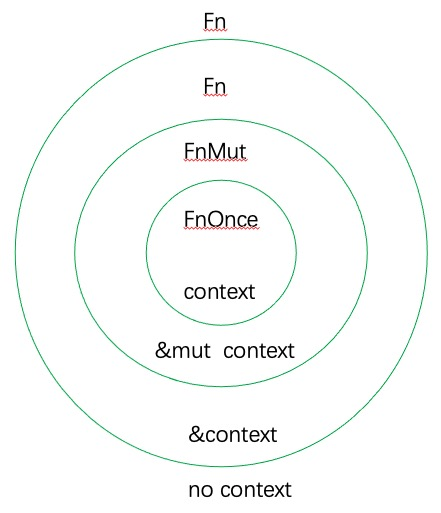

# 作为参数

每个闭包类型都是唯一且匿名的，这就无法为参数提供类型。为此，以特征(trait)为闭包分类，解决问题。

## 闭包三种特征

* Fn：以&T引用变量。不会修改，可重复调用
* FnMut：以&mut T引用环境变量。可修改，可重复调用
* FnOnce：以T转移所有权。只能调用一次

```
fn test<T> (c: T) where
    T: FnOnce()
{
    c();        //  --- `c` moved due to this call
    c();        // ^ value used here after move; 只可以调用一次
}

fn main() {
    let x = Box::new(3);

    let c = || {
        let _x = x;     // Move!!!!
    };   // drop!!!

    test(c);
}
```

闭包(F)的引用(&F)同样如此。

* 如果`F`实现`Fn`特征，那么`&F`也会实现
* 如果`F`实现`FnMut`特征，那么`&mut F`也会实现

```
fn test<T> (mut c: T) where
    T: FnMut()                  // FnMut(RW)    <--- FnMut(RW), Fn(R)
{
    c();                        // FnMut可多次调用
    c();
}

fn main() {
    let mut x = 100;

    // 该闭包实现FnMut
    let c = || {
        x += 1;                     // 环境变量x不会发生转移
        println!("{:?}", &x);
    };

    test(c);
}
```

通过反汇编可以看出, FnMut并没有发生所有权转移。
```
// main Fn
(gdb) disassemble
Dump of assembler code for function closure::main:
   0x0000555555559200 <+0>:	sub    rsp,0x18
=> 0x0000555555559204 <+4>:	mov    DWORD PTR [rsp+0xc],0x64
   0x000055555555920c <+12>:	lea    rax,[rsp+0xc]
   0x0000555555559211 <+17>:	mov    QWORD PTR [rsp+0x10],rax
   0x0000555555559216 <+22>:	mov    rdi,QWORD PTR [rsp+0x10]
   0x000055555555921b <+27>:	call   0x5555555593a0 <closure::test>
   0x0000555555559220 <+32>:	add    rsp,0x18
   0x0000555555559224 <+36>:	ret

// test Fn
(gdb) disassemble
Dump of assembler code for function closure::test:
   0x00005555555593a0 <+0>:	sub    rsp,0x28
   0x00005555555593a4 <+4>:	mov    QWORD PTR [rsp],rdi
   0x00005555555593a8 <+8>:	mov    rdi,rsp
   0x00005555555593ab <+11>:	call   0x5555555593e0 <closure::main::{{closure}}>
   0x00005555555593b0 <+16>:	jmp    0x5555555593b2 <closure::test+18>
   0x00005555555593b2 <+18>:	mov    rdi,rsp
   0x00005555555593b5 <+21>:	call   0x5555555593e0 <closure::main::{{closure}}>
   0x00005555555593ba <+26>:	jmp    0x5555555593bc <closure::test+28>
=> 0x00005555555593bc <+28>:	jmp    0x5555555593be <closure::test+30>
   0x00005555555593be <+30>:	add    rsp,0x28
   0x00005555555593c2 <+34>:	ret
   0x00005555555593c3 <+35>:	jmp    0x5555555593c5 <closure::test+37>
   0x00005555555593c5 <+37>:	mov    rdi,QWORD PTR [rsp+0x18]
   0x00005555555593ca <+42>:	call   0x555555559050 <_Unwind_Resume@plt>
   0x00005555555593cf <+47>:	ud2
   0x00005555555593d1 <+49>:	mov    QWORD PTR [rsp+0x18],rax
   0x00005555555593d6 <+54>:	mov    DWORD PTR [rsp+0x20],edx
   0x00005555555593da <+58>:	jmp    0x5555555593c3 <closure::test+35>
```


### FnOnce、FnMut、Fn 区别

如下图所示，FnMut继承自FnOnce,Fn又继承自FnMut。

也就是说，实现Fn可用于FnMut、FnOnce参数，实现FnMut可用于FnOnce参数。



```
fn test<T> (mut c: T) where
    T: FnMut()                  // FnMut并没有实现FnOnce, FnOnce是FnMut的基类
{
    c();
    c();
}

fn main() {
    let x = Box::new(3);

    let c = || {                // ^^ this closure implements `FnOnce`, not `FnMut`
        let _x = x;
    };

    test(c);
}
```

```
fn test<T> (c: T) where
    T: Fn()
{
    c();                        // Fn可重复调用
    c();
    c();
}

fn main() {
    let x = 100;

    let c = || {
        println!("{:?}", x);
    };

    test(c);
}
```

## 声明
参数是闭包还是函数指针，完全不同。毕竟闭包结构和指针类型不同，且传参方式也不一样。

```
fn call(f: fn()) {          // function pointer
    fn();
}

fn main() {
    let a = 1;

    let f = || println!("abc");         // anonymous function
    // let c = || println!("{}", &a);   // closure

    call(f);

    call(c);
        ^ expected fn pointer, found closure
}
```

函数调用具体实现:
```
1	fn call(f: fn()) {
=> 0x0000555555559200 <+0>:	push   rax
   0x0000555555559201 <+1>:	mov    QWORD PTR [rsp],rdi

2	    f();
   0x0000555555559205 <+5>:	call   rdi

3	}
   0x0000555555559207 <+7>:	pop    rax
   0x0000555555559208 <+8>:	ret
```

要接收闭包参数，正确做法是用特征和范型约束。

```
fn call<F>(mut f: F)            // FnOnce(1)    <-- FnOnce(1), FnMut(n), Fn(n)
    where F: FnMut(i32) -> i32  // FnMut(R,W)   <-- FnMut(R,W), Fn(R)
{                               // Fn(R)        <-- Fn(R)
    println!("{}", f(1));
    println!("{}", f(2));
}

fn main() {
    let a = 1;

    let c = |x| a + x;      // Fn !!!
    call(c);                // Fn 传给 FnMut没啥问题
}
```

闭包调用具体实现:

```
1	fn call<F>(mut f: F) where
=> 0x00005555555592f0 <+0>:	sub    rsp,0xf8
   0x00005555555592f7 <+7>:	mov    QWORD PTR [rsp+0x30],rdi

2	    F: FnMut(i32) -> i32
3	{
4	    println!("{}", f(1));
   0x00005555555592fc <+12>:	mov    DWORD PTR [rsp+0x84],0x1
   0x0000555555559307 <+23>:	mov    esi,DWORD PTR [rsp+0x84]
   0x000055555555930e <+30>:	lea    rdi,[rsp+0x30]
   0x0000555555559313 <+35>:	call   0x555555559490 <closure::main::{{closure}}>
   0x0000555555559318 <+40>:	mov    DWORD PTR [rsp+0x2c],eax
   0x000055555555931c <+44>:	jmp    0x55555555931e <closure::call+46>
   0x000055555555931e <+46>:	mov    eax,DWORD PTR [rsp+0x2c]
   0x0000555555559322 <+50>:	mov    DWORD PTR [rsp+0x80],eax
   0x0000555555559329 <+57>:	lea    rcx,[rsp+0x80]
   0x0000555555559331 <+65>:	mov    QWORD PTR [rsp+0x78],rcx
   0x0000555555559336 <+70>:	mov    rcx,QWORD PTR [rsp+0x78]
   0x000055555555933b <+75>:	mov    QWORD PTR [rsp+0xe8],rcx
   0x0000555555559343 <+83>:	lea    rsi,[rip+0x31bf6]        # 0x55555558af40 <core::fmt::num::imp::<impl core::fmt::Display for i32>::fmt>
   0x000055555555934a <+90>:	mov    rdi,rcx
   0x000055555555934d <+93>:	call   0x555555559570 <core::fmt::ArgumentV1::new>
   0x0000555555559352 <+98>:	mov    QWORD PTR [rsp+0x20],rdx
   0x0000555555559357 <+103>:	mov    QWORD PTR [rsp+0x18],rax
   0x000055555555935c <+108>:	jmp    0x55555555935e <closure::call+110>
   0x000055555555935e <+110>:	mov    rax,QWORD PTR [rsp+0x18]
   0x0000555555559363 <+115>:	mov    QWORD PTR [rsp+0x68],rax
   0x0000555555559368 <+120>:	mov    rcx,QWORD PTR [rsp+0x20]
   0x000055555555936d <+125>:	mov    QWORD PTR [rsp+0x70],rcx
   0x0000555555559372 <+130>:	lea    rsi,[rip+0x4122f]        # 0x55555559a5a8
   0x0000555555559379 <+137>:	lea    rdi,[rsp+0x38]
   0x000055555555937e <+142>:	mov    edx,0x2
   0x0000555555559383 <+147>:	lea    rcx,[rsp+0x68]
   0x0000555555559388 <+152>:	mov    r8d,0x1
   0x000055555555938e <+158>:	call   0x5555555594e0 <core::fmt::Arguments::new_v1>
   0x0000555555559393 <+163>:	jmp    0x555555559395 <closure::call+165>
   0x0000555555559395 <+165>:	lea    rax,[rip+0x14ad4]        # 0x55555556de70 <std::io::stdio::_print>
   0x000055555555939c <+172>:	lea    rdi,[rsp+0x38]
   0x00005555555593a1 <+177>:	call   rax
   0x00005555555593a3 <+179>:	jmp    0x5555555593a5 <closure::call+181>

5	    println!("{}", f(2));
   0x00005555555593a5 <+181>:	mov    DWORD PTR [rsp+0xd4],0x2
   0x00005555555593b0 <+192>:	mov    esi,DWORD PTR [rsp+0xd4]
   0x00005555555593b7 <+199>:	lea    rdi,[rsp+0x30]
   0x00005555555593bc <+204>:	call   0x555555559490 <closure::main::{{closure}}>
   0x00005555555593c1 <+209>:	mov    DWORD PTR [rsp+0x14],eax
   0x00005555555593c5 <+213>:	jmp    0x5555555593c7 <closure::call+215>
   0x00005555555593c7 <+215>:	mov    eax,DWORD PTR [rsp+0x14]
   0x00005555555593cb <+219>:	mov    DWORD PTR [rsp+0xd0],eax
   0x00005555555593d2 <+226>:	lea    rcx,[rsp+0xd0]
   0x00005555555593da <+234>:	mov    QWORD PTR [rsp+0xc8],rcx
   0x00005555555593e2 <+242>:	mov    rcx,QWORD PTR [rsp+0xc8]
    0x00005555555593ea <+250>:	mov    QWORD PTR [rsp+0xf0],rcx
   0x00005555555593f2 <+258>:	lea    rsi,[rip+0x31b47]        # 0x55555558af40 <core::fmt::num::imp::<impl core::fmt::Display for i32>::fmt>
   0x00005555555593f9 <+265>:	mov    rdi,rcx
   0x00005555555593fc <+268>:	call   0x555555559570 <core::fmt::ArgumentV1::new>
   0x0000555555559401 <+273>:	mov    QWORD PTR [rsp+0x8],rdx
   0x0000555555559406 <+278>:	mov    QWORD PTR [rsp],rax
   0x000055555555940a <+282>:	jmp    0x55555555940c <closure::call+284>
   0x000055555555940c <+284>:	mov    rax,QWORD PTR [rsp]
   0x0000555555559410 <+288>:	mov    QWORD PTR [rsp+0xb8],rax
   0x0000555555559418 <+296>:	mov    rcx,QWORD PTR [rsp+0x8]
   0x000055555555941d <+301>:	mov    QWORD PTR [rsp+0xc0],rcx
   0x0000555555559425 <+309>:	lea    rsi,[rip+0x4117c]        # 0x55555559a5a8
   0x000055555555942c <+316>:	lea    rdi,[rsp+0x88]
   0x0000555555559434 <+324>:	mov    edx,0x2
   0x0000555555559439 <+329>:	lea    rcx,[rsp+0xb8]
   0x0000555555559441 <+337>:	mov    r8d,0x1
   0x0000555555559447 <+343>:	call   0x5555555594e0 <core::fmt::Arguments::new_v1>
   0x000055555555944c <+348>:	jmp    0x55555555944e <closure::call+350>
   0x000055555555944e <+350>:	lea    rax,[rip+0x14a1b]        # 0x55555556de70 <std::io::stdio::_print>
   0x0000555555559455 <+357>:	lea    rdi,[rsp+0x88]
   0x000055555555945d <+365>:	call   rax
   0x000055555555945f <+367>:	jmp    0x555555559461 <closure::call+369>

6	}
   0x0000555555559461 <+369>:	jmp    0x555555559463 <closure::call+371>
   0x0000555555559463 <+371>:	add    rsp,0xf8
   0x000055555555946a <+378>:	ret
   0x000055555555946b <+379>:	jmp    0x55555555946d <closure::call+381>
```

## 实例
FnOnce在第一次调用结束后，无法继续使用。

> 不管闭包参数是哪种，存粹作为执行次数限制。

```
fn call<F>(f: F)
        where F: FnOnce(i32) -> i32             // 不管 f 是不是真的 FnOnce，
{                                               // 自己必须要遵守该约束。
    f(1);
    // ---- `f` moved due to this call
    f(2);
    // ^ value used here after move
}

fn main() {
    let a = 1;
    let c = |x| a + x;                          // &T --> Fn

    // 多次直接调用，并没问题
    c(1);
    c(2);

    // 插入 Fn 闭包
    call(c);
}
```

### 普通函数
普通函数，可传入任何一种类型。

```
// 普通函数，可以作为任意一种闭包特征进行参数传递
fn Call<F>(f: F)
    where F: FnOnce()                           // Fn, FnMut, FnOnce
{
    f();
}

fn test() {
    println!("hello");
}

fn main() {
    call(test);
}
```