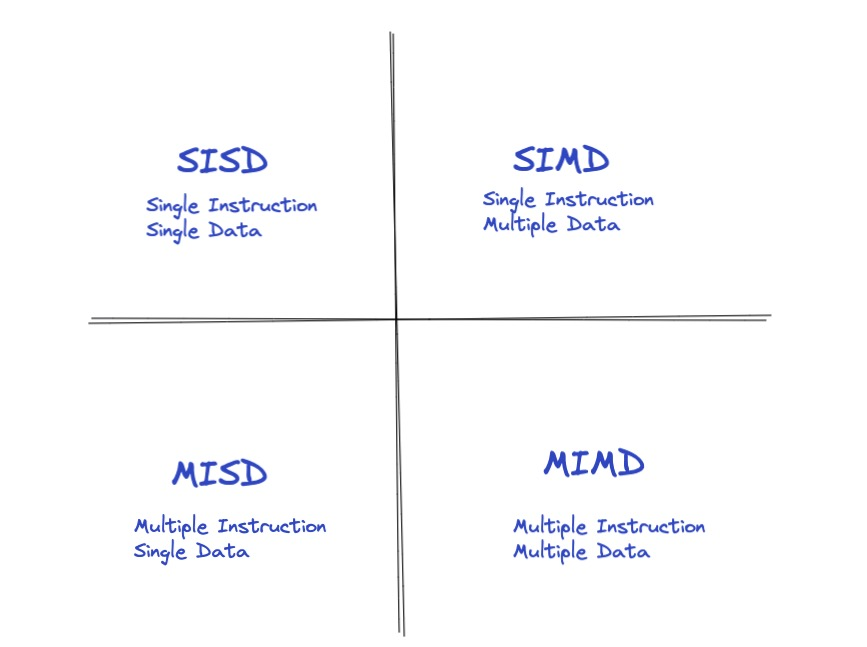

# 数据并行

计算机在许多领域的发展十分迅猛，随着人类前进的步伐，越来越多的领域对计算机的要求越来越高，待解决问题的规模也在不断增加。因此，对并行计算的要求就越来越烈。

因此解决并行计算这个问题大致有两种解决方案:

* 任务并行(Task Parallelism)：将所需要执行的任务分配到多个核上。
* 数据并行(Data parallelism)：将需要处理的数据分配到多个核上。

「数据并行处理」起来比「任务并行处理」更加简单和实用，所以得到了重点关注。

&nbsp;

## 计算机体系结构分类

按Flynn分类法，将计算机系统架构分为四类：

* `SISD`: 单指令单数据的单CPU机器，它在单一的数据流上执行指令。可以说，任何单CPU的计算机都是`SISD`系统。

* `MISD`: 有N个CPU的机器。在这种架构下，底层的并行实际上是指令级的并行。有多个指令来操作同一组数据，`MISD`在实际中很少用。

* `SIMD`：包含了多个独立的CPU，每一个CPU都有自己的存储单元，可以用来存储数据。所有的CPU可以同时在不同的数据上执行执行同一条指令，也就是数据并行。这种架构非常实用，便于算法的设计和实现。

* `MIMD`：是应用最广泛的一类计算机体系。该架构比`SIMD`架构更强，通常用来解决`SIMD`无法解决的问题。
