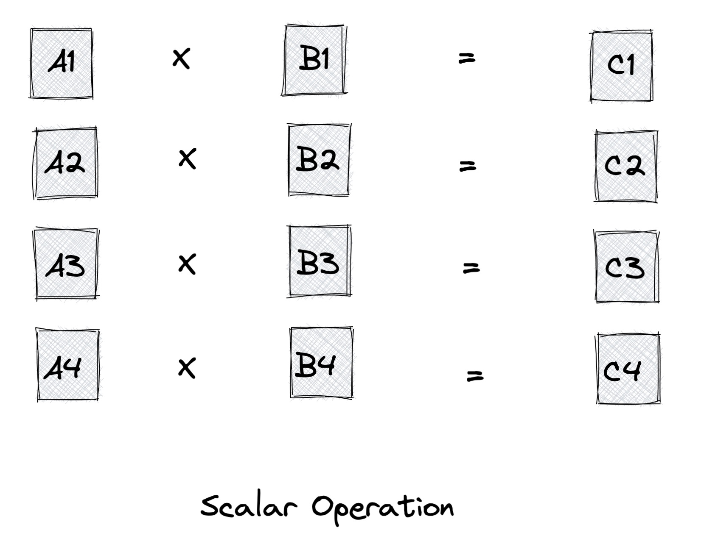
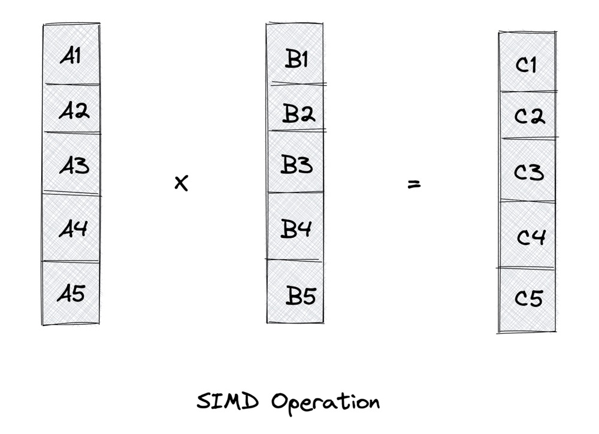
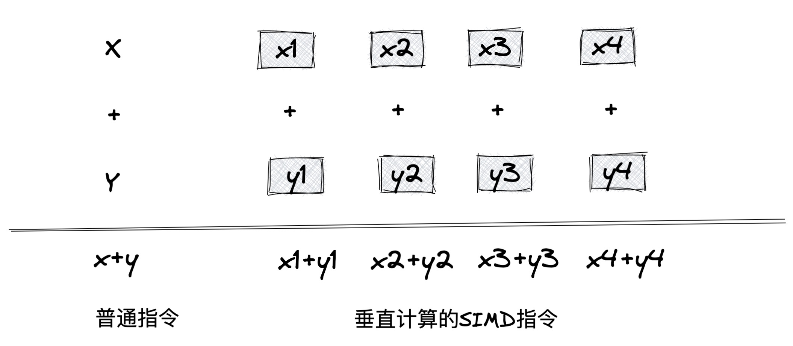
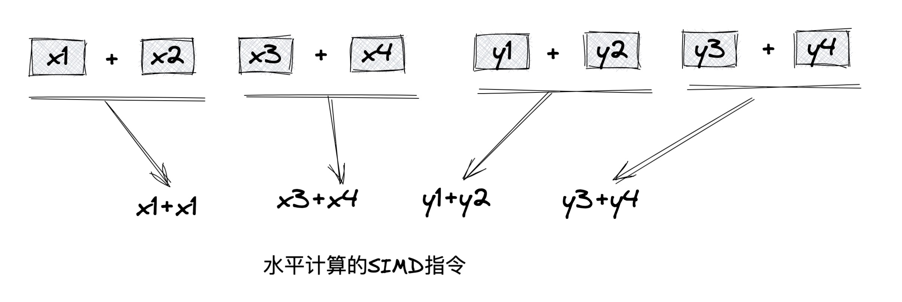

# 数据并行

计算机在许多领域的发展十分迅猛，随着人类前进的步伐，越来越多的领域对计算机的要求越来越高，待解决问题的规模也在不断增加。因此，对并行计算的要求就越来越烈。

因此解决并行计算这个问题大致有两种解决方案:

* 任务并行(Task Parallelism)：将所需要执行的任务分配到多个核上。
* 数据并行(Data parallelism)：将需要处理的数据分配到多个核上。

「数据并行处理」起来比「任务并行处理」更加简单和实用，所以得到了重点关注。

&nbsp;

## 计算机体系结构分类

按Flynn分类法，将计算机系统架构分为四类：

* `SISD`: 单指令单数据的单CPU机器，它在单一的数据流上执行指令。可以说，任何单CPU的计算机都是`SISD`系统。

* `MISD`: 有N个CPU的机器。在这种架构下，底层的并行实际上是指令级的并行。有多个指令来操作同一组数据，`MISD`在实际中很少用。

* `SIMD`：包含了多个独立的CPU，每一个CPU都有自己的存储单元，可以用来存储数据。所有的CPU可以同时在不同的数据上执行执行同一条指令，也就是数据并行。这种架构非常实用，便于算法的设计和实现。

* `MIMD`：是应用最广泛的一类计算机体系。该架构比`SIMD`架构更强，通常用来解决`SIMD`无法解决的问题。

&nbsp;

## SIMD

SIMD 是一种采用一个控制器控制多个CP，同时对一组数据(向量数据)中的每一个数据分别执行相同的操作而实现空间上数据的并行技术。

### SISD Vs. SIMD

如果采用SISD架构来计算，需要先访问内存，取得第一个操作数，然后再访问内存，取得第二个操作数，最后才能进行求和运算。

&nbsp;

SIMD可以一次性从内存中获得两个操作数，然后执行求和运算。

### 历史

SIMD起源于美国超级计算机之一的ILLIAC IV大型机中，它拥有64个处理器单元。随着现代多媒体技术的发展，各大CPU生产商陆续扩展了多媒体指令集，允许这些指令一次处理多个数据。最早Intel的MMX(MultiMedia eXtensions)指令集，包含了57个多媒体指令、8个64位寄存器。然后是SSE(Streaming SIMD Extensions) 70个指令集。接下来出现了SSE2、SSE3、SSE4和SSE5指令集。

2011年Intel发布了全新的处理器微架构，其中增加了新的指令集AVX(Advanced Vector Extensions), 进一步把寄存器的带宽扩展到256位,并且革新了指令格式，支持三目运算。

&nbsp;

### 名词解释

按寄存器的宽度可以将SIMD看作不同的并行通道。拿AVX-256来说，如果按4个64位进行计算，就可以看成是4个并行计算通道。而在SIMD中并行计算可以分为多种计算模式，其中有垂直计算和水平计算。

并行计算也是有限制的，对于不同的指令集，一次数据并行能接受长度是固定的，比如AVX-256，能够接受的长度为256字节。

&nbsp;

#### 垂直计算

垂直计算中，每个并行通道都包含的待计算值称为标量值，通道按水平方向进行组织。将加法运算中X和Y的数据在垂直方向上进行求和。在垂直计算中，每组计算的标量值都来自不同的源。

&nbsp;

#### 水平计算

水平计算则是将并行通道垂直组织，依次对相邻两个通道的标量值进行求和。在水平计算中，每组计算的标量值都来自同一源。

编写SIMD数据并行的代码成为向量化(Vectorrization)。这是因为向量(Vector)是一个指令操作数，包含一组打包到一维数组的数据元素。大多数SIMD都是对向量操作数进行操作的，所以向量也称为SIMD操作数或打包操作数。

&nbsp;

## Rust中使用SIMDe