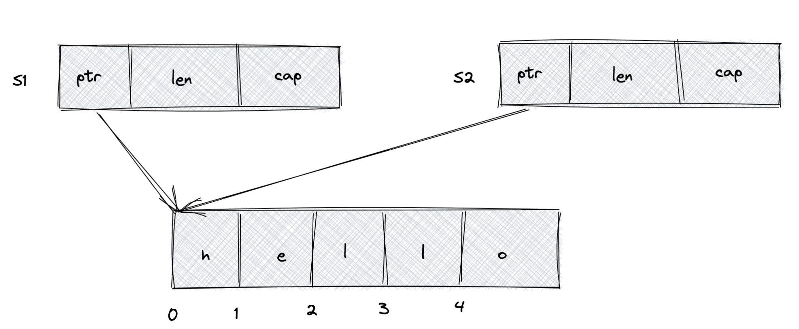
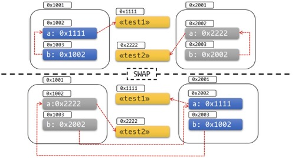

# Pin 和 Unpin

## Pin

`Pin` 是一个智能指针，它内部包含了另一个指针 `P`，只要`P`指针指向的内容(`T`)没有实现 `Unpin`，则可以保证 `T` 永远不会被移动(`move`)。`Pin` 单词很形象的表示 `Pin` 就像钉子一样可以把 `T` 钉住。所以 `Pin`一般来说用 `Pin<P<T>>` 这种方式表示(`P` 是Pointer 的缩写， `T` 是 Type的缩写)。

```rust
/// A pinned pointer.
///
/// This is a wrapper around a kind of pointer which makes that pointer "pin" its
/// value in place, preventing the value referenced by that pointer from being moved
/// unless it implements [`Unpin`].
#[stable(feature = "pin", since = "1.33.0")]
#[lang = "pin"]
#[fundamental]
#[repr(transparent)]
#[derive(Copy, Clone)]
pub struct Pin<P> {
    pointer: P,
}

#[stable(feature = "pin", since = "1.33.0")]
impl<P: Deref> Deref for Pin<P> {
    type Target = P::Target;
    fn deref(&self) -> &P::Target {
        Pin::get_ref(Pin::as_ref(self))
    }
}

#[stable(feature = "pin", since = "1.33.0")]
impl<P: DerefMut<Target: Unpin>> DerefMut for Pin<P> {
    fn deref_mut(&mut self) -> &mut P::Target {
        Pin::get_mut(Pin::as_mut(self))
    }
}
```

* `Pin`是一个智能指针(实现了`Deref`和`DerefMut`)。
* `Pin`包裹的内容只能是指针，不能是其它类型。比如`Pin<u32>` 没有意义。
* `Pin`具有"钉住"`T`不能移动的功能，这个功能是否有效取决于 `T` 是否 `impl Unpin`。如果 `T` 实现了 `Unpin`，`Pin` 的“钉住”功能完全失效了，此时 `Pin<P<T>>` 等价于 `P<T>`。
* `Unpin` 是一个 `auto trait`，编译器默认会给所有类型实现 `Unpin`。但`PhantomPinned`和编译为`async/await` desugar(脱糖)之后生成的 `impl Future`的结构体除外，它们实现的是`!Unpin`。
* 所以 `Pin<P<T>>`默认情况下的 "钉住"功能是不生效的，只针对上面说的这几个 `impl !Unpin`情况有效。

> Pin主要是为了解决 `async/await` 自动生成 Future的问题。问题就是自引用，移动自引用结构体会造成指针失效。

&nbsp;

### move

所有权转移的这个过程就是`move`。

```rust
fn main() {
  let s1 = String::from("Hello");
  let s2 = s1; // s1的所有权转移给了s2，这里发生了move
  // let s3 = s1; // s1的所有权以及转移走了，不能再move，否则会报错：error[E0382]: use of moved value: `s1`
}
```

* `let s2 = s1;` 实现原理:



`s1` 和 `s2` 两个变量在栈上分配内存，通过`ptr` 指针志向堆上数据空间。`move` 所有权转移时，会在栈上开辟一块内存`s2`，然后将`s1`栈上内容拷贝到`s2`，随机`s1`的内存失效。

```x86asm
; stack
(gdb) p/x $rsp+0x18
$3 = 0x7fffffffe258

; s1 => {ptr, len, cap}
(gdb) x/3xg 0x7fffffffe258
0x7fffffffe258:	0x000055555559c9d0	0x0000000000000005
0x7fffffffe268:	0x0000000000000005

; heap => hello
(gdb) x/5xb 0x000055555559c9d0
0x55555559c9d0:	0x48	0x65	0x6c	0x6c	0x6f

(gdb) ptype s1
type = struct alloc::string::String {
  vec: alloc::vec::Vec<u8, alloc::alloc::Global>,
}

(gdb) ptype s2
type = struct alloc::string::String {
  vec: alloc::vec::Vec<u8, alloc::alloc::Global>,
}
```

&nbsp;

```rust
fn main() {
    let mut x = String::from("xxx");
    let mut y = String::from("yyy");

    std::mem::swap(&mut x, &mut y);

    assert_eq!("yyy", &x);
    assert_eq!("xxx", &y);
}
```

`std::mem::swap()` 方法交换了两个可变借用 `&mut` 的内容，此时发生了 `move`。这种所有权转移在Rust很常见，通常也不会带来问题，但对于自引用结构体，在异步下可能存在问题。

&nbsp;

### 自引用结构体

自引用结构体(Self-Referential Structs)，它内部某个成员是对另外一个成员的引用。

```rust
struct Test<'a> {
    a: String,
    b: &'a String,
}

fn main() {
    let a = String::from("Hello");
    let _test = Test { a, b: &a };  // ^^ value borrowed here after move
}
```

由于生命周期的问题，目前Rust中只能通过指针实现自引用结构体。

&nbsp;

```rust
#[derive(Debug)]
struct Test {
    a: String,
    b: *const String, // 改成指针
}

impl Test {
    fn new(txt: &str) -> Self {
        Test {
            a: String::from(txt),
            b: std::ptr::null(),
        }
    }

    fn init(&mut self) {
        let self_ref: *const String = &self.a;
        self.b = self_ref;
    }

    fn a(&self) -> &str {
        &self.a
    }

    fn b(&self) -> &String {
        unsafe {&*(self.b)}
    }
}

fn main() {
    let mut test1 = Test::new("test1");
    test1.init();
    let mut test2 = Test::new("test2");
    test2.init();

    println!("a: {}, b: {}", test1.a(), test1.b());

    std::mem::swap(&mut test1, &mut test2);
    test1.a = "I've totally changed now!".to_string();
    println!("a: {}, b: {}", test2.a(), test2.b());
}
```

输出:

```bash
a: test1, b: test1
a: test1, b: I've totally changed now!
```

以上实例出现了问题！! 原因是Test结构体中的字段b是一个指向字段a的指针，它在栈上存的是字段a的地址。通过swap()函数交换两个Test结构体之后，字段a,b分别移动到对方的内存区域上，但是a和b本身的内容没有变。也就是指针b依然指向的是原来的地址，但是这个地址现在已经属于另外一个结构体了！这不仅不是自引用结构体了，更可怕的是这个指针可能导致更危险的问题，这是Rust决不允许出现的！




更为关键的是 Rust的`Generator`和`async/await` 异步是基于自引用结构体实现的。如果不能从根本上解决这个问题，Rust号称Memory Safe的根基就完全动摇了。

> 推荐:
> 
> [https://rust-lang.github.io/async-book/](https://rust-lang.github.io/async-book/)
> 
> [https://cfsamson.github.io/books-futures-explained](https://cfsamson.github.io/books-futures-explained)

&nbsp;

#### 问题根源？

导致以上实例问题在于 `std::mem::swap(&mut test1, &mut test2)` 这行代码，它导致了自引用结构体失效引发了内存安全问题。解决好 `swap()` 函数安全问题，就可以避免以上实例的问题。

```rust
#[inline]
#[stable(feature = "rust1", since = "1.0.0")]
pub fn swap<T>(x: &mut T, y: &mut T) {
    // SAFETY: the raw pointers have been created from safe mutable references satisfying all the
    // constraints on `ptr::swap_nonoverlapping_one`
    unsafe {
        ptr::swap_nonoverlapping_one(x, y);
    }
}
```

`swap()` 函数的参数要求是可变借用 `&mut`，所以只要我们想办法让 `Safe Rust` 下不暴露可变即借用即可。

&nbsp;

### Pin

`Pin`之前的标准库中没有这样的API能够防止在 `Safe Rust`下不暴露 `&mut T`。`Pin`可以从根源上解决这个问题(可以保证被包裹的指针`P<T>`永远钉住不让`move`)，但有一个`Unpin`先决条件，如果 `impl Unpin`，则无法实现其 `Safe Rust`。

举例子， 如果我是`Pin`，你是 `P<T>`，如果你`impl`了`Unpin`,我会提供两种方法让你在Safe Rust下拿到 `&mut T`：

* 使用 `Pin::get_mut()`

```rust
impl<'a, T: ?Sized> Pin<&'a mut T> {
    #[stable(feature = "pin", since = "1.33.0")]
    #[inline(always)]
    pub fn get_mut(self) -> &'a mut T where T: Unpin {
        self.pointer
    }
}
```

&nbsp;

* `impl DerefMut`就可以解引用拿到 `&mut T`

```rust
#[stable(feature = "ping", since = "1.33.0")]
impl<P: DerefMut<Target: Unpin>> DerefMut for Pin<P> {
    fn deref_mut(&mut self) -> &mut P::Target {
        Pin::get_mut(Pin::as_mut(self))
    }
}
```

&nbsp;

`rustc` 默认所有类型实现了 `Unpin`。

```rust
#[lang = "unpin"]
pub auto trait Unpin {}

#[stable(feature = "pin", since = "1.33.0")]
impl<'a, T: ?Sized + 'a> Unpin for &'a T {}

#[stable(feature = "pin", since = "1.33.0")]
impl<'a, T: ?Sized + 'a> Unpin for &'a mut T {}

#[stable(feature = "pin_raw", since = "1.38.0")]
impl<T: ?Sized> Unpin for *const T {}

#[stable(feature = "pin_raw", since = "1.38.0")]
impl<T: ?Sized> Unpin for *mut T {}
```

&nbsp;

有一个例外 `PhantomPinned`， 它实现了 `!Unpin`。

```rust
#[stable(feature = "pin", since = "1.33.0")]
#[derive(Debug, Copy, Clone, Eq, PartialEq, Ord, PartialOrd, Hash)]
pub struct PhantomPinned;

#[stable(feature = "pin", since = "1.33.0")]
impl !Unpin for PhantomPinned {}
```

&nbsp;

#### 解决方案

如果想去掉 `Unpin`，可以通过以下两种方法:

* 使用 `PhantomPinned`，拥有了该结构体就不会实现 `Unpin`

```rust
use std::marker::PhantomPinned;

#[derive(Debug)]
struct Test {
    a: String,
    b: *const String,
    _marker: PhantomPinned,
}
```

* 手动 `impl !Unpin`

```rust
// 前提条件是使用nightly版本，并且需要引入 #![feature(negative_impls)]
#![feature(negative_impls)]
#[derive(Debug)]
struct Test() {
    a: String,
    b: *const String,
}

impl !Unpin for Test{}
```

使用以上两种方法任一个，就可以实现在 Safe Rust下无法拿到可变借用 `&mut T`，拿不到 `&mut T` 就无法作用到 `std::mem::swap()` 上，此时该自引用结构体被钉住了。

&nbsp;

##### Unsafe方式获取可变引用

无论你是否实现`Unpin`，都可以使用如下 `get_unchecked_mut()`拿到`&mut T`。但是需要遵循Pin的契约。

```rust
impl<'a, T: ?Sized> Pin<&'a mut T> {
    #[stable(feature = "pin", since = "1.33.0")]
    #[inline(always)]
    pub unsafe fn get_unchecked_mut(self) -> &'a mut T {
        self.pointer
    }
}
```

&nbsp;

###### Pin契约

> 对于Pin<P<T>>,
>
> * 如果P<T>符合Unpin，那P<T>从被Pin包裹到被销毁，都要一直保证P<T>不被钉住
> 
> * 如果P<T>符合!Unpin，那P<T>从被Pin包裹到被销毁，都要一直保证P<T>被钉住

如果实现了`Unpin`， `Pin`可以让你在Safe Rust下拿到 `&mut T`, 否则无法在Safe Rust钉住(也就是拿不到 `&mut T`)。

&nbsp;

### 构造一个Pin

主要使用以下几种方式构造 `Pin`。

#### Pin::new()

如果 `P` 指向的 `T` 是 `Unpin`的话，可以安全的调用 `Pin::new()`构造一个 `Pin`。`Pin::new()`的底层世纪上就是调用unsafe的`Pin::new_unchecked()`，之所以`Pin::new()` 是安全的，是因为 `Unpin`的情况下`Pin`的「钉住」效果不起作用，跟正常的指针一样的。

```rust
impl<P: Deref<Target: Unpin>> Pin<P> {
    #[stable(feature = "pin", since = "1.33.0")]
    #[inline(always)]
    pub fn new(pointer: P) -> Pin<P> {
        // Safety: the value pointed to is `Unpin`, and so has no requirements
        // around pinning.
        unsafe { Pin::new_unchecked(pointer) }
    }
}
```

&nbsp;

#### pin::new_unchecked()

它是unsafe的，标为unsafe的原因是编译器没办法保证使用者后续操作一定遵守Pin的契约。只要有存在违反契约的可能性，就必须用unsafe标记，因为这是使用者的问题，编译器没办法保证。

```rust
impl<P: Deref> Pin<P> {
    #[stable(feature = "pin", since = "1.33.0")]
    #[inline(always)]
    pub unsafe fn new_unchecked(pointer: P) -> Pin<P> {
        Pin { pointer }
    }
}
```

如果使用者通过`Pin::new_unchecked()`构造一个`Pin<P<T>>`之后`Pin`的生命周期结束了，但`P<T>`依然存在，则后续操作依然可能被`move`，造成内存不安全。

```rust
use std::mem;
use std::pin::Pin;

fn move_pinned_ref<T>(mut a: T, mut b: T) {
    unsafe {
        let p: Pin<&mut T> = Pin::new_unchecked(&mut a);
        // This should mean the pointee `a` can never move again.
    }
    mem::swap(&mut a, &mut b);
    // The address of `a` changed to `b`'s stack slot, so `a` got moved even
    // though we have previously pinned it! We have violated the pinning API contract.
}
```

#### 其它

`Box::pin()`, `Rc::pin()`, `Arc::pin()` 等，底层都是调用上面的 `Pin::new_unchecked()`。

&nbsp;

### Pin的应用

`Pin` 可以分为栈上还是堆上，取决于你要`Pin`的那个指针`P`是在栈上还是堆上。比如 `Pin<&mut T>` 是在栈上, `Pin<Box<T>>` 是在堆上。

&nbsp;

#### Pin在栈上

```rust
use std::pin::Pin;
use std::marker::PhantomPinned;

#[derive(Debug)]
struct Test {
    a: String,
    b: *const String,
    _marker: PhantomPinned,
}

impl Test {
    fn new(txt: &str) -> Self {
        Test {
            a: String::from(txt),
            b: std::ptr::null(),
            _marker: PhantomPinned, // This makes our type `!Unpin`
        }
    }

    fn init<'a>(self: Pin<&'a mut Self>) {
        let self_ptr: *const String = &self.a;
        let this = unsafe { self.get_unchecked_mut() };
        this.b = self_ptr;
    }

    fn a<'a>(self: Pin<&'a Self>) -> &'a str {
        &self.get_ref().a
    }

    fn b<'a>(self: Pin<&'a Self>) -> &'a String {
        unsafe { &*(self.b) }
    }
}

pub fn main() {
    let mut test1 = unsafe { Pin::new_unchecked(&mut Test::new("test1")) };
    Test::init(test1.as_mut());

    let mut test2 = unsafe { Pin::new_unchecked(&mut Test::new("test2")) };
    Test::init(test2.as_mut());

    println!("a: {}, b: {}", Test::a(test1.as_ref()), Test::b(test1.as_ref()));
    std::mem::swap(test1.get_mut(), test2.get_mut());
    println!("a: {}, b: {}", Test::a(test2.as_ref()), Test::b(test2.as_ref()));
}
```

&nbsp;

尝试把`&mut Test` 钉在栈上，然后尝试去调用`get_mut()`作为参数传给`std::mem::swap()`，发现编译不通过。Rust编译器从编译阶段就阻止我们去犯错了。

```rust
error[E0277]: `PhantomPinned` cannot be unpinned
  --> src/main.rs:43:26
   |
43 |     std::mem::swap(test1.get_mut(), test2.get_mut());
   |                          ^^^^^^^ within `Test`, the trait `Unpin` is not implemented for `PhantomPinned`
   |
   = note: consider using `Box::pin`
```

&nbsp;

### Pin在堆上

```rust
use std::pin::Pin;
use std::marker::PhantomPinned;

#[derive(Debug)]
struct Test {
    a: String,
    b: *const String,
    _marker: PhantomPinned,
}

impl Test {
    fn new(txt: &str) -> Pin<Box<Self>> {
        let t = Test {
            a: String::from(txt),
            b: std::ptr::null(),
            _marker: PhantomPinned,
        };
        let mut boxed = Box::pin(t);
        let self_ptr: *const String = &boxed.as_ref().a;
        unsafe { boxed.as_mut().get_unchecked_mut().b = self_ptr };

        boxed
    }

    fn a<'a>(self: Pin<&'a Self>) -> &'a str {
        &self.get_ref().a
    }

    fn b<'a>(self: Pin<&'a Self>) -> &'a String {
        unsafe { &*(self.b) }
    }
}

pub fn main() {
    let mut test1 = Test::new("test1");
    let mut test2 = Test::new("test2");

    println!("a: {}, b: {}",test1.as_ref().a(), test1.as_ref().b());
    // std::mem::swap(test1.get_mut(), test2.get_mut());
    // std::mem::swap(&mut *test1, &mut *test2);
    println!("a: {}, b: {}",test2.as_ref().a(), test2.as_ref().b());
}
```

使用 `Box::pin()` 把Test钉在堆上。使用非 `&mut T` 方式进行变量内容交换。

```rust
a: test1, b: test1
a: test2, b: test2
```

&nbsp;

### Pin&Future

`Pin` 目前最重要的一个应用就是 `Future`。当初2018年官方异步组引入Pin API的初衷就是为了解决Future内部自引用的问题。因为`async/await`就是通过Generator实现的，Generator是通过匿名结构体实现的。如果`async`函数中存在跨`await`的引用，会导致底层Generator存在跨`yield`的引用，那根据Generator生成的匿名结构体就会是一个自引用结构体！然后这个自引用结构体会`impl Future`，异步的Runtime在调用`Future::poll()`函数查询状态的时候，需要一个可变借用（即`&mut Self`）。如果这个`&mut Self`不包裹在Pin里面的话，开发者自己`impl Future`就会利用`std::mem::swap()`之类的函数`move`掉`&mut Self！`所以这就是Future的`poll()`必须要使用`Pin<&mut Self>`的原因。

```rust
#[stable(feature = "futures_api", since = "1.36.0")]
pub trait Future {
    type Output;
    fn poll(self: Pin<&mut Self>, cx: &mut Context<'_>) -> Poll<Self::Output>;
}
```

`Pin` 只对实现 `!Unpin` 的类型才有钉住的效果，这个 `impl Future`的匿名结构体默认就是`!Unpin`。

```rust
pub const fn from_generator<T>(gen: T) -> impl Future<Output = T::Return>
where
    T: Generator<ResumeTy, Yield = ()>,
{
    #[rustc_diagnostic_item = "gen_future"]
    struct GenFuture<T: Generator<ResumeTy, Yield = ()>>(T);

    // We rely on the fact that async/await futures are immovable in order to create
    // self-referential borrows in the underlying generator.
    impl<T: Generator<ResumeTy, Yield = ()>> !Unpin for GenFuture<T> {}

    impl<T: Generator<ResumeTy, Yield = ()>> Future for GenFuture<T> {
        type Output = T::Return;
        fn poll(self: Pin<&mut Self>, cx: &mut Context<'_>) -> Poll<Self::Output> {
            // SAFETY: Safe because we're !Unpin + !Drop, and this is just a field projection.
            let gen = unsafe { Pin::map_unchecked_mut(self, |s| &mut s.0) };

            // Resume the generator, turning the `&mut Context` into a `NonNull` raw pointer. The
            // `.await` lowering will safely cast that back to a `&mut Context`.
            match gen.resume(ResumeTy(NonNull::from(cx).cast::<Context<'static>>())) {
                GeneratorState::Yielded(()) => Poll::Pending,
                GeneratorState::Complete(x) => Poll::Ready(x),
            }
        }
    }

    GenFuture(gen)
}
```

`impl<T: Generator<ResumeTy, Yield = ()>> !Unpin for GenFuture<T> {}` 此行代码实现了 `!Unpin`。

&nbsp;

### 其它

`Pin` 除了以上内容外，还有其它几个概念。`Pin projection`, `Structural pin` 和 `Non-structural pin`。

&nbsp; 
#### `Pin` 的黄金8条

* If T: Unpin (which is the default), then Pin<'a, T> is entirely equivalent to &'a mut T. in other words: Unpin means it's OK for this type to be moved even when pinned, so Pin will have no effect on such a type.

* Getting a &mut T to a pinned T requires unsafe if T: !Unpin.

* Most standard library types implement Unpin. The same goes for most "normal" types you encounter in Rust. A Future generated by async/await is an exception to this rule.

* You can add a !Unpin bound on a type on nightly with a feature flag, or by adding std::marker::PhantomPinned to your type on stable.

* You can either pin data to the stack or to the heap.

* Pinning a !Unpin object to the stack requires unsafe

* Pinning a !Unpin object to the heap does not require unsafe. There is a shortcut for doing this using Box::pin.

* For pinned data where T: !Unpin you have to maintain the invariant that its memory will not get invalidated or repurposed from the moment it gets pinned until when drop is called. This is an important part of the pin contract.

#### async/await 里程碑

2018年Rust异步组的核心成员@withoutboats在他[个人博客](https://without.boats/blog/)分享了`async/await`的整个心路历程，感觉这一路也是充满曲折。比如`Pin`刚开始还需要区分`Pin`，`PinMut`，`PinBox`等，现在精简到只需要一个`Pin<P>`就能搞定。还有更早的时候还计划引入一个叫`Move` 的trait来标记该类型是否可以`move`等等。我这篇文章里面的代码基于1.48版，不确定`Pin`以后会不会有更新，而且`Pin`目前还存在一个`unsoundness`的问题。