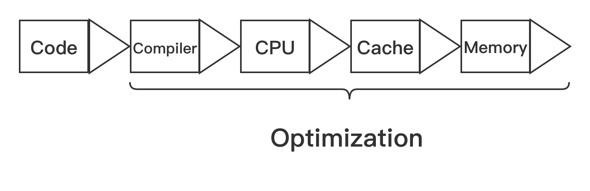

# 线程安全

线程其实是对底层硬件运行过程的直接抽象，这种抽象有优缺点:

* 优点

很多编程语言都对其提供了支持，并且没有对其使用方式加以限制，开发者可以自由实现多线程并发程序，充分利用多核。

&nbsp;

* 缺点

    * 线程的调度完全由系统内核来控制(Linux内核中的调度单位是task)，完全随机，这会导致多个线程的运行顺序是完全无法预测的，有可能产生奇怪的结果。

    * 编写正确的多线程并发程序对开发者要求太高，对多线程变成没有充足知识储备的开发者很容易写满Bug的多线程代码，并且很难重现和调试。

多线程存在的那问题主要是因为资源共享，比如共享内存、文件、数据库等。一个方法、数据结果或库在多线程环境中不会出现任何问题，则可以称之为线程安全。所以多线程的重点就是如何写出县线程安全的代码。

&nbsp;

## 竞态条件与临界区

当某个计算的正确性取决于多个线程交替执行的顺序时，就会产生**竞态条件(Race Condition)**。最常见竞态条件类型是“读取-修改-写入” 和 “先检查后执行”。产生竞态条件的区域，就叫做“临界区”。

```rust
static mut V: i32 = 0;
fn unsafe_seq() -> i32 {
    // Rust中默认不允许修改静态变量的值，所以需要在unsafe块中进行操作
    unsafe {
        V += 1;
        V
    }
}
```

&nbsp;

### 数据竞争

「数据竞争」这个术语很容易和「竞态条件」混淆。当一个线程写一个变量而另一个线程读这个变量时，如果这两个线程没有进行同步，则会发生数据竞争，最终导致读到的数据是错误的。**并非所有的竞态条件都是数据竞争，也并非所有的数据竞争都是竞态条件**。

```rust
// 通过atomic块将整个函数的执行过程赋予原子性，这样就消除了数据竞争和竞态条件
trans3(amount, account_from, account_to) {
    atomic {
        if (account_from.balance < amount) return FALSE;
        account_to.balance += amount;
        account_from.balance -= amount;
        return True;
    }
}
```

多线程编程中，数据竞争是最常见、最严重、最难调试的并发问题之一，可能会引起崩溃或内存不安全。如下是Rust多线程代码实际产生竞态条件问题的例子:

```rust
use std::thread;

static mut V: i32 = 0;

fn unsafe_seq() -> i32 {
    unsafe {
        V += 1;
        V
    }
}

fn main() {
    // thread1
    let child = thread::spawn(move || {
        for _ in 0..10 {
            unsafe_seq();
            unsafe{
                println!("child: {}", V);
            }
        }
    });

    // thread2
    let child2 = thread::spawn(move || {
        for _ in 0..10 {
            unsafe_seq();
            unsafe{
                println!("main: {}", V);
            }
        }
    });

    child.join().unwrap();
    child2.join().unwrap();
}
```

&nbsp;

## 同步、互斥和原子类型

产生竞态条件主要是因为线程乱序执行，发生数据竞争主要是因为线程同时对一块内存进行读写，要消除竞态条件，只需要保存线程按指定顺序来访问即可。要避免数据竞争，只需要保证相关数据结构操作的原子性即可。**很多编程语言都是通过同步机制来消除竞态条件，使用互斥和原子类型来避免数据竞争。**

* 同步：同步是指保证多线程按指定顺序执行的手段。
* 互斥：互斥是指同一时刻只允许单个线程对临界资源进行访问，对其他线程具有排他性，线程之间的关系表现为互斥。
* 原子性：原子类型是指修改临界数据结构的内部实现，确保对它们做任何更新，在外界看来都是原子性的，不可中断。

通常可以使用锁、信号量(Semaphores)、屏障(Barrier)和条件变量(Condition Variable)机制来实现线程同步。

&nbsp;

### 锁

根据不同的并发场景分为很多不同类型的锁，有互斥锁(mUTEX)、读写锁(RwLock)和自旋锁(Spinlock)等。锁的作用可以保护临界区，同时达到同步和互斥的效果。不同的锁表现不同。

&nbsp;

#### 互斥锁(Mutex)

互斥锁每次指允许单个线程访问临界资源

&nbsp;

#### 读写锁(Rwlock)

读写锁可以同时支持多个线程读或单个线程写

&nbsp;

#### 自旋锁(Spinlock)

自旋锁和互斥锁类似，但当获取锁失败时，它不会让线程睡眠，而是不断轮询知道获得锁成功。

&nbsp;

### 信号量

可以在线程之间传递信号，也叫信号灯，可以为资源访问进行计数。信号量是一个非负整数，所有通过它的线程都会将该整数减1，如果信号量为0，那么其他线程只能等待。当线程执行完毕离开临界区时，信号量会再次加1。当信号量只允许设置0或1时，效果相当于互斥锁。

&nbsp;

### 屏障

可以让一系列线程在某个指定的点进行同步。通过让参与指定屏障区域的线程等待，直到所有参与线程都达到指定的点。而条件变量用来自动阻塞一个线程，直到出现指定的条件，通常和互斥锁配合使用。

&nbsp;

## 原子类型与多线程内存模型

在计算机中程序需要经过CPU、CPU多级缓存和内存等协调工作才能顺利执行，在这种体系结构下，如果是多核系统，其中一个CPU核心修改了变量，那么如何通知其他核心是一个重要问题。并且为了提高性能，现代处理器和编程语言的编译器都对程序进行了极度优化，比如**乱序执行**和**指令重排**,所以机器并非按照实际编写的那样执行。



如上图是代码经过层层优化，最终被执行。

在多线程编程中，只有保持顺序一致性，才能保证程序的正确性。所谓顺序一致性，主要约定了两件事情:

* 在单线程内部指令都是按程序确定的顺序来执行的。
* 多线程程序在执行过程中虽然交替执行的，但从全局来看，也是按某种确定的顺序来执行的。

