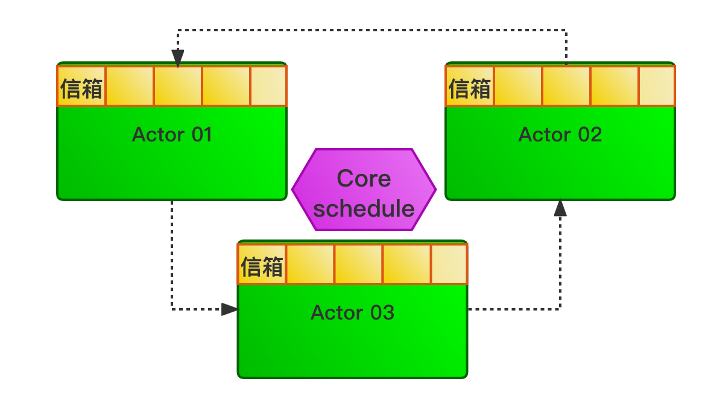
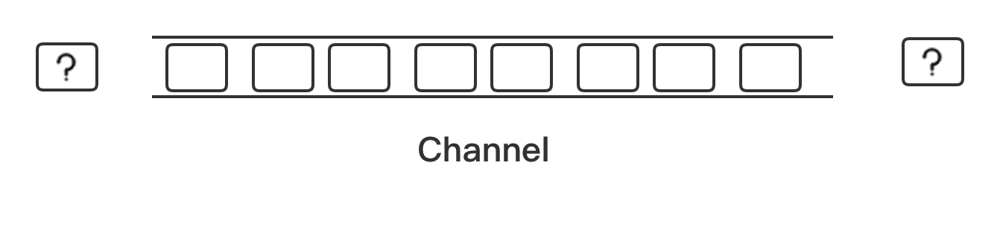

# channel实现线程间通信

在 [Effective Go](https://go.dev/doc/effective_go#:~:text=Do%20not%20communicate%20by%20sharing%20memory%3B%20instead%2C%20share%20memory%20by%20communicating.) 中对并发的描述有这样一句经典: 不要通过共享内存来通信，而应该使用通信来共享内存(`Do not communicate by sharing memory; instead, share memory by communicating.`)。通过这句话可以得知，通过消息传递的手段可以降低由共享而产生的耦合。

基于消息通信的并发模型有两种: **Actor模型** 和 **CSP模型**。Actor模型代表语言是Erlang，而CSP模型的代表语言是Golang。他们还是有一定区别:

* Actor模型中，主角是Actor, Actor之间直接发送、接收消息；而在CSP模型中，主角是 `Channel`，并不关注谁发送消息、接受消息。
* Actor模型中，Actor之间是直接通信的；CSP模型中，依靠Channel进行通信。
* Actor模型的耦合程度高于CSP模型，因为CSP模型不关注发送者和接收者。





&nbsp;

## CSP模型

CSP(Communicating Sequential Processes)模型的基本构造是： CSP进程(传送的事件/任务)和通信通道(channel)。在CSP中每个事件都是进程，进程之间没有直接交互，只能通过通道(Channel)进行交互。CSP 进程通常是匿名的，通信通道传递消息通常使用同步方式。

在Rust中，线程就是CSP进程，而通信通道就是Channel。在Rust标准库的 `std::sync::mpsc` 模块中为线程提供了Channel机制。具体实现实际上是一个**多生产者单消费者(Multi-Producer-Single-Consumer, MPSC)** 的FIFO队列。线程通过Channel进行通信，从而可以实现无锁并发。

&nbsp;

### Rust中CSP类型

在标准库 `std::sync::mpsc` 模块中定义了三种类型的SCP进程：

* **Sender**：用于发送异步消息。
* **SyncSender**：用于发送同步消息。
* **Receiver**：用于接受消息。

&nbsp;

### Rust中 Channel类型

* **异步Channel** ：对应于`channel`函数，返回 `(Sender, Receiver)` 元组。该Channel发送消息是异步的，不会发生阻塞。在理论上`Channel`缓冲区是无限的。
* **同步Channel** ：对应于`sync_channel`函数，返回 `(SyncSender, Receiver)` 元组，该Channel可以预分配具有固定大小的缓冲区，发送消息是同步的，当缓冲区满时会阻塞消息发送，直到疣可用的缓冲空间。当Channel缓冲区大小为0时，就会变成一个"点"，`Sender`和`Receiver`之间消息传递是原子操作。

`Channel` 之间的发送或接收操作都会返回一个`Result`类型用于错误处理。当 `Channel` 发生意外时会返回 `Err`，所以通常使用 `unwrap` 在线程之间传播错误，及早发现问题。

#### SPSC(单生产者单消费者队列)

```rust
use std::thread;
use std::sync::mpsc::channel;

fn main() {
    // 使用channel函数创建了一个用于线程间通信的通道，返回元组(tx, rx)
    let (tx, rx) = channel();

    // 使用spawn生成子线程，并在该线程中使用tx端口调用send向channel中发送消息
    thread::spawn(move || {
        tx.send(10).unwrap();
    });

    // 主线程中使用rx端口调用recv方法接收消息
    // 这样就简单地使用Channel实现了线程间通信
    assert_eq!(rx.recv().unwrap(), 10);
}
```

以上实例，这种只有两个线程通信的Channel,叫做**流通信(Streaming Channel)**。在流通道内部，Rust默认使用 **单生产者消费者队列(SPSC)** 来提升性能。

&nbsp;

#### MPSC(多生产者多消费者)

这种多生产者多消费者的Channel，叫作共享通道(Sharing Channel)。

```rust
// 异步Channel

use std::thread;
use std::sync::mpsc::channel;

fn main() {
    let (tx, rx) = channel();
    for i in 0..10 {
        // 生成10个子线程，同时也将发送端tx拷贝10次，生成了10个生产者
        let tx = tx.clone();
        thread::spawn(move || {
            tx.send(i).unwrap();
        });
    }

    // 接收端rx消费10次数据
    for _ in 0..10 {
        let j = rx.recv().unwrap();
        assert!(0 <= j && j < 10);
    }
}
```

```rust
// 同步Channel

use std::sync::mpsc::sync_channel;
use std::thread;

fn main() {
    // 使用sync_channel函数创建一个同步channel, 将缓冲区大小设置为1
    let (tx, rx) = sync_channel(1);
    tx.send(1).unwrap();
    thread::spawn(move || {
        // 发送端tx的send方法往同步Channel中发送消息
        // 由于是同步Channel, 这次发送的消息在上一条消息被消费之前会一直阻塞，
        // 直到Chanenl缓冲区有可用空间才会继续发送
        tx.send(2).unwrap();
    });

    // 使用接收端rx来消费Channel中的数据，如果rx未接收到数据，则会发生panic
    assert_eq!(rx.recv().unwrap(), 1);
    assert_eq!(rx.recv().unwrap(), 2);
}
```

&nbsp;

### Channel死锁

#### 共享通道(MPSC)

产生死锁的Channel案例，在 `main` 主线程输出 `0` 到 `4` 结果之后，还会一直阻塞 `main` 主线程而不退出。这是因为 `rx` 的 `iter` 方法会阻塞线程，只要 `tx` 还没有被析构，该迭代器就会一直等待新的消息，只要 `tx` 被析构之后，迭代器才能返回 `None`，从而结束迭代退出 `main` 主线程。然而，`tx` 并未被析构，所以迭代器依旧等待，`tx` 也没有发送新的消息，从而造成一种死锁状态。要解决此问题，只需要显式调用 `drop`方法，将 `tx` 析构就可以。

```rust
use std::thread;
use std::sync::mpsc::channel;

fn main() {
    let (tx, rx) = channel();
    for i in 0..5 {
        let tx = tx.clone();
        thread::spawn(move ||{
            tx.send(i).unwrap();
        });
    }

    // drop(tx);
    for j in rx.iter() {
        println!("{:?}", j);
    }
}
```

&nbsp;

#### 流通道(SPSC)

在流通道内(单个`sender`)，发送端 `tx` 在离开 `spawn` 作用域之后会调用析构函数 `drop`，在 `drop`中会调用 `tx`内部的`drop_channel` 方法来**断开(DISCONNECT)** channel。这样设计是因为流通道底层自动使用(SPSC)队列来优化性能，因为流通道只是用于两个线程之间的通信，而共享通道底层使用的还是MPSC队列，在析构行为上比流通道略为复杂。

```rust
use std::sync::mpsc::channel;
use std::thread;

fn main() {
    let (tx, rx) = channel();
    thread::spawn(move || {
        tx.send(1u8).unwrap();
        tx.send(2u8).unwrap();
        tx.send(3u8).unwrap();
    });

    for x in rx.iter() {
        println!("receive: {}", x);
    }
}
```

在底层不管是SPSC还是MPSC队列，甚至是同步Channel使用的内置独立的队列，都是基于链表实现的。使用链表的好处可以提升性能，在生产数据时，只需要在链表头部添加新的元素即可；在消费数据时，只需要从链表尾部取元素即可。