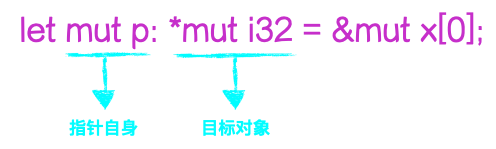

# 指针

很多时候，指针是相对宽泛概念，并非特指**原始指针(raw-pointer)**。以 **引用(reference)** 为例，在经过编译器检查后，其身上所承担的职责已经卸去。起码在底层指令层面，和原始指针并无区别。所以说它是指针确实算不得错。

**引用和原始指针是独立对象**，间接(*p)操作目标。透过指针修改目标值时，无需声明自身为可变(mut)，除非打算改变自己。



&nbsp;

```rust
fn main() {
    // 要改变的目标，必须是mut。
    let mut x = 100;

    // r: &mut i32，表明目标类型可变。
    let r = &mut x;

    *r+=1;

    // r: &i32, 不可变引用
    let r = &x;
    assert_eq!(*r, 101);
}
```

&nbsp;

## 原始指针

原始指针分`*mut T`和`*const T`两种，分别对应`可变`和`不可变`。**无论读写都不安全，须自行负责。**

* `*const T` : 表示指向类型`T`的不可变原始指针。它是`Copy`类型。类似于`&T`，只是它可以为空值。

* `*mut T` : 一个指向类型`T`的可变原始指针，它不支持`Copy`特性(non-Copy)。 

```rust
fn main() {
    let mut x = 100;

    let r: *mut i32 = &mut x;

    unsafe {
        *r += 1;
        assert_eq!(*r, 101);
    }

    let r: *const i32 = &x;
    assert_eq!(unsafe{ *r }, 101);
}
```

&nbsp;

### 引用和指针互相转换

可以和引用相互转换。

```rust
fn main() {
    let mut x = 100;
    let r = &mut x;

    // 引用转指针必然是安全的。
    let p = r as *mut i32;
    assert_eq!(unsafe{ *p }, x);

    // 指针转回引用就未必安全了。
    let r2: &mut i32 = unsafe{ &mut *p };  // unsafe{ & *p } -> &i32
    *r2 += 1;
    assert_eq!(x, 101);
}
```

```x86asm
(gdb) info locals
r2 = 0x7fffffffe2a4
p = 0x7fffffffe2a4
r = 0x7fffffffe2a4
x = 101

// 从底层实现来看，引用和指针没有区别
(gdb) x/xg 0x7fffffffe2a4
0x7fffffffe2a4:	0x0000000000000064

(gdb) x/xg 0x7fffffffe2a4
0x7fffffffe2a4:	0x0000000000000064

// *r2 += 1;
(gdb) x/wx 0x7fffffffe2a4
0x7fffffffe2a4:	0x00000065
```

&nbsp;

### usize指针转换

可通过`usize`转换，实现指针运算。也正因为如此，指向无法保证。

```rust
use std::mem::size_of_val;

fn main() {
    let mut x = [1, 2, 3, 4];
    let mut p: *mut i32 = &mut x[0]; // 指针自身和目标都可变
    
    unsafe {
        assert_eq!(*p, 1);           // 断言x[0]是否等于1

        p = ((p as usize) + size_of_val(&x[0])) as *mut i32; // p++
        *p += 10;
        assert_eq!(*p, 12);
    }
}
```

&nbsp;

原始指针不参与对象生命周期，也就是说可能成为`悬垂指针`。

```rust
#[derive(Debug)]
struct Data {
    x: i32,
}

impl Drop for Data {
    fn drop(&mut self) {
        println!("Dropping!");
    }
}

fn main() {
    let d = Data{ x: 10 };
    let p = &d as *const Data;

    {
        let _d2 = d;  // move!!!
    }                 // drop!!!

    unsafe {
        println!("{:p}, {:?}", p, *p);
    }
}
```

```rust
$  cargo r
   Compiling ddd v0.1.0 (/root/rs/ddd)
    Finished dev [unoptimized + debuginfo] target(s) in 3.04s
     Running `/root/rs/ddd/target/debug/ddd`
Dropping!
0x7ffdd34821e4, Data { x: 10 }      // 虽然能返回内容，但这只是因为是栈内存未被覆盖的缘故
```

&nbsp;

通过以下反汇编结果，可以看出原始变量`d`在内层超出`{ ... }`作用域后，进行了所有权转移，调用 `drop`进行释放。`main`函数结束时，超出该作用域没有调用`drop`函数释放局部变量`p`，则p成为了**悬垂指针**。

```x86asm
; /root/rs/ddd/src/main.rs:
  fn main() {
  0x0000555555559250 <+0>: sub    rsp,0xb8

  let d = Data{ x: 10 };
  0x0000555555559257 <+7>: mov    DWORD PTR [rsp+0x34],0xa

  let p = &d as *const Data;
  0x000055555555925f <+15>:  lea    rax,[rsp+0x34]
  0x0000555555559264 <+20>:  mov    QWORD PTR [rsp+0x38],rax

  {
    let _d2 = d;  // move!!!
  0x0000555555559269 <+25>:  mov    ecx,DWORD PTR [rsp+0x34]
  0x000055555555926d <+29>:  mov    DWORD PTR [rsp+0x44],ecx
  }              // drop!!!

  0x0000555555559271 <+33>:  lea    rdi,[rsp+0x44]
  0x0000555555559276 <+38>:  call   0x5555555591f0 <core::ptr::drop_in_place>

  ; ...
  
  0x0000555555559346 <+246>:  lea    rdi,[rsp+0x48]
  0x000055555555934b <+251>:  call   QWORD PTR [rip+0x44a1f]        # 0x55555559dd70

    }
  }
  
  0x0000555555559351 <+257>:  add    rsp,0xb8
  0x0000555555559358 <+264>:  ret
; End of assembler dump.
```
