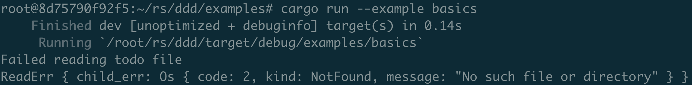

# 不可恢复错误

Rust提供了一种被称为panic(故障)的机制，它会终止调用它的线程，而不会影响任何其他线程。宏`panic!`主要用于测试，以及不可恢复性(unrecoverable)错误。当 `panic!`宏被调用时，发生灾难性故障的线程开始展开函数调用堆栈，从调用它的位置开始，一直到线程入口点。

为了找出导致灾难性故障的一系列调用，我们可以通过运行任何发生灾难性故障的程序，并在命令行设置环境变量 `RUST_BACKTRACE=1` 来查看线程中的回溯。

> 通常不可恢复性错误代表bug，或系统环境变量故障。

&nbsp;

```rust
struct X {
    n: i32,
}

impl Drop for X {
    fn drop(&mut self) {
        println!("Dropping {}!", self.n);
    }
}

fn test() {
    let _x = X{n: 2};
    panic!("panic test.");
}

fn main() {
    let _y = X{n: 1};
    test();
}
```

```rust
root@8d75790f92f5:~/rs/closure/src# cargo r
    Finished dev [unoptimized + debuginfo] target(s) in 0.21s
     Running `/root/rs/closure/target/debug/closure`
thread 'main' panicked at 'panic test.', src/main.rs:13:5
note: run with `RUST_BACKTRACE=1` environment variable to display a backtrace
Dropping 2!
Dropping 1!
```

```rust
root@8d75790f92f5:~/rs/closure/src# RUST_BACKTRACE=1 cargo r
    Finished dev [unoptimized + debuginfo] target(s) in 0.07s
     Running `/root/rs/closure/target/debug/closure`
thread 'main' panicked at 'panic test.', src/main.rs:13:5
stack backtrace:
   0: std::panicking::begin_panic
             at /rustc/cb75ad5db02783e8b0222fee363c5f63f7e2cf5b/library/std/src/panicking.rs:519:12
   1: closure::test
             at ./main.rs:13:5
   2: closure::main
             at ./main.rs:18:5
   3: core::ops::function::FnOnce::call_once
             at /rustc/cb75ad5db02783e8b0222fee363c5f63f7e2cf5b/library/core/src/ops/function.rs:227:5
note: Some details are omitted, run with `RUST_BACKTRACE=full` for a verbose backtrace.
Dropping 2!
Dropping 1!
```

可在 `Cargo.toml` 中设置以终止(abort)代替展开，不回溯清理，直接终止进程。


> 对于部署的发型版(release version)，展开信息可能没什么用。
>
> 还可删除(strip)符号表，避免错误信息造成泄漏。

&nbsp;

```rust
# Cargo.toml

[profile.release]
panic = 'abort'
```

```rust
root@8d75790f92f5:~/rs/closure/src# cargo r --release
    Finished release [optimized] target(s) in 0.05s
     Running `/root/rs/closure/target/release/closure`
thread 'main' panicked at 'panic test.', src/main.rs:13:5
note: run with `RUST_BACKTRACE=1` environment variable to display a backtrace
Aborted
```

&nbsp;

## 常用场景

除直接调用外，以下场景也会引发panic!错误。

* 越界访问
* 被除以零
* Option.unwrap/expect(可选值)
* Result.unwarp/expect(返回值)

> unwrap和expect区别？
> 
> `expect` 与 `unwrap` 的使用方式一样：返回`OK`或调用`panic!`宏
> 
> `expect` 用来调用 `panic!` 的错误信息将会作为参数传递给 `expect` ，而不像`unwrap` 那样使用默认的 `panic!` 信息。

&nbsp;

## 自定义错误和Error特征

Rust没有类型层级继承，但它具有特征继承，并为我们提供了任何类型都可以实现的 `Error` 特征，从而构造自定义错误类型。`Error` 特征的类型签名:

```rust
pub trait Error: Debug + Display {
    fn description(&self) -> &str {
        // ...
    }

    fn cause(&self) -> Option<&dyn Error> {
        // ...
    }
}
```

创建自定义错误类型，该类型必须实现 `Error` 特征。

* `description`：返回一个字符串切片引用，它是描述错误内容的可读形式。
* `cause`：返回一个 `Error` 特征对象的可选引用，用于表示可能导致错误发生的底层原因。

```rust
// src/error.rs

#![allow(dead_code)]

use std::error::Error;
use std::fmt;
use std::fmt::Display;

#[derive(Debug)]
pub enum ParseErr {
    Malformed,
    Empty
}

#[derive(Debug)]
pub struct ReadErr {
    pub child_err: Box<dyn Error>
}

// Error 特征要求的
impl Display for ReadErr {
    fn fmt(&self, f: &mut fmt::Formatter) -> fmt::Result {
        write!(f, "Failed reading todo file")
    }
}

// Error 特征要求的
impl Display for ParseErr {
    fn fmt(&self, f: &mut fmt::Formatter) -> fmt::Result {
        write!(f, "Todo list parsing failed")
    }
}

impl Error for ReadErr {
    fn description(&self) -> &str {
        "Todolist read failed: "
    }

    fn cause(&self) -> Option<&dyn Error> {
        Some(&*self.child_err)
    }
}

impl Error for ParseErr {
    fn description(&self) -> &str {
        "Todolist parse failed: "
    }

    fn cause(&self) -> Option<&dyn Error> {
        None
    }
}
```

```rust
// src/lib.rs

// ! 该程序库提供了一个解析 todos 列表的API

use std::fs::read_to_string;
use std::path::Path;

mod error;
use error::ParseErr;
use error::ReadErr;

use std::error::Error;

// 该结构体包含了一个解析为 Vec<String>的 todos 列表
#[derive(Debug)]
pub struct TodoList {
    tasks: Vec<String>,
}

impl TodoList {
    pub fn get_todos<P>(path: P) -> Result<TodoList, Box<dyn Error>>
    where
    P: AsRef<Path>, {
        let read_todos: Result<String, Box<dyn Error>> = read_todos(path);
        let parsed_todos = parse_todos(&read_todos?)?;
        Ok(parsed_todos)
    }
}

pub fn read_todos<P>(path: P) -> Result<String, Box<dyn Error>>
where
    P: AsRef<Path>,
{
    let raw_todos = read_to_string(path)
        .map_err(|e| ReadErr {
            child_err: Box::new(e),
        })?;
    Ok(raw_todos)
}

pub fn parse_todos(todo_str: &str) -> Result<TodoList, Box<dyn Error>> {
    let mut tasks: Vec<String> = vec![];
    for i in todo_str.lines() {
        tasks.push(i.to_string());
    }

    if tasks.is_empty() {
        Err(ParseErr::Empty.into())
    } else {
        Ok(TodoList { tasks })
    }
}
```

```rust
// examples/basics.rs

extern crate ddd;

use ddd::TodoList;

fn main() {
    let todos = TodoList::get_todos("examples/todos");
    match todos {
        Ok(list) => println!("{:?}", list),
        Err(e) => {
            println!("{}", e);
            println!("{:?}", e);
        }
    }
}
```

通过 `cargo run --example basic` 命令执行 `basics.rs` 示例：



&nbsp;

# 分歧函数

分歧函数(diverging)表示永远不会返回(never return)的函数。

* 无限循环`main loop`
* 包装`panic!`，用于调试或跟踪调用堆栈
* 紧急终止进程

```rust
fn test() -> ! {            // ! 分歧函数
    panic!("This function never returns!");
}

fn main() {
    let _x = test();
            // ------ any code following this expression is unreachable 

    let y = 0x64;
            // ^^^^^^^^^^^^^ unreachable statement
    println!("{:?}", y);
}
```
